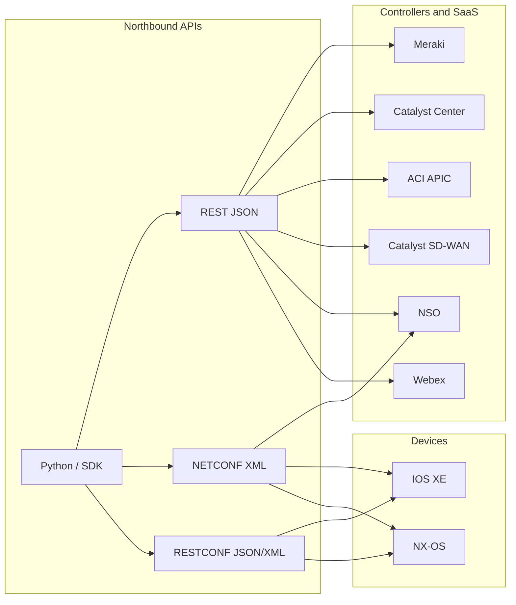
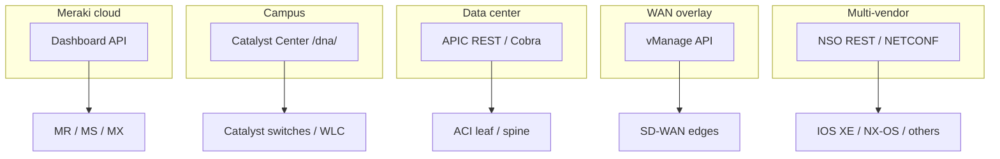
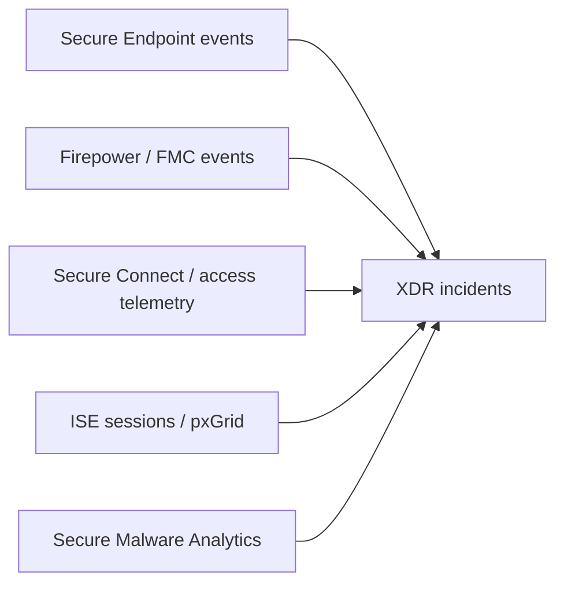
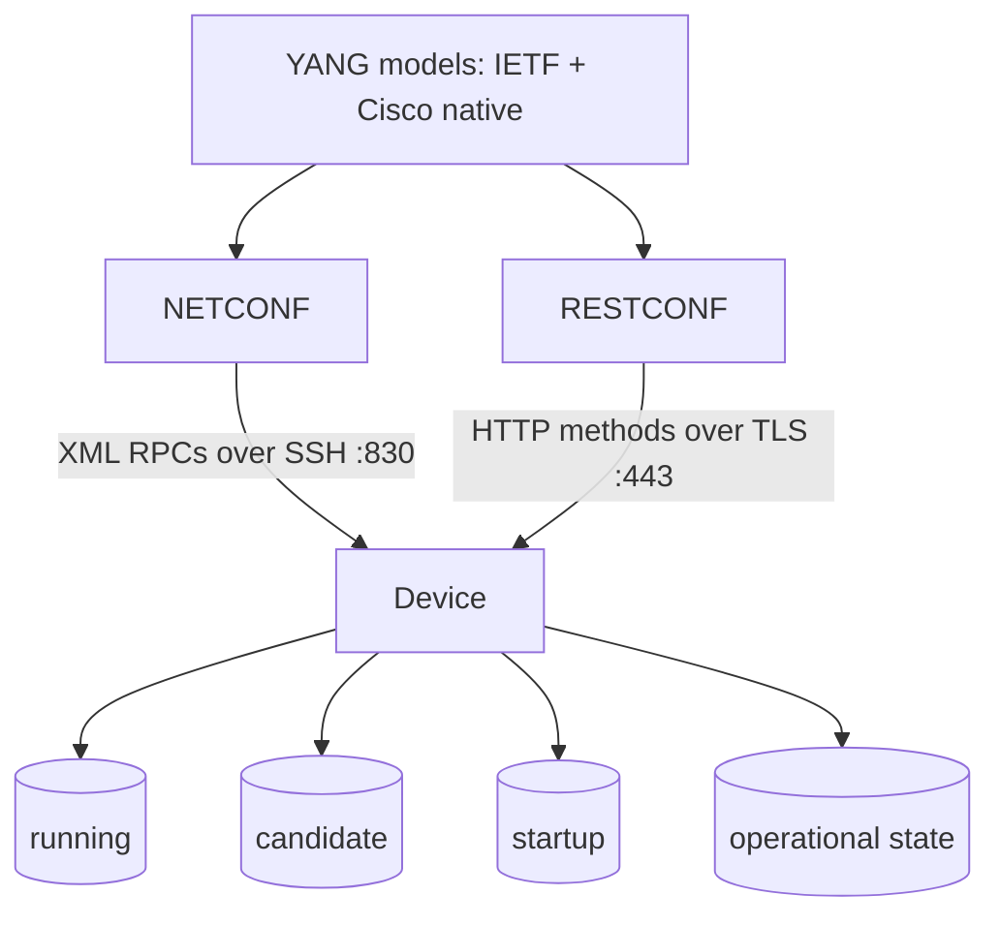
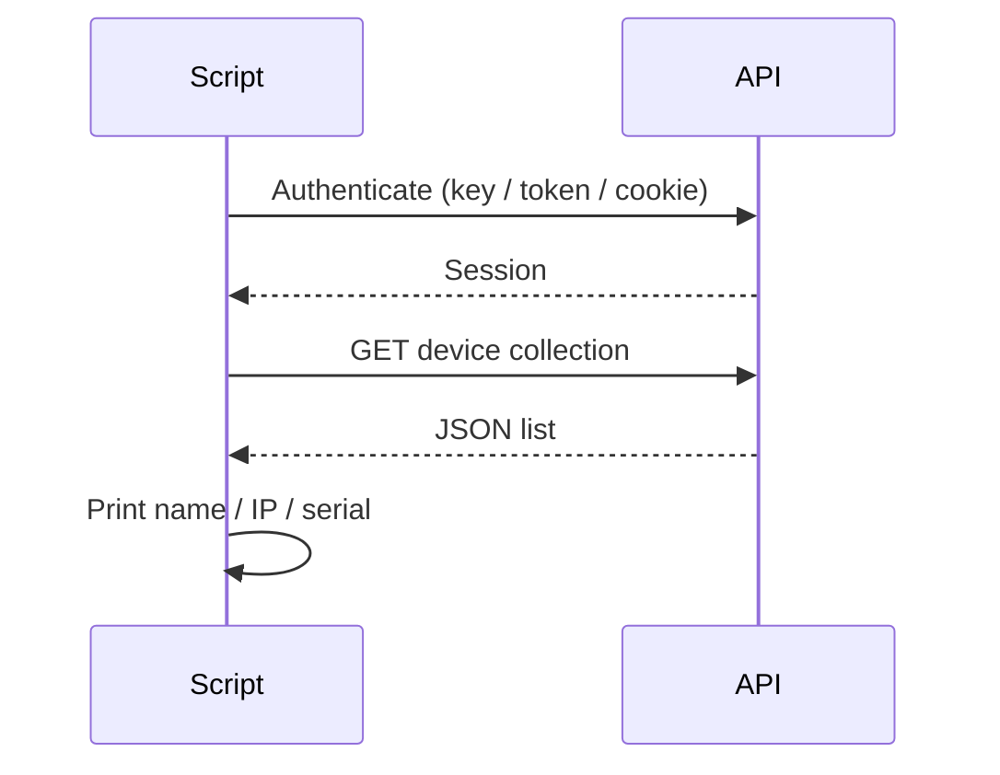
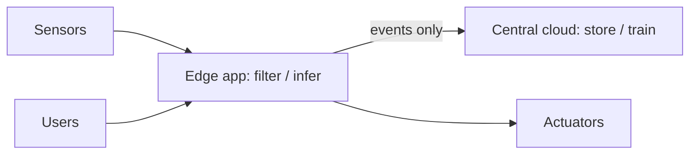
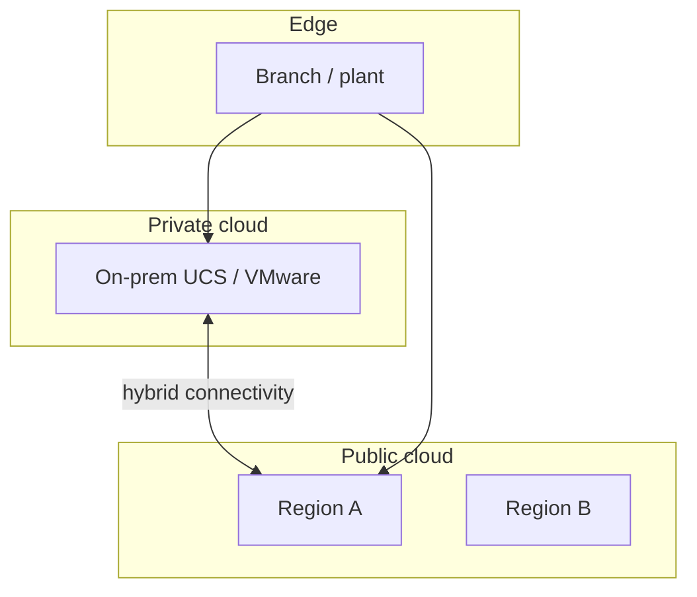
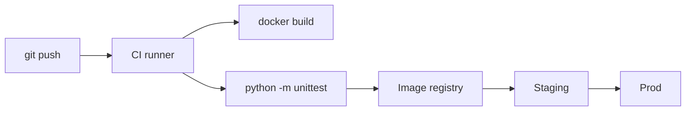
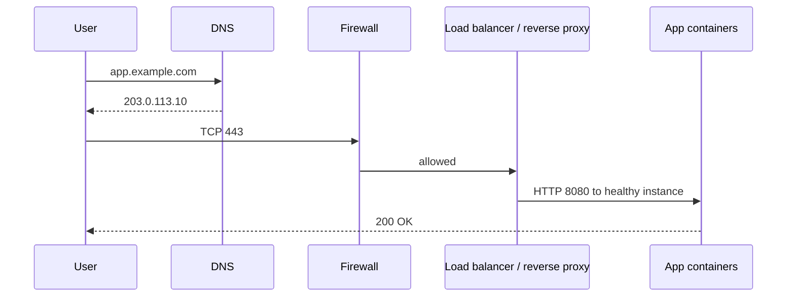
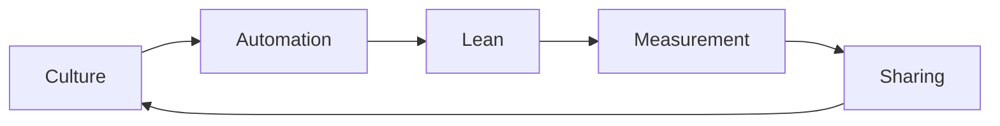

# 3.0 Cisco Platforms and Development — 15%

Domain 3 is where the exam stops treating APIs as an abstract REST skill and starts treating them as **Cisco products you can talk to**. You already know HTTP methods, JSON, auth headers, and status codes from Domain 2. Here you apply that knowledge to real controller and device APIs: Meraki, Catalyst Center, ACI, Catalyst SD-WAN, NSO, compute (UCS / Intersight), collaboration (Webex / CUCM), security platforms, and on-box IOS XE / NX-OS programmability.

The exam does **not** make you a product administrator. The verb on most of 3.2–3.7 is **Describe**. That means: what the platform is for, what its API is used for, how you typically authenticate, and which resources you would query. 3.1 and 3.9 are **Construct**: given SDK or API docs, you write working Python. 3.8 is **Apply**: YANG, NETCONF, and RESTCONF in a Cisco environment — this one needs extra technical depth.

Credentials in this chapter are placeholders. Always-On and reservable sandboxes at [https://devnetsandbox.cisco.com/](https://devnetsandbox.cisco.com/) now often issue **per-session** usernames and passwords. Copy them into `labs/.env` from `labs/.env.example`. Never paste blog passwords from 2019 into a script.



---

## 3.1 Construct a Python script that uses a Cisco SDK given SDK documentation

### 1. What Cisco expects me to know

**Construct** means you can read SDK documentation (classes, methods, required arguments, return types) and write a Python script that authenticates, calls a method, and uses the result. You are not expected to memorize every method of every Cisco SDK. You are expected to recognize the **SDK pattern**: instantiate a client with credentials, call a resource method, handle the response object.

Cisco publishes Python SDKs for many platforms (Meraki `meraki`, Catalyst Center `dnacentersdk`, Webex `webexpythonsdk`, ACI `cobra` / `acicobra`, and others). The exam can give you a snippet of documentation and ask you to complete a script. Lab `labs/05_cisco_apis/sdk_pattern.py` is a miniature version of that pattern so you can practice without depending on a package that changes.

### 2. Detailed explanation

An SDK (Software Development Kit) wraps raw HTTP so you do not assemble URLs and headers by hand. Under the hood it still does REST: it sets `Accept: application/json`, injects an API key or Bearer token, serializes Python dicts to JSON, and deserializes JSON back to Python objects.

When you read SDK docs, extract four facts:

1. **How the client is constructed.** Constructor arguments are almost always base URL (sometimes implied), API key or username/password, and optional `verify` for TLS.
2. **How resources are namespaced.** Meraki uses `dashboard.organizations.getOrganizations()`. Catalyst Center SDK uses `dnac.devices.get_device_list()`. Webex SDK uses `api.rooms.list()`.
3. **Required vs optional parameters.** Path parameters (org id, room id) are required. Query parameters (`timespan`, `family`) are optional.
4. **What comes back.** A `list` of dicts, a generator, or a response object with `.response` or `.items`.

Compare that to raw `requests`:

| Approach | You write | You must know |
| --- | --- | --- |
| Raw REST | URL, headers, JSON body, status check | HTTP details |
| SDK | Client + method + kwargs | Class/method names from docs |

An SDK does **not** remove the need to understand the product model. If Meraki is org → network → device, the SDK methods still follow that hierarchy. If Catalyst Center needs a token first, the SDK obtains it in `__init__` and you never see `POST /dna/system/api/v1/auth/token` — unless you read the source.

Typical failure modes when using an SDK:

- Passing a REST path as a method argument (`"/organizations"`) when the method already encodes the path.
- Forgetting that some SDKs return generators (you must iterate or call `list()`).
- Disabling TLS verify in a lab (`verify=False`) and then leaving it that way in a real script.
- Mixing SDK versions: `webexteamssdk` was renamed; current package is `webexpythonsdk`. `dna_center` hostnames still appear in older docs; the product is Catalyst Center.

### 3. Syntax and examples

**Pattern (local teaching SDK)** — same idea as `labs/05_cisco_apis/sdk_pattern.py`:

```python
from dataclasses import dataclass
import requests

@dataclass
class InventorySDK:
    base_url: str
    token: str
    verify: bool = True

    def _headers(self) -> dict:
        return {
            "Authorization": f"Bearer {self.token}",
            "Accept": "application/json",
        }

    def get_devices(self, family: str | None = None) -> list[dict]:
        params = {"family": family} if family else None
        r = requests.get(
            f"{self.base_url}/devices",
            headers=self._headers(),
            params=params,
            timeout=15,
            verify=self.verify,
        )
        r.raise_for_status()
        return r.json()

sdk = InventorySDK(base_url="https://controller.example.com/api", token="lab-token")
# devices = sdk.get_devices(family="Switches and Hubs")
```

**Meraki official SDK** (install with `pip install meraki`; docs at [https://developer.cisco.com/meraki/api-v1/getting-started/](https://developer.cisco.com/meraki/api-v1/getting-started/)):

```python
import os
import meraki

dashboard = meraki.DashboardAPI(
    api_key=os.environ["MERAKI_API_KEY"],
    base_url="https://api.meraki.com/api/v1",
    suppress_logging=True,
)
orgs = dashboard.organizations.getOrganizations()
org_id = orgs[0]["id"]
devices = dashboard.organizations.getOrganizationDevices(org_id)
for device in devices:
    print(device["name"], device["serial"], device.get("lanIp"))
```

**Catalyst Center SDK** (`dnacentersdk`; getting started: [https://developer.cisco.com/docs/catalyst-center/getting-started/](https://developer.cisco.com/docs/catalyst-center/getting-started/)):

```python
import os
from dnacentersdk import DNACenterAPI

dnac = DNACenterAPI(
    username=os.environ["CATALYST_CENTER_USER"],
    password=os.environ["CATALYST_CENTER_PASSWORD"],
    base_url=f"https://{os.environ['CATALYST_CENTER_HOST']}",
    version="2.3.7.6",
    verify=False,  # lab sandboxes often use a private CA
)
devices = dnac.devices.get_device_list()
for row in devices["response"]:
    print(row["hostname"], row["managementIpAddress"])
```

Notice the class is still named `DNACenterAPI`. The product was rebranded to **Cisco Catalyst Center**; many URLs and SDK names still contain `dna`.

**Webex SDK** (docs: [https://developer.webex.com/docs/getting-started](https://developer.webex.com/docs/getting-started)):

```python
import os
from webexpythonsdk import WebexAPI

api = WebexAPI(access_token=os.environ["WEBEX_TOKEN"])
me = api.people.me()
room = api.rooms.create(title="CCNAAUTO SDK lab")
api.messages.create(roomId=room.id, text=f"Hello from {me.displayName}")
```

When SDK docs show a method signature such as `getOrganizationDevices(organizationId, **kwargs)`, the exam-style task is: create the client, obtain `organizationId` from a prior call, then call that method. You map documentation parameter names onto Python kwargs.

### 4. Exam-style understanding

Given a documentation snippet, ask:

- What object do I instantiate, and with which credentials?
- Which method matches the required operation (list devices, send a message, get a token)?
- Which value from call A becomes an argument to call B? (org id → device list; room id → messages)
- Does the return value need indexing (`["response"]`, `["items"]`, or a plain list)?

Common traps:

- Using `requests.get` inside a question that already imported an SDK — they want the SDK method.
- Hard-coding a token in source. The professional pattern is `os.environ[...]` (see `labs/.env.example`).
- Confusing **library name** (`dnacentersdk`) with **product name** (Catalyst Center) with **URL prefix** (`/dna/`).

If two answers both “work,” prefer the one that matches the documentation’s method name exactly.

### 5. Hands-on exercise

1. Read `labs/05_cisco_apis/sdk_pattern.py` and run it. Confirm the fake SDK injects an `Authorization: Bearer` header (httpbin echoes headers).
2. Open [https://developer.cisco.com/meraki/api-v1/getting-started/](https://developer.cisco.com/meraki/api-v1/getting-started/) and locate `getOrganizations` and `getOrganizationDevices`. Write a five-line script that uses `meraki.DashboardAPI` instead of raw `requests`. Compare it to `labs/05_cisco_apis/meraki_list_devices.py`.
3. Optional: `pip install dnacentersdk`, reserve a Catalyst Center sandbox at [https://devnetsandbox.cisco.com/](https://devnetsandbox.cisco.com/), put host/user/password in `labs/.env`, and list devices with `DNACenterAPI` as shown above.

---

## 3.2 Describe the capabilities of Cisco network management platforms and APIs (Meraki, Cisco Catalyst Center, ACI, Cisco Catalyst SD-WAN, and NSO)

### 1. What Cisco expects me to know

**Describe** the five named platforms: what job each one does in a network, what its API is for, how you typically authenticate, and which resources you would list or change. You will not configure a full SD-WAN overlay or design an ACI fabric on this exam. You will distinguish “cloud dashboard for branch/wireless” from “on-prem campus controller” from “data-center policy fabric” from “WAN overlay manager” from “service orchestrator.”

Official starting points:

- Meraki: [https://developer.cisco.com/meraki/api-v1/getting-started/](https://developer.cisco.com/meraki/api-v1/getting-started/)
- Catalyst Center: [https://developer.cisco.com/docs/catalyst-center/getting-started/](https://developer.cisco.com/docs/catalyst-center/getting-started/)
- ACI: [https://developer.cisco.com/docs/aci/](https://developer.cisco.com/docs/aci/)
- NSO: [https://developer.cisco.com/docs/nso/](https://developer.cisco.com/docs/nso/)

### 2. Detailed explanation

**Meraki** is a **cloud-managed** networking family (MR wireless, MS switching, MX security/SD-WAN, cameras, sensors). The source of truth is the Meraki Dashboard in Cisco’s cloud, not an on-prem controller you install. The Dashboard API is REST + JSON at `https://api.meraki.com/api/v1`. Authentication is a Dashboard API key in the header `X-Cisco-Meraki-API-Key`. The object tree is **organization → networks → devices / clients / SSIDs / VLANs**. Use it to inventory hardware, list clients seen on a network, pull traffic analytics, and change a subset of dashboard settings programmatically. Rate limits are strict (typically a small number of GETs per second per org); production scripts must backoff on HTTP 429.

**Cisco Catalyst Center** (formerly **Cisco DNA Center**; REST paths still start with `/dna/`) is an **on-premises** (or Cisco-hosted) campus/branch controller: inventory, assurance, software image management, Plug and Play, templates, and intent-based policy. You authenticate with HTTP Basic against `POST /dna/system/api/v1/auth/token` and then send `X-Auth-Token` on subsequent calls. Intent APIs live under `/dna/intent/api/v1/...`. A representative read is `GET /dna/intent/api/v1/network-device`. Use it when the campus is Catalyst switching/wireless and you need a single API for inventory, health, and clients — not when the estate is Meraki cloud.

**ACI (Application Centric Infrastructure)** is a **data-center leaf/spine fabric**. The controller is **APIC** (Application Policy Infrastructure Controller). The API is REST (JSON or XML) against the APIC; there is also the Cobra Python object model. You log in with `POST /api/aaaLogin.json` and receive a token cookie (`APIC-Cookie`). Everything is a managed object in a MIT (Management Information Tree): tenants, application profiles, EPGs, bridge domains, contracts. You query by class (`/api/class/fvTenant.json`) or distinguished name. Use ACI APIs to automate fabric policy, not campus QoS.

**Cisco Catalyst SD-WAN** (formerly Viptela / Viptela-based SD-WAN; people still say “vManage”) is the WAN overlay: vBond, vSmart, vManage, and WAN edge routers (vEdge / Catalyst 8xxx / ISR with SD-WAN image). The **vManage API** is REST. You typically `POST` to a session/token endpoint, then reuse a `JSESSIONID` cookie or token header to list devices, templates, and statistics. Use it to inventory WAN edges, push device templates, and read overlay health — not to manage a Meraki MX (that is Dashboard) and not to manage an ACI leaf.

**NSO (Network Services Orchestrator)** is a **multi-vendor service orchestrator**, not a device controller for one domain. You define **service models** (YANG) that map to **device models**. Northbound, NSO speaks REST, RESTCONF, and NETCONF. Southbound, it talks to devices via CLI, NETCONF, SNMP, and vendor APIs. Use NSO when the requirement is “provision a L3VPN / VLAN / ACL as a service across many devices,” not “get a wireless client list from one dashboard.” Docs: [https://developer.cisco.com/docs/nso/](https://developer.cisco.com/docs/nso/).



### 3. Syntax and examples

**Meraki — list organizations (raw REST):**

```http
GET https://api.meraki.com/api/v1/organizations
X-Cisco-Meraki-API-Key: <dashboard-api-key>
Accept: application/json
```

**Catalyst Center — token then devices:**

```http
POST https://{host}/dna/system/api/v1/auth/token
Authorization: Basic base64(user:password)

GET https://{host}/dna/intent/api/v1/network-device
X-Auth-Token: <Token from previous JSON>
```

**ACI — login then class query:**

```http
POST https://{apic}/api/aaaLogin.json
Content-Type: application/json

{"aaaUser": {"attributes": {"name": "admin", "pwd": "<password>"}}}
```

```http
GET https://{apic}/api/class/fabricNode.json
Cookie: APIC-Cookie=<token>
```

**Catalyst SD-WAN (vManage) — session then device list (shape; exact path can vary by version):**

```http
POST https://{vmanage}/j_security_check
Content-Type: application/x-www-form-urlencoded

j_username=user&j_password=pass
```

Then `GET /dataservice/device` with the session cookie. Some versions also expose a token endpoint; always follow the API doc for the sandbox version you reserved.

**NSO — REST northbound (example shape):**

```http
GET https://{nso}/restconf/data/tailf-ncs:devices/device
Accept: application/yang-data+json
Authorization: Basic ...
```

NSO can also be driven with NETCONF RPCs against the same service/device tree. That is the point: NSO is a YANG datastore in front of many devices.

### 4. Exam-style understanding

Match the **requirement** to the **platform**:

| Requirement | Platform | Why |
| --- | --- | --- |
| List cloud-managed APs and MX appliances | Meraki | Dashboard is the inventory |
| Campus assurance, image upgrade, intent API | Catalyst Center | `/dna/intent` |
| Tenant / EPG / contract in a leaf-spine fabric | ACI / APIC | Policy MIT |
| List WAN edge routers in an overlay | Catalyst SD-WAN / vManage | Overlay control plane |
| Provision a service across mixed vendors | NSO | Service model + southbound |

Auth-style recognition:

- Header API key → Meraki
- Token from `/dna/system/api/v1/auth/token` + `X-Auth-Token` → Catalyst Center
- `aaaLogin.json` + cookie → ACI
- vManage session/cookie → Catalyst SD-WAN
- YANG/RESTCONF or NETCONF northbound → NSO (also used on devices; context tells you which)

Do not mix **Meraki Dashboard** with **Catalyst Center** just because both can list wireless clients. One is cloud-key REST; the other is on-prem token REST under `/dna/`.

### 5. Hands-on exercise

1. Skim the five doc landing pages listed in section 1. For each, write one sentence: purpose, auth, one resource path.
2. Run `labs/05_cisco_apis/meraki_list_devices.py` with a Dashboard key in `labs/.env` (personal non-prod org or a Meraki sandbox if listed).
3. Reserve **Catalyst Center** at [https://devnetsandbox.cisco.com/](https://devnetsandbox.cisco.com/), copy per-session credentials, run `labs/05_cisco_apis/catalyst_center_devices.py`.
4. Optional: reserve **ACI** or **SD-WAN** sandbox and issue only the login + one GET from Postman. You are proving you can authenticate and read inventory, not designing a fabric.

---

## 3.3 Describe the capabilities of Cisco compute management platforms and APIs (UCS Manager and Intersight)

### 1. What Cisco expects me to know

**Describe** two compute-management planes: **UCS Manager** (on-system / fabric-interconnect domain) and **Cisco Intersight** (cloud SaaS operations). Know what each manages (blades, rack servers, profiles, firmware), that UCS Manager’s historic API is XML-based, and that Intersight is REST with API keys. You are not racking a chassis on this exam.

### 2. Detailed explanation

**UCS Manager** runs on a pair of **Fabric Interconnects** and manages a UCS domain: blade chassis, rack-mount servers, service profiles (identity, firmware, SAN/LAN connectivity), pools, and policies. The northbound API is the **UCS XML API** (HTTPS, XML documents, cookies after `aaaLogin`). Cisco also ships a **UCS Python SDK** that wraps those XML methods so you can query `computeBlade`, `computeRackUnit`, and service-profile objects without hand-writing XML. Use UCS Manager APIs when the servers live in a classic UCS domain and the source of truth is the FI pair.

**Cisco Intersight** is a **cloud operations** platform for Cisco compute (UCS, HyperFlex, some networking, and third-party targets). You claim devices to Intersight; then you inventory, firmware, policy, and (in Intersight Service for Terraform / workflows) automate from the cloud. The API is **REST + JSON**. Authentication uses an **API key id + secret** (often as HTTP signatures) rather than a UCS Manager XML login. Use Intersight when the requirement is SaaS-wide compute ops, multi-domain inventory, or cloud-triggered workflows — not when you must talk only to an air-gapped FI with no cloud connector.

Relationship: a UCS domain can be managed locally by UCS Manager **and** claimed into Intersight. Intersight does not replace every XML API call on day one; it is the cloud control plane. For the exam, keep the split clean: **UCS Manager = domain XML/SDK**, **Intersight = cloud REST/API keys**.

### 3. Syntax and examples

**UCS Manager XML login (shape):**

```xml
<aaaLogin inName="admin" inPassword="***" />
```

Sent as an XML document over HTTPS to the FI. Subsequent queries use the returned cookie and class IDs such as `computeBlade` or `lsServer` (service profile). The Python SDK hides this:

```python
# Conceptual UCS SDK usage — connect to FI, query blades
# from ucsmsdk.ucshandle import UcsHandle
# handle = UcsHandle("10.10.20.40", "admin", password)
# handle.login()
# blades = handle.query_classid("computeBlade")
```

**Intersight REST (shape):**

```http
GET https://intersight.com/api/v1/compute/PhysicalSummaries
Authorization: <Intersight API key signature>
Accept: application/json
```

You create keys in the Intersight UI (Settings → API Keys). Scripts use the official `intersight-python` SDK or signed REST. Never commit the secret key file.

### 4. Exam-style understanding

| Question in disguise | Answer |
| --- | --- |
| On-prem FI pair, blades, service profiles, XML | UCS Manager |
| Cloud SaaS, API keys, multi-domain compute inventory | Intersight |
| Python wrapping XML class IDs | UCS Python SDK |
| REST JSON to `intersight.com` | Intersight API |

If a scenario says “no cloud connectivity,” Intersight is the wrong primary tool. If it says “one dashboard for UCS domains in three data centers,” Intersight is the intended capability.

### 5. Hands-on exercise

1. Open DevNet and search **UCS Manager** and **Intersight** API docs. Note auth type for each (XML login vs API key).
2. If an **Intersight** or **UCS** sandbox is listed at [https://devnetsandbox.cisco.com/](https://devnetsandbox.cisco.com/), reserve it and perform **one** authenticated GET (inventory). Otherwise, read a public Intersight OpenAPI spec page and write down three resource names (`compute/PhysicalSummaries`, firmware, hyperflex).
3. In your notes, draw a two-box diagram: FI domain (UCSM) versus Intersight cloud, with an optional “claim” arrow.

---

## 3.4 Describe the capabilities of Cisco collaboration platforms and APIs (Webex, Webex devices, Cisco Unified Communications Manager including AXL and UDS interfaces)

### 1. What Cisco expects me to know

**Describe** three collaboration surfaces: **Webex** (cloud messaging/meetings/calling APIs), **Webex devices** (room/desk devices, xAPI / cloud APIs), and **Cisco Unified Communications Manager (CUCM)** with **AXL** (admin SOAP) and **UDS** (user-facing REST). You should know which API you use to create a space and post a message versus which API you use to add a phone DN on a cluster.

Webex getting started: [https://developer.webex.com/docs/getting-started](https://developer.webex.com/docs/getting-started)

### 2. Detailed explanation

**Webex** (formerly Webex Teams / Spark) is Cisco’s cloud collaboration platform. The REST API at `https://webexapis.com/v1` uses an **OAuth or bot Bearer token**: `Authorization: Bearer <token>`. Core resources for this exam:

- `/people` — users; `GET /people/me` is the identity check
- `/rooms` — spaces (the product UI says “spaces”; the API still says rooms)
- `/memberships` — participants in a space
- `/messages` — posts in a space (and direct messages)
- `/webhooks` — notifications when messages or memberships change (Domain 2 overlap)

Bots and integrations are first-class: you create a bot at the developer portal, copy its token, and it posts as that bot identity.

**Webex devices** (Room Kit, Board, Desk) expose **xAPI** (in-room: SSH/HTTP to the codec; cloud: Control Hub / xAPI over the Webex cloud). You can set volume, place a call, send a message to the on-screen UI, or read people-count. For the exam, remember: **cloud Webex REST is for spaces/messages; device xAPI is for the hardware in the room.**

**CUCM** is the on-premises call-control cluster (phones, DNs, partitions, route patterns). Two APIs appear on the blueprint:

- **AXL (Administrative XML)** — SOAP/XML over HTTPS. This is the **admin** interface: add a user, add a phone, change a DN. You enable the AXL web service on CUCM and authenticate as an AXL-privileged application user. Payloads are XML envelopes, not JSON.
- **UDS (User Data Services)** — **REST** interface aimed at **user-facing** apps: directory lookup, user settings, extension mobility-style data. UDS is not the tool you use to provision 5,000 phones; AXL is.

Do not confuse Webex Calling APIs (cloud PSTN/calling) with CUCM AXL. The blueprint groups Webex and CUCM together as collaboration, but the **protocol split** (REST Bearer vs SOAP AXL vs REST UDS) is the scoring detail.

### 3. Syntax and examples

**Webex — list spaces and post a message:**

```http
GET https://webexapis.com/v1/rooms
Authorization: Bearer <token>

POST https://webexapis.com/v1/messages
Authorization: Bearer <token>
Content-Type: application/json

{"roomId": "Y2lzY29zcGFyazovL3VzL1JPT00v...", "text": "Interface Gig1 is down"}
```

Python equivalent is in `labs/05_cisco_apis/webex_rooms.py`.

**CUCM AXL — SOAP shape (not JSON):**

```xml
<soapenv:Envelope xmlns:soapenv="http://schemas.xmlsoap.org/soap/envelope/"
                  xmlns:ns="http://www.cisco.com/AXL/API/14.0">
  <soapenv:Body>
    <ns:getPhone>
      <name>SEPAAAABBBBCCCC</name>
    </ns:getPhone>
  </soapenv:Body>
</soapenv:Envelope>
```

Posted to `https://{cucm}:8443/axl/` with HTTP Basic.

**UDS — REST directory (shape):**

```http
GET https://{cucm}:8443/cucm-uds/users
Accept: application/xml
```

UDS responses are typically XML even though the style is REST. That is a frequent “gotcha” if you expected JSON.

### 4. Exam-style understanding

| Task | Interface |
| --- | --- |
| Create a Webex space, add a person, post text | Webex REST `/rooms` `/memberships` `/messages` |
| Mute a Room Kit or set do-not-disturb on the codec | Webex devices / xAPI |
| Add a phone and DN on a CUCM cluster | AXL (SOAP admin) |
| Let a custom app look up a user in the corporate directory | UDS |

If the payload in a question is an XML SOAP envelope with `getPhone`, the answer is AXL, not Webex. If the header is `Authorization: Bearer` and the host is `webexapis.com`, it is Webex.

### 5. Hands-on exercise

1. Create a free Webex account and a **Bot** at [https://developer.webex.com/docs/getting-started](https://developer.webex.com/docs/getting-started). Put the token in `labs/.env` as `WEBEX_TOKEN`.
2. Run `labs/05_cisco_apis/webex_rooms.py`. Confirm it creates a space, posts a message, lists memberships, then deletes the space.
3. In the Webex API Reference, open **Rooms**, **Messages**, and **Memberships**. Note required fields (`title`, `roomId`, `personEmail`).
4. Optional CUCM: only if a CUCM sandbox is available — send one AXL `getVersion` (or equivalent) from Postman. Skip if you have no cluster; reading a sample AXL envelope is enough to recognize SOAP vs REST.

---

## 3.5 Describe the capabilities of Cisco security platforms and APIs (XDR, Firepower, Secure Connect, Secure Endpoint, ISE, and Secure Malware Analytics)

### 1. What Cisco expects me to know

**Describe** each named security platform at capability level: what it does, what its API is used for, and the kind of resource you would query (incidents, events, sessions, samples). This is not a CCNP Security course. Product names have shifted; follow the **official 200-901 list** below, and treat older names as aliases you might still see in docs.

### 2. Detailed explanation

**Cisco XDR** (Extended Detection and Response) correlates detections across email, endpoint, network, and cloud into **incidents** a SOC can hunt. APIs are REST: list incidents, pull related observables, update investigation status. Think “single investigation object that stitches Firepower events + Secure Endpoint events + email,” not “configure an ACL on a firewall.” Older materials may mention **SecureX**; XDR is the blueprint name for this correlation layer.

**Firepower** here means the **Firepower / FTD** threat-defense family managed by **FMC (Firepower Management Center)** or cloud management. The **FMC REST API** is used for access policies, network objects, and events (intrusion, connection, malware). Auth is typically a token from a username/password login against FMC, then a header on later calls. Use it to automate object creation or pull events — not to replace the entire FMC GUI on the exam.

**Cisco Secure Connect** is on the official v1.1 blueprint. It is Cisco’s **SASE / secure access** offering: users and branches connect to a cloud-delivered security stack (secure web gateway, zero-trust access, DNS-layer security, and related services) instead of backhauling everything to a DC firewall. APIs expose reporting, identity/connector status, and policy for that cloud edge. **Cisco Umbrella** still appears in older exam matrices and in lots of sample code because DNS-layer security and much of the Secure Access DNA came from Umbrella. For this exam, if the blueprint says Secure Connect, describe **cloud SASE/secure access APIs**; if a lab or older question says Umbrella, recognize it as the DNS/cloud-security ancestor/component of that story — do not ignore the official name.

**Cisco Secure Endpoint** is the **endpoint** AMP successor (you will still see **AMP for Endpoints** in URLs and SDKs). APIs list **computers**, **events** (detections, quarantines), and **file lists**. Auth is typically an API client id/key. Use it to ask “which hosts saw this SHA256?” not “which switch port is this MAC on?” (that is Catalyst Center / Meraki).

**Cisco ISE (Identity Services Engine)** is the **policy and identity** engine: 802.1X, profiling, guest, pxGrid. Two developer surfaces matter:

- **ERS (External RESTful Services)** — REST for admin objects: network devices, endpoint groups, internal users, anc policies.
- **pxGrid** — a publish/subscribe and query bus so other platforms (Firepower, XDR, Rapid Threat Containment) learn session/identity context.

Use ISE APIs when the data is **who/what/where on the network** (session, identity group), not packet captures.

**Cisco Secure Malware Analytics** is the **Threat Grid** malware sandbox: you submit a file or URL, the service detonates it, and you retrieve behavioral indicators, network callbacks, and scores via API. Use it when the workflow is “detonate this sample,” not “block this IP on FMC” (though XDR/FMC may consume the result).



### 3. Syntax and examples

Illustrative REST shapes (hosts and exact paths vary by region and version — use the product’s API reference):

```http
GET https://{xdr}/iroh/iroh-intel/investigate/incidents
Authorization: Bearer <xdr-token>
```

```http
POST https://{fmc}/api/fmc_platform/v1/auth/generatetoken
Authorization: Basic ...
```

```http
GET https://api.amp.cisco.com/v1/computers
Authorization: Basic <secure-endpoint-client-credentials>
```

```http
GET https://{ise}:9060/ers/config/networkdevice
Accept: application/json
Authorization: Basic <ers-admin>
```

```http
POST https://panacea.threatgrid.com/api/v2/samples
```

(Secure Malware Analytics / Threat Grid sample submit; API key as a query or header per current docs.)

You do not need to memorize every path. You need to recognize **incident correlation (XDR)**, **firewall policy/events (Firepower/FMC)**, **SASE/cloud access (Secure Connect)**, **endpoint computers/events (Secure Endpoint)**, **identity/policy (ISE ERS/pxGrid)**, **sandbox detonation (Secure Malware Analytics)**.

### 4. Exam-style understanding

| Need | Platform |
| --- | --- |
| Stitch detections into one incident | XDR |
| Access-control policy objects / IPS events | Firepower / FMC |
| Cloud user/branch secure access (SASE) | Secure Connect |
| Host quarantine events, SHA256 on a laptop | Secure Endpoint |
| 802.1X session, ANC, network device objects | ISE |
| Detonate a suspicious binary | Secure Malware Analytics |

Name-change traps: AMP → Secure Endpoint; Threat Grid → Secure Malware Analytics; Umbrella → related to Secure Connect / Secure Access; DNA Center is **not** a security platform in 3.5 (it is 3.2).

### 5. Hands-on exercise

1. Make a six-row table in your notes: platform, one-line job, auth style, one resource.
2. Browse DevNet docs for **ISE ERS** and **Secure Endpoint** (AMP) — they have the most approachable REST examples.
3. If a **SecureX / XDR** or **ISE** sandbox appears at [https://devnetsandbox.cisco.com/](https://devnetsandbox.cisco.com/), reserve it and perform a single authenticated list call. Otherwise, skip live labs; 3.5 is Describe, not Construct.

---

## 3.6 Describe the device level APIs and dynamic interfaces for IOS XE and NX-OS

### 1. What Cisco expects me to know

**Describe** how you program **the device itself** (not a controller) on **IOS XE** and **NX-OS**: NETCONF, RESTCONF, gNMI (IOS XE), on-box Python / Guest Shell, NX-API CLI (JSON-RPC), and NX-API REST. Know default transports (NETCONF 830/tcp SSH, RESTCONF 443 HTTPS) and that these APIs are **model-driven or CLI-encoded**, unlike expect/SSH scraping.

NX-OS developer docs: [https://developer.cisco.com/docs/nx-os/](https://developer.cisco.com/docs/nx-os/)

### 2. Detailed explanation

**IOS XE** (Catalyst 9000, Catalyst 8000 / CSR-like routers, many ISR/ASR with XE) enables a programmability stack:

- **NETCONF** — XML RPCs over SSH, port **830/tcp**. YANG models (IETF + Cisco-IOS-XE-native).
- **RESTCONF** — HTTPS, usually **443**, YANG identified in the URL, JSON or XML encoding, media type `application/yang-data+json`.
- **gNMI / gRPC** — streaming telemetry and set/get using protobuf; common for high-scale telemetry, less for “first REST lab.”
- **Guest Shell** — a CentOS/Alma-like container on the device (`guestshell enable`) where you run **on-box Python**, EEM-triggered scripts, and even `pip` in that environment. The script runs **on the router**, not on your laptop.
- **On-box Python** — IOS XE can also run Python in other on-box contexts; Guest Shell is the one you should be able to name.
- **Model-driven telemetry** — periodic or on-change YANG subscriptions (dial-out/dial-in).

You still use SSH/CLI, SNMP, and RESTCONF together; the exam wants you to pick the **API that matches the job** (structured config get → NETCONF/RESTCONF; on-box reaction to syslog → Guest Shell Python).

**NX-OS** (Nexus switching, especially **Nexus 9000**) adds Cisco’s own HTTP APIs on top of the same industry stack on many platforms:

- **NX-API CLI** — HTTPS JSON-RPC (or XML) that sends **CLI commands** and returns structured output. This is “CLI over HTTP,” not YANG. You POST a JSON body with `"cmd": "show version"` to `/ins`.
- **NX-API REST** — object-based REST for DME (Data Management Engine) objects on NX-OS; different from NX-API CLI.
- **NETCONF / RESTCONF** — available on many Nexus 9K images; same YANG idea as IOS XE, different native models (`Cisco-NX-OS-device` vs `Cisco-IOS-XE-native`).
- **on-box Python / Guest Shell** — similar idea to IOS XE on supported Nexus platforms.
- **NX-SDK / NX-API** — for custom on-switch applications (beyond CCNA Automation depth).

**Dynamic interfaces** in this objective means the **programmable interfaces that change with the device model** (YANG-driven NETCONF/RESTCONF, NX-API object model), not a “dynamic interface” as in Frame Relay. Open-source and Cisco tools discover capabilities at run time (`hello` in NETCONF, YANG library in RESTCONF).

Enablement (conceptual IOS XE):

```text
netconf-yang
restconf
ip http secure-server
```

Without those, your laptop script gets connection refused or 404. Sandbox images usually have them on.

### 3. Syntax and examples

**RESTCONF on IOS XE** (see `labs/06_yang_netconf_restconf/restconf_get_interfaces.py`):

```http
GET https://{host}:443/restconf/data/ietf-interfaces:interfaces
Accept: application/yang-data+json
Authorization: Basic ...
```

**NETCONF on IOS XE** (see `labs/06_yang_netconf_restconf/netconf_get_config.py`): TCP 830, XML `<get-config>`, datastore `running`.

**NX-API CLI JSON-RPC:**

```http
POST https://{nexus}/ins
Content-Type: application/json

{
  "ins_api": {
    "version": "1.0",
    "type": "cli_show",
    "chunk": "0",
    "sid": "1",
    "input": "show version",
    "output_format": "json"
  }
}
```

**Guest Shell (IOS XE CLI):**

```text
guestshell enable
guestshell run python3
```

Inside Guest Shell you can `import cli` (Cisco-provided) to run IOS commands from Python on-box.

### 4. Exam-style understanding

| Feature | IOS XE | NX-OS |
| --- | --- | --- |
| NETCONF 830 | Yes (enable `netconf-yang`) | Yes on many 9K |
| RESTCONF 443 | Yes (`restconf`) | Yes on many 9K |
| JSON-RPC CLI over HTTP | Not the headline API | **NX-API CLI** |
| On-box Linux + Python | Guest Shell | Guest Shell / bash (platform-dependent) |
| Native YANG | Cisco-IOS-XE-native | Cisco-NX-OS-device |

If the question shows a JSON body with `ins_api` and `cli_show`, that is **NX-API CLI**, not RESTCONF. If the URL contains `/restconf/data/` and `ietf-interfaces`, that is RESTCONF (either OS). If the person is SSH’d to the router running Python locally, that is **on-box / Guest Shell**, not your laptop `requests` script.

### 5. Hands-on exercise

1. Launch **IOS XE on Catalyst 8000 Always-On** (or reservable IOS XE) at [https://devnetsandbox.cisco.com/](https://devnetsandbox.cisco.com/). Copy **this session’s** host/user/password into `labs/.env`. Do not reuse passwords from old blog posts.
2. Run `python labs/06_yang_netconf_restconf/restconf_get_interfaces.py` and `python labs/06_yang_netconf_restconf/netconf_get_config.py`.
3. Open [https://developer.cisco.com/docs/nx-os/](https://developer.cisco.com/docs/nx-os/) and find an NX-API CLI example. Compare the JSON body to RESTCONF. Write one sentence: “NX-API CLI sends CLI; RESTCONF sends YANG resource paths.”
4. Optional: reserve a Nexus sandbox and POST `show version` via NX-API in Postman.

---

## 3.7 Describe the appropriate DevNet resource for a given scenario (Sandbox, Code Exchange, support, forums, Learning Labs, and API documentation)

### 1. What Cisco expects me to know

**Describe** which **DevNet** resource you would use for a given job: try a live API, copy sample code, take a guided lab, read a reference, or ask for help. The list on the blueprint is: **Sandbox, Code Exchange, support, forums, Learning Labs, and API documentation**.

### 2. Detailed explanation

**Sandbox** — [https://devnetsandbox.cisco.com/](https://devnetsandbox.cisco.com/) — hosted labs: Always-On (shared, sometimes busy, credentials often **per-session**) and reservable (you get a VPN or proxy and a private topology for a few hours). Use a sandbox when you need a **real APIC / Catalyst Center / IOS XE / vManage** and you do not have hardware. Sandboxes are not production. They reset. They are the correct answer to “I need to test NETCONF against IOS XE for free.”

**Code Exchange** — [https://developer.cisco.com/codeexchange/](https://developer.cisco.com/codeexchange/) — a catalog of **sample projects** (often GitHub) tagged by product. Use it when you want a **starting repository** (Ansible role, Python collector, Terraform provider example), not the authoritative method-by-method reference.

**API documentation** — product-specific reference (OpenAPI, resource lists, auth). Examples: Meraki API v1, Catalyst Center APIs, NX-OS, NSO, Webex. Use docs when you need **exact paths, schemas, and status codes**. Docs do not give you a live device; the sandbox does.

**Learning Labs** — guided, in-browser or step-by-step DevNet courses (REST, Python, specific APIs). Use them when you need a **tutorial path**, not a copy-paste production SDK.

**Forums** — DevNet Community / Cisco community boards. Use them when you have a **specific error** (401 on token, YANG path 404) and docs plus sandbox still fail. Forums are not authoritative API contracts.

**Support** — TAC / DevNet support / product support depending on entitlement. Use support when you have a **production outage or a defect**, not when you are still learning `requests.get`. For exam purposes: sandbox + docs + Code Exchange are self-serve; support is the escalation path for customers with a contract.

### 3. Syntax and examples

There is no CLI for this objective. Practice the **mapping**:

```text
Need a live Catalyst Center → Sandbox
Need the JSON schema for GET /networks/{id}/clients → API documentation
Need a GitHub sample that already uses dnacentersdk → Code Exchange
Need a 20-minute walkthrough of RESTCONF → Learning Labs
Need help with a 500 from a shared Always-On box after checking docs → Forums
Production NSO bug on a paid deployment → Support / TAC
```

Bookmark:

- Sandbox: [https://devnetsandbox.cisco.com/](https://devnetsandbox.cisco.com/)
- Code Exchange: [https://developer.cisco.com/codeexchange/](https://developer.cisco.com/codeexchange/)
- Meraki docs: [https://developer.cisco.com/meraki/api-v1/getting-started/](https://developer.cisco.com/meraki/api-v1/getting-started/)
- Catalyst Center docs: [https://developer.cisco.com/docs/catalyst-center/getting-started/](https://developer.cisco.com/docs/catalyst-center/getting-started/)
- ACI docs: [https://developer.cisco.com/docs/aci/](https://developer.cisco.com/docs/aci/)
- NSO docs: [https://developer.cisco.com/docs/nso/](https://developer.cisco.com/docs/nso/)
- Webex docs: [https://developer.webex.com/docs/getting-started](https://developer.webex.com/docs/getting-started)

### 4. Exam-style understanding

The exam likes **scenario → resource**:

- “You want to try the Meraki API but have no org” → Sandbox (or a free Dashboard org; sandbox is the DevNet answer).
- “You want community Python that lists SD-WAN devices” → Code Exchange.
- “You need the exact query parameter name” → API documentation.
- “You are new and want a guided NETCONF lab” → Learning Labs.
- “Docs disagree with what the sandbox returns and you need discussion” → Forums.
- “A production API is down for a customer with a contract” → Support.

Do not pick Code Exchange when the question asks for **normative** request/response fields — that is API documentation. Do not pick Sandbox when the question asks where to **find sample code** — that is Code Exchange.

### 5. Hands-on exercise

1. Log in to [https://devnetsandbox.cisco.com/](https://devnetsandbox.cisco.com/) and note one Always-On and one reservable lab. Read the **lab instructions** for credentials (session-specific).
2. Open [https://developer.cisco.com/codeexchange/](https://developer.cisco.com/codeexchange/) and search `meraki`. Star or clone nothing proprietary; just observe that samples are full projects, not API references.
3. Open Catalyst Center getting-started docs and find the token URL. Confirm it matches `labs/05_cisco_apis/catalyst_center_devices.py`.

---

## 3.8 Apply concepts of model driven programmability (YANG, RESTCONF, and NETCONF) in a Cisco environment

### 1. What Cisco expects me to know

**Apply** means you can use YANG, RESTCONF, and NETCONF together in a Cisco (typically IOS XE) environment: what each artifact is, how they relate, how data is encoded, which datastore you read or write, which RPC or HTTP method you use, which ports and auth apply, and how to read a reply. This is the deepest “describe/apply” topic in Domain 3. Labs: `labs/06_yang_netconf_restconf/` (`sample.yang`, `restconf_get_interfaces.py`, `netconf_get_config.py`, sample JSON/XML replies).

### 2. Detailed explanation

**YANG** is a **data modeling language** (RFC 7950). It is not a transport and not an encoding. A YANG module describes the shape of configuration and operational state: containers, lists, leafs, types, keys, and whether a node is `config true` (writable) or `config false` (operational only). Cisco devices and controllers load standard IETF modules (`ietf-interfaces`, `ietf-yang-library`) plus vendor modules (`Cisco-IOS-XE-native`, `Cisco-NX-OS-device`). Your script never “sends YANG” on the wire. It sends **XML or JSON that must validate against a YANG model**.

Core YANG building blocks (see the teaching excerpt `labs/06_yang_netconf_restconf/sample.yang`):

- `module` / `namespace` / `prefix` — identity of the model
- `container` — a grouping of nodes (no key)
- `list` — repeating entries with a `key`
- `leaf` — a single value with a `type`
- `config false` — operational state (e.g. `oper-status`), not saved in running-config

**NETCONF** (RFC 6241) is a **network configuration protocol**. Transport for Cisco IOS XE is **SSH on TCP port 830**. Payloads are **XML**. The client and server exchange `<hello>` with **capabilities** (which YANG modules, which datastores, which operations). Then the client sends **RPCs** (Remote Procedure Calls) and the server returns `<rpc-reply>`.

Important NETCONF operations:

| RPC | Purpose |
| --- | --- |
| `<get-config>` | Read configuration from a datastore (`running`, `candidate`, `startup`) |
| `<get>` | Read config **and** operational state (filtered) |
| `<edit-config>` | Write configuration into a datastore |
| `<copy-config>` | Copy one datastore to another |
| `<delete-config>` | Delete a datastore (not `running`) |
| `<lock>` / `<unlock>` | Exclusive access to a datastore |
| `<commit>` | Candidate → running (when candidate capability exists) |
| `<discard-changes>` | Drop uncommitted candidate edits |
| `<close-session>` / `<kill-session>` | End sessions |

**Datastores:**

- **running** — the active configuration (what the device is using)
- **candidate** — a scratch copy you edit then `<commit>` (if advertised)
- **startup** — what loads at boot (like startup-config)
- **operational** — not a NETCONF configuration datastore; operational state is read with `<get>` (and RESTCONF operational resources). YANG `config false` nodes live here conceptually.

IOS XE often exposes running (and candidate depending on image/config). Do not assume every box has a writable candidate.

**RESTCONF** (RFC 8040) is **HTTP(S) access to the same YANG data**. On IOS XE it is typically **HTTPS TCP 443**, Basic or token auth as configured, with media types:

- `application/yang-data+json`
- `application/yang-data+xml`

RESTCONF maps YANG to URLs:

```text
https://{host}/restconf/data/{module}:{container}/{list}={key}/...
```

Example: `ietf-interfaces:interfaces/interface=GigabitEthernet1`

HTTP methods:

| Method | Meaning on a data resource |
| --- | --- |
| GET | Read (config or oper depending on path) |
| POST | Create a child resource |
| PUT | Create or replace this resource |
| PATCH | Merge/edit |
| DELETE | Remove the resource |
| OPTIONS / HEAD | Discovery / headers |

RESTCONF also has `/restconf/operations/{rpc}` for YANG-defined RPCs (not the same as NETCONF’s XML `<get-config>` wrapper, but the idea of “invoke an operation” is analogous).

**How they relate:**



**Encoding:** NETCONF is XML on the wire. RESTCONF can be JSON **or** XML; Cisco labs almost always use JSON. JSON uses module prefixes in keys (`ietf-interfaces:interfaces`). XML uses namespaces (`xmlns="urn:ietf:params:xml:ns:yang:ietf-interfaces"`). Same data; different serialization.

**Auth:** NETCONF uses SSH username/password (or keys). RESTCONF uses HTTPS + HTTP Basic (common on IOS XE labs) or other HTTP auth the platform enables. Both should be treated as management-plane credentials — put them in `labs/.env`, never in Git.

**Reading responses:**

- NETCONF success: `<rpc-reply>` containing `<data>` (for gets) or `<ok/>` (for edits). Errors: `<rpc-error>` with `error-tag` (`invalid-value`, `data-missing`, `access-denied`).
- RESTCONF success: 200 (GET), 201 (created), 204 (no content). Errors: 400/404/409/415 with a YANG error JSON body. Wrong `Accept` header often yields 406/415.

Cisco-specific notes:

- Enable `netconf-yang` and `restconf` on IOS XE.
- Native model `Cisco-IOS-XE-native:native` is a large tree (hostname, interfaces, ip, etc.). IETF models are smaller and more portable.
- Filters matter. A full `<get-config>` of `running` can be huge; subtree filters (as in `netconf_get_config.py`) request one interface.

### 3. Syntax and examples

**YANG excerpt** (from `labs/06_yang_netconf_restconf/sample.yang`):

```yang
container interfaces {
  list interface {
    key "name";
    leaf name { type string; }
    leaf description { type string; }
    leaf enabled { type boolean; default "true"; }
  }
}
container interfaces-state {
  config false;
  list interface {
    key "name";
    leaf oper-status { type enumeration { enum up; enum down; enum testing; } }
  }
}
```

`interfaces` is configuration. `interfaces-state` is operational (`config false`). RESTCONF would expose them as different data resources; NETCONF `<get-config>` would **not** return `oper-status`.

**NETCONF `<get-config>`** (client sends this RPC):

```xml
<rpc xmlns="urn:ietf:params:xml:ns:netconf:base:1.0" message-id="101">
  <get-config>
    <source><running/></source>
    <filter>
      <interfaces xmlns="urn:ietf:params:xml:ns:yang:ietf-interfaces">
        <interface>
          <name>GigabitEthernet1</name>
        </interface>
      </interfaces>
    </filter>
  </get-config>
</rpc>
```

**Typical reply** (see `labs/06_yang_netconf_restconf/sample_netconf_get-config.xml`):

```xml
<rpc-reply xmlns="urn:ietf:params:xml:ns:netconf:base:1.0" message-id="101">
  <data>
    <interfaces xmlns="urn:ietf:params:xml:ns:yang:ietf-interfaces">
      <interface>
        <name>GigabitEthernet1</name>
        <description>MANAGEMENT</description>
        <enabled>true</enabled>
      </interface>
    </interfaces>
  </data>
</rpc-reply>
```

**Python NETCONF** (`ncclient`, from the lab):

```python
from ncclient import manager

with manager.connect(
    host=host, port=830, username=user, password=password,
    hostkey_verify=False, device_params={"name": "iosxe"},
    allow_agent=False, look_for_keys=False,
) as m:
    reply = m.get_config(source="running", filter=FILTER)
    print(reply.xml)
```

**RESTCONF GET** and JSON body (see `sample_restconf_get.json`):

```http
GET /restconf/data/ietf-interfaces:interfaces HTTP/1.1
Host: ios-xe.example:443
Accept: application/yang-data+json
Authorization: Basic ...
```

```json
{
  "ietf-interfaces:interfaces": {
    "interface": [
      {
        "name": "GigabitEthernet1",
        "description": "MANAGEMENT",
        "enabled": true
      }
    ]
  }
}
```

**RESTCONF PATCH** (change description — original example):

```http
PATCH /restconf/data/ietf-interfaces:interfaces/interface=GigabitEthernet1
Content-Type: application/yang-data+json

{"ietf-interfaces:interface": {"description": "UPLINK-TO-CORE"}}
```

**Python RESTCONF** (from the lab):

```python
url = f"https://{HOST}:{PORT}/restconf/data/ietf-interfaces:interfaces"
r = requests.get(
    url, auth=(USER, PASSWORD),
    headers={"Accept": "application/yang-data+json"},
    verify=False, timeout=30,
)
print(r.status_code, r.json())
```

### 4. Exam-style understanding

Keep three layers separate: **model (YANG)**, **protocol (NETCONF vs RESTCONF)**, **encoding (XML vs JSON)**.

| If you see… | It is… |
| --- | --- |
| `leaf`, `list`, `key`, `config false` | YANG |
| Port 830, `<get-config>`, `<rpc-reply>` | NETCONF |
| `/restconf/data/`, `application/yang-data+json`, GET/PATCH | RESTCONF |
| `source>running` | Configuration datastore read |
| `config false` / `interfaces-state` | Operational data; use `<get>` or RESTCONF oper path, not `<get-config>` |

Traps:

- Saying YANG is a protocol. It is not.
- Using JSON on NETCONF (standard NETCONF is XML).
- Expecting RESTCONF on port 830.
- Editing operational state.
- Forgetting `Accept: application/yang-data+json` (IOS XE may reject a generic `application/json`).
- Confusing **candidate commit** with RESTCONF PATCH to running (both can change the box; the locking/commit workflow is a NETCONF candidate feature).

### 5. Hands-on exercise

1. Read `labs/06_yang_netconf_restconf/sample.yang` and mark which nodes are config vs operational.
2. Launch IOS XE from [https://devnetsandbox.cisco.com/](https://devnetsandbox.cisco.com/). Fill `IOSXE_*` in `labs/.env` from **this** reservation.
3. Run `restconf_get_interfaces.py`. Compare live JSON to `sample_restconf_get.json`.
4. Run `netconf_get_config.py`. Compare XML to `sample_netconf_get-config.xml`. List the first few NETCONF capabilities printed by the script.
5. In Postman or `curl`, GET `Cisco-IOS-XE-native:native/hostname` with the yang-data Accept header. Then GET a nonsense path and read the error JSON — that is how you debug 404s on exam day.

---

## 3.9 Construct code to perform a specific operation based on a set of requirements and given API reference documentation such as these:

Parent objective: you are given **requirements + API docs** (not a memorized URL list) and you **construct** working code. The three examples on the blueprint are 3.9.a, 3.9.b, and 3.9.c. Treat each as its own construct skill. Always load secrets from the environment (`labs/.env.example`).

---

## 3.9.a Obtain a list of network devices by using Meraki, Cisco Catalyst Center, ACI, Cisco Catalyst SD-WAN, or NSO

### 1. What Cisco expects me to know

**Construct** a script that authenticates to **one** of these platforms and returns a device inventory. You must follow the platform’s auth and resource hierarchy. The exam can specify which platform; the skill is the same: read the reference, obtain a handle (key, token, cookie), GET the device collection, print identifiers (name, serial, management IP).

### 2. Detailed explanation

**Meraki.** Header `X-Cisco-Meraki-API-Key`. Base `https://api.meraki.com/api/v1`. Devices can be listed per organization (`GET /organizations/{orgId}/devices`) or per network (`GET /networks/{netId}/devices`). You often list organizations first, pick an id, then list devices. Fields you care about: `name`, `serial`, `model`, `lanIp`, `networkId`.

**Catalyst Center.** `POST /dna/system/api/v1/auth/token` with Basic auth → JSON `Token`. Then `GET /dna/intent/api/v1/network-device` with `X-Auth-Token`. The list is usually under `response`. Fields: `hostname`, `managementIpAddress`, `softwareType`, `serialNumber`, `family`.

**ACI.** `POST /api/aaaLogin.json` → token cookie. Devices in the fabric are `fabricNode` (leaves, spines, controllers). `GET /api/class/fabricNode.json`. Parse `imdata` → `fabricNode` attributes (`name`, `role`, `model`). This is not a campus switch inventory; it is fabric nodes.

**Catalyst SD-WAN.** Authenticate to vManage (form login or token per version). Then a device list under the dataservice API (commonly `GET /dataservice/device`). Fields include hostname, system-ip, reachability, device-type. Use the doc for **your** vManage version; path names have shifted across releases.

**NSO.** Devices are entries in the NSO device tree, not “discovered via CDP” unless you built that. RESTCONF: `GET /restconf/data/tailf-ncs:devices/device` (or REST `/api/running/devices`). You get NSO’s view of managed devices (address, authgroup, ned-id, oper-state).



### 3. Syntax and examples

**Meraki** — `labs/05_cisco_apis/meraki_list_devices.py`:

```python
orgs = get("/organizations")
org_id = orgs[0]["id"]
devices = get(f"/organizations/{org_id}/devices")
for d in devices:
    print(d.get("name"), d.get("model"), d.get("serial"), d.get("lanIp"))
```

**Catalyst Center** — `labs/05_cisco_apis/catalyst_center_devices.py`:

```python
tok = token()  # POST /dna/system/api/v1/auth/token
payload = get("/dna/intent/api/v1/network-device", tok)
for d in payload.get("response", []):
    print(d.get("hostname"), d.get("managementIpAddress"))
```

**ACI (original example):**

```python
s = requests.Session()
s.verify = False
login = s.post(
    f"https://{apic}/api/aaaLogin.json",
    json={"aaaUser": {"attributes": {"name": user, "pwd": password}}},
    timeout=30,
)
login.raise_for_status()
nodes = s.get(f"https://{apic}/api/class/fabricNode.json", timeout=30)
for item in nodes.json().get("imdata", []):
    attr = item["fabricNode"]["attributes"]
    print(attr.get("name"), attr.get("role"), attr.get("model"))
```

**SD-WAN / NSO:** follow the sandbox API doc for the exact GET. The construct pattern does not change: session first, then list, then iterate.

### 4. Exam-style understanding

Given a doc page, you should be able to fill in:

1. Base URL and auth header/body
2. The GET path for devices
3. The JSON key that holds the array (`response`, `imdata`, top-level list)
4. Two identifying fields to print

If the requirement says “Meraki” and an answer uses `X-Auth-Token`, it is wrong. If it says “Catalyst Center” and the path has no `/dna/`, be suspicious. If it says “ACI” and the script never calls `aaaLogin`, it will 403.

### 5. Hands-on exercise

1. Copy `labs/.env.example` to `labs/.env`.
2. Run `python labs/05_cisco_apis/meraki_list_devices.py` with a Dashboard key.
3. Reserve Catalyst Center; run `python labs/05_cisco_apis/catalyst_center_devices.py`.
4. Optional: ACI or SD-WAN sandbox — list nodes/devices once in Postman, then reproduce with 20 lines of Python.

---

## 3.9.b Manage spaces, participants, and messages in Webex

### 1. What Cisco expects me to know

**Construct** code that uses the Webex REST API (or SDK) to **create/list/delete spaces (rooms)**, **add/list participants (memberships)**, and **create/list messages**. Auth is a Bearer token. Docs: [https://developer.webex.com/docs/getting-started](https://developer.webex.com/docs/getting-started). Lab: `labs/05_cisco_apis/webex_rooms.py`.

### 2. Detailed explanation

Webex UI **spaces** = API **rooms**. You cannot post a message without a `roomId` (or a person id for 1:1). You cannot add a participant without `roomId` plus `personEmail` or `personId`.

REST resources:

| Resource | Path | Typical methods |
| --- | --- | --- |
| Identity | `/people/me` | GET |
| Spaces | `/rooms` | POST create, GET list, GET by id, PUT title, DELETE |
| Participants | `/memberships` | POST add, GET list by roomId, DELETE membership id |
| Messages | `/messages` | POST text/markdown/files, GET by roomId, DELETE |

Pagination uses `items` arrays. Always check `status_code` (201 create, 204 delete, 400 missing roomId, 401 bad token, 403 bot not in space).

Bots cannot add people to spaces in all the same ways a human token can; if a membership POST fails, that is often a **scope / bot limitation**, not a wrong URL. Personal access tokens from the getting-started page are the easiest for this lab.

### 3. Syntax and examples

From the lab:

```python
me = api("GET", "/people/me")
room = api("POST", "/rooms", json={"title": "CCNAAUTO lab space"})
room_id = room["id"]
api("POST", "/messages", json={"roomId": room_id, "text": "Hello from the 200-901 lab"})
messages = api("GET", "/messages", params={"roomId": room_id})
memberships = api("GET", "/memberships", params={"roomId": room_id})
api("POST", "/memberships", json={"roomId": room_id, "personEmail": "colleague@example.com"})
api("DELETE", f"/rooms/{room_id}")
```

Headers on every call:

```http
Authorization: Bearer <WEBEX_TOKEN>
Content-Type: application/json
```

Base URL: `https://webexapis.com/v1` (settable via `WEBEX_BASE` in `.env`).

### 4. Exam-style understanding

Order of operations is a scoring item: create room → capture `id` → post message with that `roomId` → list memberships. Posting a message with only `text` and no `roomId`/`toPersonEmail` is invalid.

Markdown vs text: `"markdown": "**down**"` vs `"text": "down"`. Files use a `files` URL array. You do not need file uploads for the core objective.

If a question uses the SDK, `api.rooms.create(title=...)` then `api.messages.create(roomId=..., text=...)` is the same flow.

### 5. Hands-on exercise

1. Create a bot or personal token at [https://developer.webex.com/docs/getting-started](https://developer.webex.com/docs/getting-started).
2. Set `WEBEX_TOKEN` in `labs/.env`.
3. Run `python labs/05_cisco_apis/webex_rooms.py`.
4. Extend the script: POST a membership for a second email you control, GET memberships, then DELETE the membership id before deleting the room.

---

## 3.9.c Obtain a list of clients / hosts seen on a network using Meraki or Cisco Catalyst Center

### 1. What Cisco expects me to know

**Construct** a script that lists **clients/hosts** (end users, phones, printers — not the network devices of 3.9.a) from **Meraki** or **Catalyst Center**. You must use the correct resource: Meraki network clients vs Catalyst Center client/health APIs.

### 2. Detailed explanation

A **device** in 3.9.a is infrastructure (switch, AP, gateway). A **client/host** in 3.9.c is something **seen on** the network: a MAC that associated to an SSID or learned on a switch.

**Meraki.** After you have a `networkId`:

```http
GET /networks/{networkId}/clients?timespan=86400
X-Cisco-Meraki-API-Key: ...
```

`timespan` is seconds of history. Useful fields: `mac`, `ip`, `description`, `ssid`, `vlan`, `status`. Organization-wide client search also exists, but the exam-friendly path is **network → clients**. The lab `meraki_list_devices.py` already does this after listing networks.

**Catalyst Center.** Client data is **assurance** data, not the network-device inventory. Paths vary by version; common ones:

- `GET /dna/intent/api/v1/client-health`
- `GET /dna/data/api/v1/clients` (newer data APIs)

The lab tries both and prints payload keys if one 404s. You still use the same **token** as 3.9.a. Client objects include MAC, IP, hostname, connection status, and health score.

Do not use ISE ERS here unless the question explicitly moves to identity; 3.9.c names Meraki or Catalyst Center.

### 3. Syntax and examples

**Meraki** (from the lab):

```python
networks = get(f"/organizations/{org_id}/networks")
net_id = networks[0]["id"]
clients = get(f"/networks/{net_id}/clients", params={"timespan": 86400})
for c in clients:
    print(c.get("description") or c.get("mac"), c.get("ip"), c.get("ssid"))
```

**Catalyst Center** (from the lab):

```python
tok = token()
for path in (
    "/dna/intent/api/v1/client-health",
    "/dna/data/api/v1/clients",
):
    payload = get(path, tok)
```

When reading Catalyst Center JSON, walk `response` lists; do not assume the Meraki-style top-level array.

### 4. Exam-style understanding

| Inventory | Platform call |
| --- | --- |
| APs, switches, MX | Meraki `/devices` or Catalyst `/network-device` |
| Laptops/phones seen | Meraki `/clients` or Catalyst client-health/clients |

If you print switch hostnames for a “clients seen” requirement, you answered 3.9.a by mistake. `timespan` is a Meraki query parameter; Catalyst Center uses its own filters/time windows in assurance APIs.

### 5. Hands-on exercise

1. Run `labs/05_cisco_apis/meraki_list_devices.py` and confirm the **Clients seen** section prints MACs/IPs.
2. On Catalyst Center sandbox, run `catalyst_center_devices.py` and note which client path returned 200.
3. Write a four-line comment at the top of each script mapping it to 3.9.a vs 3.9.c (the labs already do this in the module docstring).

---

# 4.0 Application Deployment and Security — 15%

Domain 4 is how software **gets from a laptop to a place users can hit it**, and how you keep that software from leaking secrets or getting pwned. CCNA Automation is not CCIE Data Center and not a full OSCP. You need working vocabulary for **edge vs cloud**, **VMs vs bare metal vs containers**, **CI/CD**, **Docker**, **unit tests**, **TLS and secrets**, **firewalls/DNS/load balancers/reverse proxies**, **OWASP Top 10**, **Bash**, and **DevOps (CAMS/CALMS)**.

Local labs: `labs/07_docker/` (Dockerfile + `app.py`), `labs/01_python_basics/test_subnet.py`, and Bash on WSL Ubuntu as described in `CCNAAUTO_LAB_SETUP.md`.

---

## 4.1 Describe the benefits of edge computing

### 1. What Cisco expects me to know

**Describe** why an application (or part of it) would run **at the edge** — near users, devices, or branch sites — instead of only in a centralized cloud region. Benefits, not a full MEC architecture course.

### 2. Detailed explanation

**Edge computing** places compute and often storage **close to where data is produced or consumed**: a factory PLC network, a retail store, a cell tower site, a campus IDF, a vehicle. The opposite pattern is “send every sensor sample to `us-east-1` and wait.”

Benefits you should be able to explain:

- **Latency.** A robot control loop or a Wi-Fi location API cannot wait 80 ms plus jitter to a distant region. Edge keeps the round trip on the LAN or a nearby PoP.
- **Bandwidth and cost.** Cameras at 4K do not need to backhaul 24/7. Infer “person detected” at the edge; send events, not raw video.
- **Autonomy / resilience.** A store must still scan inventory if the WAN to the cloud dies. Edge apps keep a local control loop.
- **Data locality and compliance.** Some industries cannot export raw PII or plant data. Process locally; send aggregates.
- **Real-time decisions.** QoS, SD-WAN path selection, and radio scheduling are edge problems; they are not batch ETL.

Cisco-relevant picture: SD-WAN edges, industrial switches, UCS/Intersight at a remote site, and apps in a local Kubernetes cluster or even a container on a Catalyst device (beyond exam depth) are all “compute near the network edge.” Domain 3’s controllers may still sit in a DC; **the workload** sits near the user.

Edge is **not** the same as CDN-only (caches of static files), though CDNs are one edge pattern. Edge computing includes **running your logic**, not only caching JPEGs.

### 3. Syntax and examples

There is no required CLI. A design sketch you can draw:



Example: a Python service on a store NUC reads Meraki camera motion metadata locally and POSTs a Webex message when a loading dock is blocked. The video stays on-site; the cloud sees a JSON event.

### 4. Exam-style understanding

If the scenario stresses **milliseconds**, **WAN failure**, **too much video/IoT volume**, or **data that must not leave the site**, the benefit is edge computing. If the scenario is “elastic capacity for a global web app with no latency sensitivity,” public cloud centralization may be the better attribute (4.2) — do not force “edge” into every answer.

### 5. Hands-on exercise

1. Write five bullets: latency, bandwidth, autonomy, locality, real-time. Add one original example each (warehouse scanner, stadium Wi-Fi analytics, clinic imaging, mine safety sensors, branch SD-WAN).
2. Optional: run `labs/07_docker/app.py` locally and then in Docker — that is still “central laptop,” but it sets up 4.3.c. Mentally place the same container on a branch host as an edge deploy.

---

## 4.2 Describe the attributes of different application deployment models (private cloud, public cloud, hybrid cloud, and edge)

### 1. What Cisco expects me to know

**Describe** four **where-do-we-run-it** models: private cloud, public cloud, hybrid cloud, and edge. Attributes: who owns the hardware, tenancy, connectivity, elasticity, and operational responsibility.

### 2. Detailed explanation

**Public cloud.** A provider (AWS, Azure, GCP, Cisco cloud services) offers compute/storage/network as a service over the Internet. **Multi-tenant** hardware you do not unbox. Attributes: rapid elasticity, opex billing, global regions, you manage the app (and sometimes the OS) but not the data center. APIs and IAM are first-class. Tradeoff: data gravity, egress cost, shared-responsibility security, less physical control.

**Private cloud.** Cloud-style APIs and pooling **on infrastructure your organization controls** (on-prem UCS + OpenStack/VMware/Nutanix, or a dedicated hosted suite). Attributes: single-tenant (from your perspective), stronger physical control and sometimes easier compliance, you still pay for idle capacity. “Private” does not mean “no APIs”; a private cloud that still requires a ticket to launch a VM is just a virtualized DC.

**Hybrid cloud.** **Two or more** environments (typically private + public) **orchestrated together**: burst to public, backup to public, identity spanning both, or an app with a stateful database on-prem and a stateless front end in public cloud. Connectivity (VPN, SD-WAN, Direct Connect/ExpressRoute) and **consistent identity/policy** are the hard attributes. Hybrid is not “we have a VM in both places and email the files.”

**Edge.** Covered in 4.1 as a **placement** model: compute near users/devices. Attributes: smaller failure domain, limited hardware, often intermittent WAN, need for GitOps/containers that can run disconnected. Edge can be part of hybrid (central Kubernetes + site clusters).



### 3. Syntax and examples

Attribute table:

| Attribute | Public | Private | Hybrid | Edge |
| --- | --- | --- | --- | --- |
| Hardware owner | Provider | You (or dedicated hoster) | Mix | You / telco / colocation |
| Elasticity | High | Limited by purchased gear | Burst to public | Low–medium |
| Latency to local users | Region-dependent | Low if users are in that DC | Depends | Lowest for local users |
| Typical API | Cloud provider | Private cloud API / vCenter / Intersight | Both + network | Device/local k8s / IoT |

Example: a university runs Canvas integrations in Azure (public), student-record DBs in the campus private cloud, and a digital-signage player in each building (edge). The integration layer is hybrid.

### 4. Exam-style understanding

Do not confuse **deployment model** (4.2: public/private/hybrid/edge) with **deployment type** (4.3: VM / bare metal / container). You can run containers in public cloud, VMs in private cloud, and bare metal at the edge.

“We keep PHI on-prem and use AWS for the website” is **hybrid**. “We only use an on-prem OpenStack with self-service VMs” is **private cloud**. “Lambda in AWS only” is **public**. “Inference on a factory server” is **edge**.

### 5. Hands-on exercise

1. Classify four apps you already use (Webex, a home lab VM, a bank’s mobile app, a store POS) into the four models. Justify with one attribute each.
2. Read your `labs/.env.example`: DevNet Sandbox is **publicly hosted lab infrastructure** (not your private cloud). Your Docker Desktop is **local**, which is closer to edge/laptop than to public cloud.

---

## 4.3 Describe the attributes of these application deployment types

This objective splits into virtual machines, bare metal, and containers. Each subtype below has the full five-section treatment.

---

## 4.3.a Virtual machines

### 1. What Cisco expects me to know

**Describe** what a VM is, what it includes (virtual hardware + guest OS + app), and attributes: isolation, density, live migration, slower start than containers, larger images.

### 2. Detailed explanation

A **virtual machine** is a full computer emulated by a **hypervisor** (ESXi, Hyper-V, KVM). The guest believes it has CPU, RAM, disk, and NICs. You install a **guest operating system** (Windows, Ubuntu) then your application. Isolation is strong (separate kernels) compared to containers that share a host kernel.

Attributes:

- **Strong isolation** and mixed OS on one host (Windows + Linux guests).
- **Heavier**: minutes to boot, gigabytes per guest OS.
- **Mature networking**: vSwitches, port groups, overlay — maps cleanly to CCNA switching ideas.
- **Snapshots, clones, templates, live migration** (vMotion-style) for operations.
- **Inefficient** if you only needed to run one Python process — you paid for a whole kernel.

Cisco compute (UCS + Intersight, section 3.3) is often the hardware under the hypervisor.

### 3. Syntax and examples

You do not write a VM on the exam in Python. You should recognize a **guest** vs **host**:

```text
Physical server (UCS blade)
  └── Hypervisor
        ├── VM: Ubuntu + nginx + app
        └── VM: Windows + AD lab
```

Cloud analog: an AWS EC2 instance **is** a VM from the exam’s point of view.

### 4. Exam-style understanding

If the requirement is “run Windows and Linux on the same server” or “live-migrate a full OS,” the type is **VM**. If the requirement is “pack 200 microservices with second-scale start,” containers win. If the requirement is “maximum I/O, no hypervisor tax,” bare metal wins.

### 5. Hands-on exercise

1. If Hyper-V or VirtualBox is available, note vCPU/RAM of one VM versus the host. If not, use Docker only and still write the isolation comparison in your notes.
2. Relate: DevNet Sandbox topologies are usually VMs behind the portal — that is why they take minutes to reserve.

---

## 4.3.b Bare metal

### 1. What Cisco expects me to know

**Describe** running the application (or OS) **directly on physical servers** with no hypervisor (or with the app as the main OS workload). Attributes: performance, dedicated hardware, slower provisioning, weaker multi-tenancy.

### 2. Detailed explanation

**Bare metal** means the operating system runs on **physical** CPU/RAM/NIC/disk. Databases with huge I/O, real-time systems, and some telecom VNFs (or CNFs on dedicated nodes) still want this. You gain:

- **No hypervisor overhead** and full access to NICs (SR-IOV, DPDK).
- **Predictable performance** (noisy neighbor is you).
- **Simpler failure story** for some appliances (the firewall *is* the box).

You lose:

- **Density and fast clone** of VMs/containers.
- **Easy multi-tenant** packing.
- **Seconds-scale** scale-out (you wait for PXE/iLO/Intersight to image a server).

UCS service profiles and Intersight firmware jobs exist **because** bare metal still needs automation — you just automate the physical layer instead of `kubectl scale`.

### 3. Syntax and examples

```text
UCS blade + service profile
  └── Ubuntu installed on local disk
        └── PostgreSQL (no hypervisor)
```

Contrast with the same blade running ESXi plus a PostgreSQL VM.

### 4. Exam-style understanding

Keywords: **physical**, **no hypervisor**, **dedicated**, **highest performance**, **slowest to provision**. A container on a laptop is not bare metal. A VM in AWS is not bare metal (unless the product is literally a bare-metal instance class — still “provider hardware,” but the exam’s 4.3.b is the **type**, not the 4.2 model).

### 5. Hands-on exercise

1. List three workloads you would keep bare metal (high-frequency trading NIC, old vendor appliance, GPU training box) and three you would not (stateless API, CI runner, student lab OS).
2. Skim UCS/Intersight from 3.3 and note one API that images or inventories **physical** servers.

---

## 4.3.c Containers

### 1. What Cisco expects me to know

**Describe** containers as **isolated processes** sharing the host kernel, packaged with a root filesystem (image). Attributes: fast start, high density, portable images, weaker isolation than VMs, perfect fit for CI/CD and microservices. Docker details are 4.6 and 4.7; here you need the **type** versus VM/bare metal.

### 2. Detailed explanation

A **container** packages an application plus its libraries into an **image**. A **runtime** (Docker, containerd) starts a process with namespaces (PID, net, mnt) and cgroups (CPU/RAM). There is **no guest kernel**. That is why a container starts in seconds and why a Linux container will not run a Windows kernel inside it on a Linux host.

Attributes:

- **Portable**: `docker run` the same image on a laptop, a VM, or a Kubernetes node.
- **Layered images** (4.6) make CI rebuilds fast.
- **Weaker isolation** than VMs: kernel exploits are a class of risk; still far better than “all processes in one OS user space with no namespaces.”
- **Networking**: virtual Ethernet, port publish (`-p 8080:8080`), overlay networks in Swarm/Kubernetes.
- **Ephemeral filesystem** by default; durable data needs volumes.

Containers run **on** VMs or **on** bare metal. Kubernetes in public cloud is “containers (4.3.c) on VMs (4.3.a) in public cloud (4.2).”

### 3. Syntax and examples

Lab app: `labs/07_docker/app.py` inside `labs/07_docker/Dockerfile`. Conceptually:

```text
Host Linux kernel
  ├── Container A: python app.py   (port 8080)
  └── Container B: nginx
```

Versus two VMs each with their own kernel.

### 4. Exam-style understanding

| Type | Isolation unit | Typical start | Guest OS |
| --- | --- | --- | --- |
| Bare metal | Physical server | Minutes–hours | One OS on iron |
| VM | Virtual hardware | Seconds–minutes | Yes |
| Container | Namespaced process | Milliseconds–seconds | No (shares host kernel) |

If the question mentions Dockerfile, image, or `docker run`, the type is containers. If it mentions hypervisor and guest OS, VMs.

### 5. Hands-on exercise

Complete 4.6 and 4.7 hands-on with `labs/07_docker`. After `docker run`, you have felt a container. Write one paragraph contrasting it with a VM you have used.

---

## 4.4 Describe components for a CI/CD pipeline in application deployments

### 1. What Cisco expects me to know

**Describe** the **pieces** of a CI/CD pipeline: source, build, test, artifact, deploy, and the feedback loop. You are not required to author a production GitHub Actions enterprise platform. You should recognize what each stage is for.

### 2. Detailed explanation

**CI (Continuous Integration)** means every change is **merged often** and **automatically built and tested**. The goal is to catch breakage on a small diff, not at the end of a three-month branch.

**CD** means either **Continuous Delivery** (every good build **can** be released with one click) or **Continuous Deployment** (every good build **is** released automatically). The exam cares that you know the pipeline **automates** build/test/deploy rather than “copy files with FTP on Friday.”

Typical components:

| Component | Role |
| --- | --- |
| **VCS** (Git) | Source of truth for code; PRs trigger the pipeline |
| **CI server / runner** | GitHub Actions, GitLab CI, Jenkins — executes jobs |
| **Build** | Compile, `pip install`, `docker build` |
| **Unit tests** | Fast tests (objective 4.5) |
| **Artifact repository** | Docker registry, PyPI, Nexus — stores versioned outputs |
| **Security scans** | Dependency CVE scan, image scan, secret scan (ties to 4.8 / 4.10) |
| **CD / GitOps** | Deploy to test then prod (Ansible, Terraform, kubectl, Helm) |
| **Environments** | Dev, staging, prod with promotion |
| **Observability** | Logs/metrics after deploy so you can roll back |

A pipeline is **code** (`workflow.yaml`, Jenkinsfile). The Git lab notes in `labs/04_git/workflow.yaml` remind you that version control and not storing keys in Git are part of the same professional habit.



### 3. Syntax and examples

**Minimal GitHub Actions-style pipeline** (original teaching example):

```yaml
name: ccnaauto-app
on: [push]
jobs:
  test-and-build:
    runs-on: ubuntu-latest
    steps:
      - uses: actions/checkout@v4
      - uses: actions/setup-python@v5
        with:
          python-version: "3.12"
      - run: pip install -r labs/requirements.txt
      - run: python -m unittest labs.01_python_basics.test_subnet
      - run: docker build -t ccnaauto-lab:ci labs/07_docker
```

That file is **CI**. Adding a deploy job to a Kubernetes cluster or `docker compose` on a jump host would be **CD**.

### 4. Exam-style understanding

Match the failure to the missing component: tests never run → no CI test stage; “it worked on my laptop” → no build in a clean runner; prod was updated by hand and drifted → no CD/GitOps; secrets in the YAML → failed 4.8 as well as 4.4.

CI is not only “Jenkins.” Any automated build-on-push is CI. CD is not only Kubernetes.

### 5. Hands-on exercise

1. Run the unit tests locally (`python -m unittest labs.01_python_basics.test_subnet`) — that is the **test** stage.
2. Run `docker build` (4.7) — that is the **build** stage.
3. Read `labs/04_git/workflow.yaml` checklist and imagine each Git action triggering CI.
4. Optional: add a GitHub Action to a private repo that only runs unittest — no need to deploy.

---

## 4.5 Construct a Python unit test

### 1. What Cisco expects me to know

**Construct** a unit test using the standard library `unittest` module: subclass `TestCase`, use assertions (`assertEqual`, `assertRaises`, …), and run with `python -m unittest`. Docs: [https://docs.python.org/3/library/unittest.html](https://docs.python.org/3/library/unittest.html). Lab: `labs/01_python_basics/test_subnet.py` testing `prefix_to_hosts` in `functions_classes_modules.py`.

### 2. Detailed explanation

A **unit test** verifies a **small unit** (function/class) in isolation. It is not a test that logs into Catalyst Center (that would be integration). Good unit tests are **fast, repeatable, and independent**.

`unittest` structure:

- `import unittest`
- `class TestSomething(unittest.TestCase):`
- Methods named `test_*`
- Assertions: `self.assertEqual(a, b)`, `self.assertTrue(x)`, `self.assertIn(item, container)`, `self.assertRaises(Error)`
- Optional `setUp` / `tearDown` for fixtures
- `if __name__ == "__main__": unittest.main()`

Discovery: `python -m unittest` finds `test*.py`. You can pass a module path: `python -m unittest labs.01_python_basics.test_subnet`.

TDD (Domain 1 overlap): write the failing test first, then implement. The lab docstring describes that cycle.

Failures print a traceback and `FAIL` vs `ERROR` (assertion vs exception). `OK` means all tests passed.

### 3. Syntax and examples

From `labs/01_python_basics/test_subnet.py`:

```python
import unittest
from functions_classes_modules import prefix_to_hosts

class TestPrefixToHosts(unittest.TestCase):
    def test_slash_24(self):
        self.assertEqual(prefix_to_hosts("192.168.1.0/24"), 254)

    def test_slash_30(self):
        self.assertEqual(prefix_to_hosts("10.0.0.0/30"), 2)

    def test_slash_32(self):
        self.assertEqual(prefix_to_hosts("172.16.0.1/32"), 1)

    def test_invalid_raises(self):
        with self.assertRaises(ValueError):
            prefix_to_hosts("not-an-ip")

if __name__ == "__main__":
    unittest.main()
```

Run:

```bash
python -m unittest labs.01_python_basics.test_subnet
python -m unittest test_subnet.py
```

Original extra example — testing a tiny helper you might write for REST status handling:

```python
def is_success(code: int) -> bool:
    return 200 <= code < 300

class TestStatus(unittest.TestCase):
    def test_ok(self):
        self.assertTrue(is_success(200))
    def test_created(self):
        self.assertTrue(is_success(201))
    def test_not_found(self):
        self.assertFalse(is_success(404))
```

### 4. Exam-style understanding

Given a function, you should write a class that calls it and asserts. Common mistakes: naming the method `slash_24` without `test_` (it will not run); using `assert a == b` instead of `self.assertEqual` (works in pytest, not the unittest style the exam names); forgetting `self` as the first argument.

`assertEqual(254, prefix_to_hosts(...))` argument order: first is typically expected in some styles; `unittest` prints “expected vs actual” based on `assertEqual(first, second)` — keep expected vs actual consistent with the docs.

### 5. Hands-on exercise

1. From the repo root (or `labs/01_python_basics`), run `python -m unittest test_subnet.py`.
2. Break `prefix_to_hosts` temporarily and re-run — read a `FAIL`.
3. Add `test_slash_16` expecting `65534` and run until it passes.
4. Keep tests next to code; do not put API keys in tests.

---

## 4.6 Interpret contents of a Dockerfile

### 1. What Cisco expects me to know

**Interpret** a Dockerfile: what each instruction does, that each instruction creates a **layer**, and that order affects **cache**. Reference: [https://docs.docker.com/reference/dockerfile/](https://docs.docker.com/reference/dockerfile/). Lab file: `labs/07_docker/Dockerfile`.

### 2. Detailed explanation

A **Dockerfile** is a recipe that produces an **image**. The daemon executes instructions **top to bottom**. Unchanged prefix layers are cached on rebuild.

Instructions you must read fluently:

| Instruction | Meaning |
| --- | --- |
| `FROM` | Base image; first (or after `ARG` for FROM) |
| `LABEL` | Metadata key=value; not required for the app to run |
| `WORKDIR` | `cd` for later instructions and the default cwd at runtime |
| `COPY` / `ADD` | Copy files into the image. Prefer `COPY`. `ADD` can unpack URLs/tar (easy to misuse) |
| `RUN` | Execute a command **at build time** (apt, pip) — becomes a layer |
| `ENV` | Environment variable persisted in the image |
| `EXPOSE` | Documents a port; does **not** publish it by itself |
| `CMD` | Default process. JSON-exec form `["python","app.py"]` is preferred (no shell) |
| `ENTRYPOINT` | Fixed process; `CMD` then becomes default arguments |
| `USER` | Drop root (security) |
| `VOLUME` | Mount point for persistent data |
| `ARG` | Build-time only variable (not the same as `ENV`) |

**Layers:** each `RUN`, `COPY`, etc. snapshots the filesystem. A change to `app.py` invalidates `COPY app.py` and everything **after** it, but not `FROM python:3.12-slim` if that line did not change. That is why you copy `requirements.txt` and `RUN pip install` **before** copying the rest of the source in larger apps.

**CMD vs ENTRYPOINT:**

- `CMD ["python", "app.py"]` — replaceable: `docker run img bash` overrides CMD.
- `ENTRYPOINT ["python"]` + `CMD ["app.py"]` — `docker run img other.py` runs `python other.py`.

Shell form `CMD python app.py` runs via `/bin/sh -c`, which breaks some signals. Prefer exec form.

`EXPOSE 8080` plus `ENV PORT=8080` does not open a Windows firewall. You still `docker run -p 8080:8080`.

### 3. Syntax and examples

Lab Dockerfile:

```dockerfile
FROM python:3.12-slim
LABEL exam.objective="4.6 Interpret contents of a Dockerfile"
WORKDIR /app
COPY app.py .
ENV PORT=8080
ENV APP_ENV=lab
EXPOSE 8080
CMD ["python", "app.py"]
```

Interpretation, line by line:

1. Start from a slim Python 3.12 image.
2. Metadata only.
3. Subsequent paths and the container cwd are `/app`.
4. Copy `app.py` from the build context into `/app/app.py`.
5–6. Set `PORT` and `APP_ENV` inside the container.
7. Document TCP 8080.
8. Default process: `python app.py` with no shell.

A **worse** Dockerfile for teaching cache (do not copy this into prod blindly):

```dockerfile
FROM python:3.12-slim
WORKDIR /app
COPY . .
RUN pip install -r requirements.txt
CMD ["python", "app.py"]
```

Any source change busts the pip layer. Better: copy requirements first, `RUN pip`, then copy the app.

### 4. Exam-style understanding

Given a Dockerfile, answer: what is the base? what is the working directory? what command starts? which port is documented? what env vars exist?

Traps:

- Believing `EXPOSE` publishes the port to the host.
- Confusing `RUN` (build) with `CMD` (runtime).
- Thinking `COPY . .` copies from the container; it copies from the **build context** (usually the directory of the Dockerfile).
- `FROM ubuntu` then `CMD python` without installing Python — the image would fail at runtime.

### 5. Hands-on exercise

1. Read `labs/07_docker/Dockerfile` and `app.py` side by side. Confirm `PORT` is read by the app.
2. Add a comment above each instruction in your notes (not necessarily in the file) stating “build-time” vs “run-time.”
3. Open [https://docs.docker.com/reference/dockerfile/](https://docs.docker.com/reference/dockerfile/) and read `FROM`, `COPY`, `RUN`, `CMD`, `ENTRYPOINT`, `ENV`, `EXPOSE`.
4. Continue into 4.7 to build and run it.

---

## 4.7 Utilize Docker images in local developer environment

### 1. What Cisco expects me to know

**Utilize** means you can **build, list, run, stop, and remove** images/containers on your laptop (Docker Desktop on Windows is fine). You map ports, pass env vars, and inspect logs. This is the practical companion to 4.6.

### 2. Detailed explanation

**Image** = immutable template. **Container** = running (or stopped) instance of an image. You can run many containers from one image.

Everyday workflow:

1. `docker build -t name:tag dir` — create an image from a Dockerfile
2. `docker images` — list images
3. `docker run --rm -p host:container name:tag` — start a container
4. `docker ps` — running containers (`-a` includes stopped)
5. `docker logs <id>` — stdout of the app
6. `docker stop` / `docker rm` — lifecycle
7. `docker rmi` — delete an image

`--rm` deletes the container on exit (good for labs). `-d` runs detached. `-e PORT=9090` overrides `ENV`. `-p 8080:8080` binds host port 8080 to container 8080. Without `-p`, `EXPOSE` alone does not make http://localhost:8080 work.

Pulling: `docker pull python:3.12-slim` fetches from Docker Hub (needs network). The lab `FROM` line does this implicitly on first build.

File sharing: the build **context** is the path you pass to `docker build`. Secrets in that directory can be copied into the image if you `COPY . .` — another 4.8 issue.

### 3. Syntax and examples

From the repo, with Docker Desktop running:

```bash
cd labs/07_docker
docker build -t ccnaauto-lab:local .
docker images
docker run --rm -p 8080:8080 ccnaauto-lab:local
```

In another terminal:

```bash
curl http://127.0.0.1:8080
```

You should see a line containing `CCNAAUTO docker lab` (from `app.py`).

Useful extras:

```bash
docker run --rm -e PORT=9090 -p 9090:9090 ccnaauto-lab:local
docker ps
docker stop <container>
docker logs <container>
docker rm <container>
docker rmi ccnaauto-lab:local
```

Run an interactive shell **in** an image when debugging:

```bash
docker run --rm -it ccnaauto-lab:local bash
```

(If `bash` is missing in `python:3.12-slim`, use `sh`.)

### 4. Exam-style understanding

Match command to intent: build vs run vs list vs delete. Know that **tag** `ccnaauto-lab:local` is name:tag. Know `-p` is required for localhost access. Know the difference between deleting a container (`rm`) and an image (`rmi`) — you cannot `rmi` while a container still references the image.

### 5. Hands-on exercise

1. Install Docker Desktop if needed (`CCNAAUTO_LAB_SETUP.md`).
2. Build and run `labs/07_docker` as above. Hit the URL from a browser or `curl`.
3. Change the greeting in `app.py`, rebuild, rerun. Notice that only layers after `COPY` rebuild.
4. Run `docker images` and identify `python:3.12-slim` (base) vs `ccnaauto-lab:local` (yours).

---

## 4.8 Describe application security issues related to secret protection, encryption (storage and transport), and data handling

### 1. What Cisco expects me to know

**Describe** how applications fail when they mishandle **secrets**, **encryption in transit and at rest**, and **data** (PII, logs, backups). This is professional practice for every script in this course (`labs/.env.example` exists so you never commit keys).

### 2. Detailed explanation

**Secret protection.** API keys, tokens, passwords, private keys, and certificates must not live in Git, Docker layers, screenshots, or chat logs. Patterns:

- **Environment variables** (`MERAKI_API_KEY` in `.env`, loaded by `python-dotenv`) for local labs.
- **Secret stores / vaults** (HashiCorp Vault, cloud secret managers, CI secret variables) for real pipelines.
- **Short-lived tokens** (OAuth, Catalyst Center token that expires) beat immortal passwords in source.
- `.gitignore` the `.env` file; commit only `.env.example` with empty values.
- Never `COPY .env` into a Dockerfile.

If a key leaked, **rotate** it (Meraki dashboard, Webex bot, sandbox session). Assume Git history is public once pushed.

**Encryption in transit.** TLS (HTTPS, WSS, NETCONF over SSH) stops eavesdropping and, with proper cert validation, impersonation. Lab scripts often use `verify=False` because sandboxes have private CAs — that is a **lab compromise**. In production, install the CA or use proper certificates. RESTCONF on 443 and Webex APIs already use TLS; do not “downgrade to HTTP to make it work.”

**Encryption at rest.** Disks, database volumes, backups, and laptop SSDs should use encryption (LUKS, BitLocker, cloud volume encryption, database TDE). An API key in a stolen unencrypted laptop disk is a credential dump. Encrypting at rest does **not** replace TLS: a stolen backup still needs TLS when restored over the network.

**Data handling.** Collect the minimum (need-to-know). Do not log full Authorization headers or packet payloads with passwords. Mask PAN/PII. Define retention. If you dump Catalyst Center client lists to a CSV on a shared laptop, that CSV is now an identity file — treat it as sensitive. GDPR/CCPA-style thinking: know where client MACs and emails go.

### 3. Syntax and examples

**Good (lab pattern):**

```python
import os
from dotenv import load_dotenv
load_dotenv()
API_KEY = os.getenv("MERAKI_API_KEY")
```

**Bad:**

```python
API_KEY = "1234567890abcdef"  # committed to Git
```

**Transit:**

```python
requests.get(url, headers=headers, verify=True, timeout=30)
```

**At rest (conceptual):** database volume encrypted; S3 bucket with encryption enabled; no plaintext key files on the desktop named `passwords.txt`.

Docker anti-pattern:

```dockerfile
ENV MERAKI_API_KEY=realkey
```

Anyone with the image can `docker history` or `inspect` that layer.

### 4. Exam-style understanding

Three buckets: **secrets** (how we store credentials), **transport** (TLS), **storage** (disks/backups) **plus data handling** (what we log and keep). A question about `verify=False` is transport integrity. A question about a key in GitHub is secret protection. A question about unencrypted backups of customer client lists is storage + data handling.

### 5. Hands-on exercise

1. Confirm `labs/.env` is not committed. Use `labs/.env.example` as the template.
2. Search your scripts: no hardcoded tokens.
3. When you run Catalyst Center labs with `verify=False`, write a note: “replace with a CA in production.”
4. Create a fake “incident”: paste a dummy key into a file, then practice rotating a Webex bot token in the developer portal (revoke + new token).

---

## 4.9 Explain how firewall, DNS, load balancers, and reverse proxy in application deployment

### 1. What Cisco expects me to know

**Explain how** these four functions sit in front of (or beside) an application: what problem each solves, where it sits in a request path, and what breaks if it is misconfigured. Not ASA CLI mastery — deployment architecture.

### 2. Detailed explanation

**DNS.** Users type `app.example.com`. DNS resolves it to a VIP or cloud load-balancer name. Attributes: TTL, CNAME vs A, split-horizon (internal vs public). If DNS is wrong, the app can be healthy and still “down.” DNS is also a control point (Umbrella / Secure Connect DNS-layer security from Domain 3). In deployment, you also use DNS for **service discovery** (`db.internal`).

**Firewall.** Allows or denies flows (ports 443 to the load balancer, 22 only from a jump net, no direct 5432 from the Internet). Stateful inspection, application awareness (NGFW / Firepower). In app deploy, the firewall **protects north-south** (Internet → app) and **east-west** (app → database). Your Docker `-p 8080:8080` on a laptop bypasses the corporate firewall — do not confuse them.

**Load balancer.** Distributes TCP/HTTP connections across **several app instances** (containers/VMs). Health checks remove sick backends. SSL/TLS can terminate on the LB (users hit HTTPS; backends may be HTTP on a private net — understand the trust boundary). Algorithms: round-robin, least connections, session persistence (cookies). Without an LB, you have a single point of failure and no horizontal scale.

**Reverse proxy.** A proxy that **receives client requests** destined for your app (the opposite of a forward proxy that the client configures). nginx, Traefik, Apache, and many LBs act as reverse proxies: TLS termination, URL routing (`/api` to API containers, `/` to static), header injection, buffering, WebSocket upgrade. A reverse proxy is often **the same box** as an HTTP load balancer. Exam distinction: **load balancer** stresses distribution and health; **reverse proxy** stresses sitting in front, routing, and hiding internal topology.



### 3. Syntax and examples

nginx reverse-proxy sketch (original):

```nginx
server {
    listen 443 ssl;
    server_name app.example.com;
    location / {
        proxy_pass http://127.0.0.1:8080;
        proxy_set_header Host $host;
        proxy_set_header X-Forwarded-For $proxy_add_x_forwarded_for;
    }
}
```

The Docker lab app listens on 8080; nginx would be the public 443 front.

Firewall policy in words: allow `any` → `lb_vip` port 443; allow `lb` → `app_subnet` port 8080; deny `any` → `app_subnet` port 8080 from the Internet.

DNS: `app.example.com CNAME lb-prod.example.com`.

### 4. Exam-style understanding

| Symptom | Likely layer |
| --- | --- |
| Name does not resolve | DNS |
| SYN dropped, timeout | Firewall |
| One backend overloaded, others idle | Load balancer / persistence |
| Host header or path routing wrong; internal ports hidden | Reverse proxy |
| Certificate name mismatch | TLS on LB/proxy (also 4.8) |

A reverse proxy **can** load-balance; a layer-4 firewall **does not** rewrite `/api` to a container. Keep the primary job of each term clear.

### 5. Hands-on exercise

1. Run the Docker app on 8080 (4.7). That is the **origin**.
2. Optionally install nginx in WSL or use a cloud sandbox and proxy to 8080 — or skip install and still draw the mermaid path on paper.
3. `nslookup` / `dig` a public site and identify A/CNAME. `dig` is Bash (4.11).
4. List which ports you would open on a firewall for: DNS (53), HTTPS (443), SSH jump (22 from management), database (never from Internet).

---

## 4.10 Describe top OWASP threats (such as XSS, SQL injections, and CSRF)

### 1. What Cisco expects me to know

**Describe** high-level **OWASP Top 10** application risks, with working understanding of **XSS**, **SQL injection**, and **CSRF** as named on the blueprint. Catalog: [https://owasp.org/www-project-top-ten/](https://owasp.org/www-project-top-ten/). You explain the **mechanism and the mitigation**, not exploit tooling.

### 2. Detailed explanation

OWASP Top 10 is a consensus list of the most critical web app risks. The exact ten **reorder between versions** (2017 vs 2021 vs later). For this exam, know the **idea** of the list and **deep-dive the three named threats**. Other Top 10 themes you should recognize in passing: broken access control, cryptographic failures (ties to 4.8), injection in general, insecure design, misconfiguration, vulnerable components, auth failures, integrity failures, logging/monitoring failures, SSRF.

**XSS (Cross-Site Scripting).** The application **reflects or stores attacker-controlled text as HTML/JS** in another user’s browser. The victim’s browser trusts the origin (`app.example.com`) and runs the attacker’s script: session theft, fake login forms, calls to your API as the user.

- **Reflected XSS:** payload in the URL/query, bounced in the response (`?q=<script>...`).
- **Stored XSS:** payload saved (comment, Webex-like message rendered as HTML without sanitizing).
- **DOM XSS:** client-side JavaScript unsafely writes `location.hash` into the DOM.

Mitigations: **encode/escape** output (HTML entity encode), use templating that auto-escapes, **Content-Security-Policy**, avoid `innerHTML` with user data, HTTPOnly cookies.

**SQL injection (SQLi).** User input is concatenated into a SQL string so the attacker changes the query: `' OR 1=1 --` turns an auth check into a tautology, or `UNION SELECT` dumps tables.

Mitigations: **parameterized queries / prepared statements** (never string-format SQL), least-privilege DB accounts, ORM with bind parameters, input validation as defense in depth (not the only control).

**CSRF (Cross-Site Request Forgery).** The browser **automatically sends cookies** (session) to `bank.example.com` when the user visits `evil.example.com`, which contains `<form action="https://bank.example.com/transfer">`. The bank sees a genuine logged-in request it did not intend.

Mitigations: **anti-CSRF tokens** (synchronizer token in form + session), **SameSite cookies**, prefer `Authorization: Bearer` in SPA clients that are not auto-attached as cookies, re-auth for sensitive actions.

XSS vs CSRF: XSS **runs code in your origin**. CSRF **forges a request** using existing credentials without injecting script into your pages (though XSS can also defeat CSRF tokens).

### 3. Syntax and examples

**Vulnerable SQLi pattern (do not use):**

```python
# BAD — string concatenation
sql = f"SELECT * FROM users WHERE name = '{username}'"
```

**Safe pattern:**

```python
cursor.execute("SELECT * FROM users WHERE name = %s", (username,))
```

**XSS — unsafe render:**

```python
# BAD — user_comment may contain <script>
return f"<p>{user_comment}</p>"
```

**Safer:**

```python
import html
return f"<p>{html.escape(user_comment)}</p>"
```

**CSRF — missing token:** a POST `/api/v1/organizations/{id}/shutdown` that trusts only a session cookie. Fix: require a CSRF token header or use a Bearer token that `evil.example.com` cannot read (same-origin policy) plus SameSite.

These examples are **defensive**. They show what to write and what to avoid.

### 4. Exam-style understanding

| Threat | One-line | Primary fix |
| --- | --- | --- |
| XSS | Attacker script runs in victim browser as your site | Output encoding, CSP |
| SQLi | Attacker changes database query | Parameterized queries |
| CSRF | Attacker site triggers victim’s authenticated request | CSRF tokens, SameSite |

If the payload is in a comment that other users load, think **stored XSS**. If the payload is `' OR '1'='1`, think **SQLi**. If the victim is logged in and visits another site that POSTs to your app, think **CSRF**.

Do not confuse SQLi with XSS: one hits the **database**, the other hits the **browser**. Both are injection-family issues in a broad sense; the exam names them separately.

### 5. Hands-on exercise

1. Read the current OWASP Top 10 overview at [https://owasp.org/www-project-top-ten/](https://owasp.org/www-project-top-ten/). Write the ten names once; you need fluency, not memorized sub-bullet 4 of each.
2. In a local Python snippet, practice `html.escape` and a parameterized query as above. Do not attack any live system.
3. Review `webex_rooms.py`: messages are posted as JSON `text`. If a future UI rendered `text` as HTML, that would be an XSS design issue — good mental model for APIs that later grow a dashboard.

---

## 4.11 Utilize Bash commands (file management, directory navigation, and environmental variables)

### 1. What Cisco expects me to know

**Utilize** Bash for **moving around a filesystem**, **creating/copying/removing files**, and **setting/reading environment variables**. On Windows, do this in **WSL Ubuntu** so the exam’s Linux-shaped questions match your muscle memory (`CCNAAUTO_LAB_SETUP.md`).

### 2. Detailed explanation

Bash is a shell: it reads commands, expands variables, and runs programs. The exam focus is not writing 200-line Bash frameworks. It is:

**Directory navigation**

- `pwd` — print working directory
- `ls` / `ls -la` — list (including hidden `.env`)
- `cd /path` — change directory (`cd ~`, `cd -`, `cd ..`)
- `mkdir -p labs/tmp` — create path
- `tree` (if installed) — visualize

**File management**

- `touch file` — create empty / update mtime
- `cp src dst` / `cp -r dir1 dir2` — copy
- `mv old new` — rename or move
- `rm file` / `rm -r dir` — delete (`-i` interactive; be careful)
- `cat`, `less`, `head`, `tail` — read
- `chmod`, `chown` — permissions (know that scripts need execute bit)
- `find . -name '*.py'` — search
- redirection: `echo hi > file`, `>>` append, `2>` stderr

**Environment variables**

- `echo $HOME`, `echo $PATH`
- `export WEBEX_TOKEN=...` — current session (and children)
- `VAR=value command` — one-shot for a child process
- `env` / `printenv` — list
- `unset VAR`
- `.env` files are **not** automatically Bash; `source labs/.env` works only if the file is valid shell syntax (`KEY=value`, no spaces)

`PATH` is the list of directories searched for commands. If `python` is not found, it is a PATH problem, not a Python-is-uninstalled problem necessarily.

Windows PowerShell is a different language (`$env:VAR`, `Get-ChildItem`). The objective says **Bash** — practice in WSL.

### 3. Syntax and examples

```bash
pwd
cd ~/Documents/04_Learning/CCNA\ Automation
ls -la labs
mkdir -p labs/tmp
cp labs/.env.example labs/tmp/env.study
mv labs/tmp/env.study labs/tmp/env.copy
cat labs/tmp/env.copy | head
rm labs/tmp/env.copy
rmdir labs/tmp

export MERAKI_API_KEY="not-a-real-key"
echo "$MERAKI_API_KEY"
python3 -c 'import os; print("key set:" , bool(os.getenv("MERAKI_API_KEY")))'
unset MERAKI_API_KEY

# run a lab with env from a file that is valid Bash
set -a
source labs/.env   # only if you created it with KEY=value lines
set +a
```

`set -a` exports all variables that get set while sourcing — useful for `.env` files written as shell.

PATH example:

```bash
echo "$PATH"
which python3
```

### 4. Exam-style understanding

Given a required outcome, pick the command: “create a directory” → `mkdir`; “see hidden files” → `ls -a`; “make a variable visible to a Python child” → `export`; “rename” → `mv` not `cp`.

Traps: `rm -r` on the wrong path; spaces in paths without quotes; assuming `export` persists after you close the terminal (it does not — use `~/.bashrc` for persistence, but do **not** put API keys there if the file is synced); mixing PowerShell `$env:FOO` into a Bash answer.

### 5. Hands-on exercise

1. Open WSL Ubuntu. `cd` to this repo. `ls labs/07_docker`.
2. `export PORT=8080` and `echo $PORT`.
3. Copy `.env.example` to a **gitignored** `.env` and `source` it if the syntax is valid.
4. `chmod +x` a tiny `hello.sh` you write with `echo "$USER"` and run `./hello.sh`.
5. Use `head`/`tail` on `test_subnet.py`. That is file management plus navigation.

---

## 4.12 Describe the principles of DevOps practices

### 1. What Cisco expects me to know

**Describe** DevOps as **culture and practices**, not as a job title or a single tool. The usual teaching acronym is **CAMS** or **CALMS**: Culture, Automation, Lean, Measurement, Sharing (Lean is the extra L in CALMS). Tie it to CI/CD (4.4), IaC, and collaboration between people who used to be “dev” vs “ops.”

### 2. Detailed explanation

**DevOps** is a way of delivering software and infrastructure **together**, with short feedback loops, so that a network change and an application change are not thrown over a wall.

**CALMS / CAMS:**

- **Culture.** Shared ownership of production. Blameless postmortems. Network engineers review API changes; developers respect change windows and blast radius. Without culture, Jenkins is just a new silo.
- **Automation.** CI/CD, tests (4.5), Docker builds (4.6–4.7), Ansible/Terraform (Domain 5), API-driven Cisco platforms (Domain 3). If a human must SSH and click, it will not scale and it will drift.
- **Lean.** Small batches, limit WIP, remove waste (manual ticket for every VLAN). Continuous delivery of **small** changes is easier to reverse than a quarterly “big bang.”
- **Measurement.** SLIs/SLOs, pipeline duration, change failure rate, MTTR. You cannot improve what you do not measure. For network automation: time from commit to device config, error rate of REST calls, coverage of unit tests.
- **Sharing.** Docs, runbooks, Code Exchange-style samples, inner-source libraries, pairing. DevNet forums (3.7) are a weak analog; inside a company this is the wiki and the Git repo.

DevOps is **not** “no more change control.” It is **faster, safer** change: automated tests, progressive delivery, instant rollback. It is **not** “developers have root on every router.” Least privilege still applies (4.8).

Related terms: **SRE** (error budgets, toil reduction), **GitOps** (desired state in Git), **platform engineering**. The exam’s word is DevOps principles.



### 3. Syntax and examples

There is no single DevOps CLI. Map principles to artifacts you already have:

| Principle | In this course |
| --- | --- |
| Culture | Study group reviews of scripts before they touch a sandbox |
| Automation | `python -m unittest`, `docker build`, GitHub Actions sketch in 4.4 |
| Lean | Small PRs: one API script, not a 40-file dump |
| Measurement | Test pass/fail, HTTP status logs in the labs |
| Sharing | `labs/.env.example`, Code Exchange, this study guide |

Anti-examples: unique snowflake routers with undocumented ACL changes; production credentials in Slack; a three-week CAB for a one-line YANG default.

### 4. Exam-style understanding

If the question is “what principle is missing when builds are automated but teams still blame each other for outages?” → **culture**. If configs are applied by hand on 200 devices → missing **automation**. If nobody knows whether deploys got faster → missing **measurement**. If one hero owns all Jenkinsfiles and takes vacation → missing **sharing**.

Do not answer “DevOps” with only “Docker.” Containers are a **tool** that helps automation; they are not the definition.

### 5. Hands-on exercise

1. Write a five-line CALMS note mapping each letter to one file in this repo.
2. Run tests + docker build in one sitting — that is a mini CI loop (automation + measurement).
3. Share (with yourself / a study partner) a PR-style review of `meraki_list_devices.py`: secrets? timeouts? error handling? That is culture + sharing.
4. Revisit 3.7: Code Exchange is industry-scale **sharing**; Sandbox is **automation-friendly infrastructure** for learning.

---

## Domain 3–4 checkpoint

You should now be able to:

- Read SDK docs and construct a client call (3.1).
- Match Meraki, Catalyst Center, ACI, Catalyst SD-WAN, and NSO to a job and an auth style (3.2).
- Distinguish UCS Manager XML domains from Intersight cloud REST (3.3).
- Use Webex rooms/memberships/messages and recognize CUCM AXL vs UDS (3.4, 3.9.b).
- Place XDR, Firepower, Secure Connect, Secure Endpoint, ISE, and Secure Malware Analytics in a SOC/automation story (3.5).
- Contrast IOS XE RESTCONF/NETCONF/Guest Shell with NX-API CLI (3.6).
- Pick the right DevNet resource (3.7).
- Apply YANG models through NETCONF 830/XML and RESTCONF 443/JSON, including datastores and RPCs (3.8).
- Construct device lists and client lists from Meraki or Catalyst Center (3.9.a, 3.9.c).
- Explain edge, cloud models, VM/bare metal/containers, CI/CD, Docker, unittest, secrets/TLS, firewall/DNS/LB/proxy, OWASP XSS/SQLi/CSRF, Bash, and CALMS DevOps (4.1–4.12).

Next study block in this series is Domain 5 (infrastructure as code and network automation tools) when that chapter is present. Until then, keep credentials in `labs/.env`, launch devices from [https://devnetsandbox.cisco.com/](https://devnetsandbox.cisco.com/), and treat every API error body as a teacher.
