# 5.0 Infrastructure and Automation — 20%

This domain is one of the two heaviest weights on **200-901 CCNAAUTO v1.1**. Treat it as a reading-and-reasoning domain more than a typing domain. Cisco wants you to **describe** why model-driven automation exists, **compare** controller-level and device-level management, **describe** simulation/test tools, CI/CD, IaC, and the capabilities of Ansible, Terraform, and Cisco NSO, then **identify** or **interpret** artifacts: Python that calls Cisco APIs, Ansible playbooks, bash scripts, RESTCONF/NETCONF replies, YANG models, unified diffs, and sequence diagrams.

That last cluster of **interpret** verbs is where people lose points. You are not being asked to become a professional NETCONF developer. You are being asked to look at a snippet and say, accurately, *what is happening*. The labs under `labs/06_yang_netconf_restconf/`, `labs/08_ansible/`, `labs/09_terraform/`, `labs/04_git/example.diff`, and `labs/05_cisco_apis/` exist so you can practice that skill on real-looking output.

A useful mental model for the whole domain:

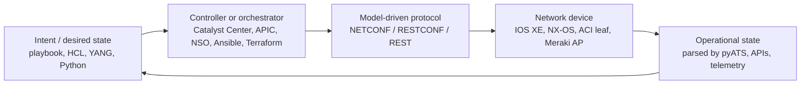

If you can place every objective on that diagram, the rest of this chapter is detail.

---

## 5.1 Describe the value of model driven programmability for infrastructure automation

### 1. What Cisco expects me to know

The verb is **Describe**. You must explain *why* model-driven programmability is more valuable for automation than traditional CLI scraping or ad-hoc SNMP. You do not need to author a full IETF YANG module from scratch. You do need the vocabulary: **YANG is the model**; **NETCONF and RESTCONF are protocols** that carry data shaped by that model; the payoff is **structured, validated, machine-readable configuration and state**.

Connect this objective to 5.10 (interpret a query result) and 5.11 (interpret a YANG model). 5.1 is the “why”; 5.10 and 5.11 are the “read this.”

### 2. Detailed explanation

For decades, network automation meant logging into a box over SSH, sending CLI commands, and parsing the human-oriented text that came back. That works until it does not:

- CLI output is **not a contract**. A new IOS XE release can insert a column, wrap a line, or rename a field. Your regex breaks.
- CLI is **not validated up front** as a data structure. `interface GigabitEthernet1` plus a typo in a nested command may apply half a change.
- CLI is **vendor- and OS-specific**. The same “set a description on an interface” idea is different on IOS XE, NX-OS, IOS XR, and ASA.
- Screen scraping does not give you **transactions**. You cannot easily say “apply this whole change or none of it.”

**Model-driven programmability** replaces “speak the device’s human CLI” with “speak a schema.” The schema is **YANG** (Yet Another Next Generation), standardized in [RFC 7950](https://datatracker.ietf.org/doc/html/rfc7950). A YANG module declares:

- what configuration leaves exist (hostname, interface name, IP address, enabled flag)
- what operational state leaves exist (oper-status, packet counters)
- types, keys, defaults, and nesting
- which nodes are writable (`config true`) versus read-only (`config false`)

Protocols then **encode** instances of that schema:

| Layer | Role | Typical encoding | Typical transport |
| --- | --- | --- | --- |
| YANG | Data model (the contract) | N/A — this is the schema | N/A |
| NETCONF | RPC protocol for config/state | XML | SSH, TCP **830** |
| RESTCONF | HTTP mapping of YANG data | JSON or XML (`yang-data+json` / `yang-data+xml`) | HTTPS, typically TCP **443** |
| gNMI / telemetry | Streaming of YANG-modeled state | protobuf / JSON | gRPC (beyond blueprint depth, but know it exists) |

The **value** for infrastructure automation is not “XML is nicer than CLI.” The value is:

1. **Structure.** A RESTCONF GET of `ietf-interfaces:interfaces` returns objects with named fields, not a banner and a table. Python `response.json()` just works.
2. **Validation.** The device (and your client, if it loads the YANG) can reject a payload that is missing a list key or uses the wrong type *before* it becomes a half-applied config.
3. **Vendor-neutral models.** IETF modules such as `ietf-interfaces` and `ietf-ip` describe the same idea on any compliant device. Native modules (`Cisco-IOS-XE-native`) still exist when you need Cisco-specific knobs. Automation can prefer IETF models for portability and native models for features.
4. **Discoverability.** NETCONF `<hello>` advertises capabilities and YANG modules. RESTCONF exposes `/restconf/data/` and YANG library resources. You can ask the device what it supports instead of guessing CLI.
5. **Separation of config and state.** YANG marks `config false` containers. NETCONF `<get-config>` reads configuration datastores; `<get>` can include operational state. RESTCONF maps this to different resource paths. Automation can **set** desired config and **assert** live state without mixing the two.
6. **Transactional, targetable changes.** NETCONF `edit-config` against `candidate` plus `commit` is an atomic unit. RESTCONF PATCH can change one leaf. You stop concatenating CLI snippets and hoping the pager did not eat a line.
7. **Idempotent automation.** Because you send *desired data* rather than *a sequence of CLI keystrokes*, a second run that sends the same YANG instance does not keep appending garbage. This is the same idea as Ansible/Terraform desired state (5.5, 5.6), applied at the device API.

CLI is not “wrong.” It remains the operator’s interactive tool and the fallback southbound adapter for older devices (Cisco NSO still speaks CLI to many boxes). Model-driven programmability is what you use when **software** is the operator.

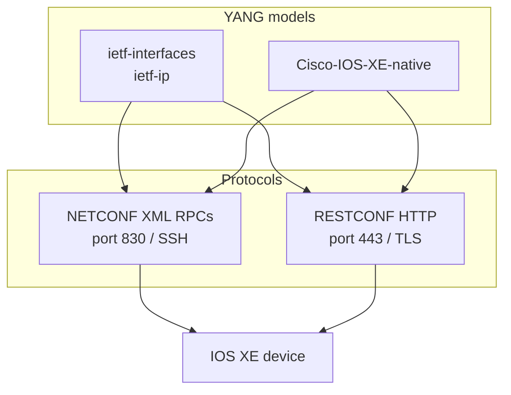

**Misconceptions to kill now:**

- YANG is not a protocol. You do not “open a YANG session.”
- NETCONF is not REST. It is SSH-based RPCs with XML.
- RESTCONF is not “the Cisco REST API.” It is the IETF HTTP mapping of YANG. Meraki and Catalyst Center APIs are product REST APIs, not RESTCONF.
- Model-driven does not mean “only IETF.” Native Cisco YANG is still model-driven.

### 3. Syntax and examples

A tiny YANG leaf from the lab excerpt `labs/06_yang_netconf_restconf/sample.yang`:

```yang
leaf enabled {
  type boolean;
  default "true";
}
```

That single declaration is the contract: the value must be boolean; if omitted, treat it as `true`. A RESTCONF JSON instance that honors it:

```json
{
  "ietf-interfaces:interfaces": {
    "interface": [
      {
        "name": "GigabitEthernet1",
        "enabled": true
      }
    ]
  }
}
```

The same data as NETCONF XML (namespace from the module):

```xml
<interfaces xmlns="urn:ietf:params:xml:ns:yang:ietf-interfaces">
  <interface>
    <name>GigabitEthernet1</name>
    <enabled>true</enabled>
  </interface>
</interfaces>
```

Contrast the **CLI scrape** you would otherwise write:

```text
GigabitEthernet1 is up, line protocol is up
  Description: MANAGEMENT
  Internet address is 10.10.20.48/24
```

That text has no stable schema. The YANG/JSON form is what an Ansible module, a Python `requests` script, or NSO actually consumes.

Cisco IOS XE RESTCONF documentation (encoding, URLs, media types):  
https://www.cisco.com/c/en/us/td/docs/ios-xml/ios/prog/configuration/1717/b_1717_programmability_cg/restconf-protocol.html

### 4. Exam-style understanding

These are **original study items**, not Cisco exam questions. Use them to check whether you can *describe the value*, not recite a slogan.

**Item A.** A teammate says, “We already automate with `paramiko` and `expect`. Why bother with YANG?”  
*What a strong answer includes:* CLI text is unstructured and version-fragile; YANG provides a schema; NETCONF/RESTCONF carry validated structured data; config and state are distinguished; changes can be transactional.

**Item B.** Given a diagram labeled YANG → NETCONF → SSH, identify which box is the **model** and which is the **protocol**.  
*Answer:* YANG is the model; NETCONF is the protocol; SSH is transport.

**Item C.** Which statement is true?  
1. RESTCONF replaces YANG.  
2. NETCONF is a YANG encoding.  
3. YANG models the data; RESTCONF and NETCONF are protocols that encode it.  
4. SNMP MIBs are YANG modules.  
*Answer:* 3.

**Item D.** Why might an automation pipeline prefer `ietf-interfaces` over scraping `show ip interface brief`?  
*Answer:* Stable named fields, JSON/XML parse, IETF portability, explicit enabled/oper-status leaves instead of a formatted table.

### 5. Hands-on exercise

1. Open `labs/06_yang_netconf_restconf/sample.yang` and list every `container`, `list`, `leaf`, and `key`.
2. Open `labs/06_yang_netconf_restconf/sample_restconf_get.json` and `sample_netconf_get-config.xml`. Confirm they are two encodings of the same interface idea.
3. In a Cisco DevNet Sandbox IOS XE Always-On (or reservable) lab, run `labs/06_yang_netconf_restconf/restconf_get_interfaces.py` after filling `labs/.env`. Notice `Accept: application/yang-data+json`.
4. Read [RFC 8040](https://datatracker.ietf.org/doc/html/rfc8040) section 1 (RESTCONF overview) and [RFC 6241](https://datatracker.ietf.org/doc/html/rfc6241) section 1 (NETCONF overview). You do not need to memorize the RFCs; you need the layering.

---

## 5.2 Compare controller-level to device-level management

### 1. What Cisco expects me to know

The verb is **Compare**. You must know differences, advantages, disadvantages, and when each approach is appropriate. **Controller-level** means a fabric or campus controller: Cisco Catalyst Center, ACI APIC, SD-WAN vManage, Meraki dashboard. **Device-level** means you talk to one box with SSH, NETCONF, RESTCONF, or a device REST API.

This is not “controllers are always better.” Cisco tests whether you can pick the right *scope*.

### 2. Detailed explanation

**Device-level management** is a 1:1 conversation with a switch, router, or firewall.

- Transport: SSH (CLI), NETCONF :830, RESTCONF :443, occasionally a device HTTP API (IOS XE RESTCONF, NX-API).
- Scope: that device’s running config and local state.
- Strengths: precise, works in a lab of one box, no controller license, excellent for model-driven leaf changes and troubleshooting a single node.
- Weaknesses: you own inventory, consistency, sequencing, and rollback across 200 devices. A Python `for host in hosts` loop is still device-level management with extra steps.

**Controller-level management** is a 1:N conversation with a system that already has inventory, topology, and policy.

| Controller | Typical domain | What you send it |
| --- | --- | --- |
| Cisco Catalyst Center (DNA Center URLs still use `/dna/`) | Campus/enterprise LAN | Intent APIs: discover devices, images, assurance, templates |
| Cisco APIC | ACI fabric | Policy: tenants, EPGs, contracts — not per-leaf CLI |
| Cisco vManage | Catalyst SD-WAN | Templates, policies, device lists for WAN edges |
| Meraki dashboard | Cloud-managed campus/branch | Org → network → device hierarchy via Dashboard API |

Strengths of controllers:

- **Intent and policy** instead of per-interface snippets. “These VLANs exist on this site” rather than 40 `switchport` blocks.
- **Inventory** is the source of truth for hostnames, serials, management IPs, software images.
- **Assurance / telemetry** is already aggregated (Catalyst Center client health, Meraki clients).
- **Blast radius is designed.** APIC pushes a fabric-consistent policy. A device-level NETCONF edit on one leaf can desynchronize the fabric if you fight the controller.

Weaknesses of controllers:

- Another platform to authenticate to, version, and trust.
- APIs are **product REST**, not IETF RESTCONF. You learn Catalyst Center token auth and Meraki `X-Cisco-Meraki-API-Key`, not a single YANG module.
- Some changes are asynchronous (Catalyst Center task IDs). Device-level NETCONF `rpc-reply` with `<ok/>` is simpler.
- If the controller is down, your automation story changes. Device-level still works for break-glass SSH.

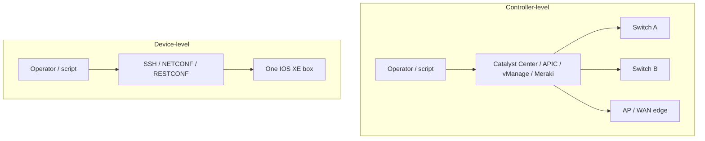

**How they coexist.** Production networks usually do both. You use Catalyst Center to onboard and image a campus. You still use RESTCONF on a lab CSR or a device that is not in a controller. NSO (5.6) sits in the middle: it is an orchestrator that speaks southbound to devices *and* can be driven northbound like a controller.

**ACI nuance.** Pushing XML to APIC is controller-level even though it looks like a device API. Pushing NX-OS CLI to a leaf that APIC owns is fighting the controller. Exam items often show an APIC URL (`/api/node/mo/...` or `/api/class/...`) versus an IOS XE RESTCONF URL (`/restconf/data/...`). Recognize the *level*.

### 3. Syntax and examples

Device-level RESTCONF (one IOS XE host from `labs/.env.example`):

```python
url = "https://devnetsandboxiosxe.cisco.com:443/restconf/data/ietf-interfaces:interfaces"
# Talks to that box only.
```

Controller-level Catalyst Center (from `labs/05_cisco_apis/catalyst_center_devices.py`):

```python
# Token is for the controller, not for each switch.
POST https://{CATALYST_CENTER_HOST}/dna/system/api/v1/auth/token
GET  https://{CATALYST_CENTER_HOST}/dna/intent/api/v1/network-device
```

Controller-level Meraki (from `labs/05_cisco_apis/meraki_list_devices.py`):

```python
GET https://api.meraki.com/api/v1/organizations
GET https://api.meraki.com/api/v1/organizations/{org_id}/devices
# Header: X-Cisco-Meraki-API-Key
```

Controller-level ACI (illustrative, original example):

```python
# Login to APIC, then query a class — fabric-wide, not one leaf SSH session.
POST https://apic.lab.example/api/aaaLogin.json
GET  https://apic.lab.example/api/class/fvTenant.json
```

### 4. Exam-style understanding

Original study items:

**Item A.** You must change the hostname on a single always-on IOS XE sandbox router that is not part of Catalyst Center. Device-level or controller-level?  
*Answer:* Device-level RESTCONF or NETCONF.

**Item B.** You must list every access point in a Meraki organization and their LAN IPs. Device-level or controller-level?  
*Answer:* Controller-level (Dashboard API). You do not SSH to each AP.

**Item C.** Advantage of controller-level for a 200-switch campus?  
*Answer:* Shared inventory, intent/policy consistency, image/assurance APIs, less per-box drift.

**Item D.** Risk of device-level NETCONF `edit-config` on an ACI leaf?  
*Answer:* You can create config that APIC does not own, causing drift or a later overwrite.

**Item E.** Match the URL to the level:  
- `/restconf/data/Cisco-IOS-XE-native:native/hostname` → device  
- `/dna/intent/api/v1/network-device` → controller  
- `/api/v1/organizations/{id}/networks` → controller (Meraki)  
- `/api/node/mo/uni/tn-PROD.json` → controller (ACI)

### 5. Hands-on exercise

1. Read `labs/05_cisco_apis/meraki_list_devices.py` and `catalyst_center_devices.py`. Write one sentence for each: “This script talks to ___ and therefore is ___-level.”
2. Read `labs/06_yang_netconf_restconf/restconf_get_interfaces.py`. Same sentence.
3. Draw the mermaid diagram above on paper and add NSO as a third box that has northbound REST and southbound NETCONF/CLI.
4. Optional: launch a Catalyst Center sandbox from https://devnetsandbox.cisco.com and a separate IOS XE sandbox. Hit one intent API and one RESTCONF path in Postman. Feel the difference in authentication (controller token vs device basic auth).

---

## 5.3 Describe the use and roles of network simulation and test tools (such as Cisco Modeling Labs and pyATS)

### 1. What Cisco expects me to know

The verb is **Describe**. Know **what CML and pyATS are for**, not how to license every CML node type. Cisco Modeling Labs (CML, formerly VIRL) **simulates topologies**. pyATS (with Genie) **parses, tests, and compares operational state**. Together they let you validate automation *before* it touches production.

### 2. Detailed explanation

**Cisco Modeling Labs (CML)** is a network simulator. You build a topology of virtual routers, switches, and Linux nodes, wire them with links, and start the lab. It is the successor to VIRL. Use it when you need:

- a **safe topology** to practice NETCONF/RESTCONF, routing, VLANs, or Ansible against IOS XE / NX-OS images
- **pre-change validation**: apply a Terraform/Ansible change to CML, then promote the same artifact to production
- **training and CI**: a pipeline spins a small CML lab, runs tests, destroys the lab

CML is not Packet Tracer. It runs real (virtual) network OS images, so APIs and YANG models behave like the hardware they emulate, within resource limits. It is also not a replacement for a controller sandbox: Catalyst Center and APIC have their own DevNet sandboxes.

Docs: https://developer.cisco.com/modeling-labs/

**pyATS** is Cisco’s Python test framework for networks. **Genie** sits on top and provides parsers, models, and `learn`/`diff` of operational state. Use it when you need:

- to **parse** `show` command output or device APIs into structured Python without writing regex
- to **snapshot** (“learn”) BGP, interfaces, or config before a change
- to **compare** post-change state to the snapshot (`genie diff`)
- to run **test cases** in a CI job: “after the playbook, every interface in the whitelist is up”

Docs: https://developer.cisco.com/pyats/

**Roles in an automation workflow:**

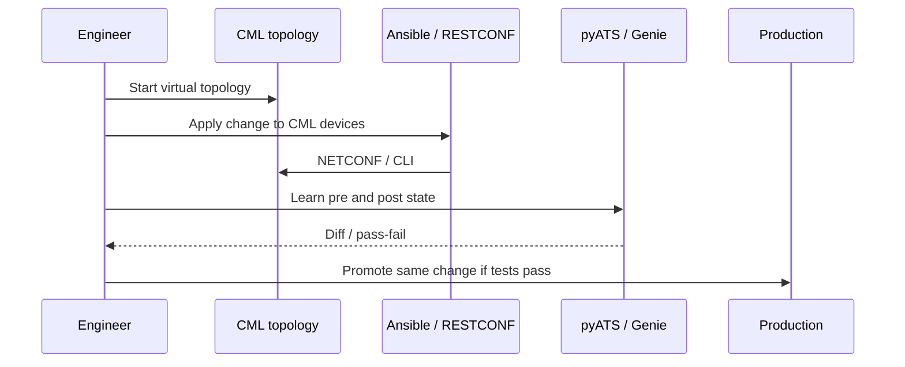

Other tools you may see in the same sentence (describe, do not over-study): VIRL (old name), CML Personal vs Enterprise, Cisco DevNet Sandbox (hosted topologies, not CML on your laptop), Robot Framework (sometimes wraps pyATS). The exam examples in the blueprint are **CML and pyATS**.

**pyATS vs Pytest.** Pytest is a general Python unit-test runner (domain 1.3). pyATS is a **network-aware** test harness: testbeds (YAML inventory of devices), connections, parsers. You can run pyATS jobs in CI the same way you run pytest.

### 3. Syntax and examples

A conceptual pyATS testbed (YAML). This is original study syntax, not a live lab file:

```yaml
testbed:
  name: ccnaauto-lab
devices:
  edge-01:
    os: iosxe
    type: router
    connections:
      cli:
        protocol: ssh
        ip: 10.10.20.48
```

A conceptual Genie “learn then diff” flow:

```text
pyats learn interface --testbed-file testbed.yml --output pre/
# ... automation runs ...
pyats learn interface --testbed-file testbed.yml --output post/
genie diff pre/ post/
```

CML is GUI- and API-driven. The skill to describe: nodes, links, simulations (start/stop), and reaching a node’s management IP for NETCONF. You do not need CML REST payload memorization for CCNA Automation.

### 4. Exam-style understanding

Original study items:

**Item A.** Which tool would you use to build a virtual three-router OSPF topology on a laptop or server?  
*Answer:* Cisco Modeling Labs (CML).

**Item B.** Which tool would you use to parse `show ip bgp summary` across ten devices and fail CI if a neighbor dropped?  
*Answer:* pyATS / Genie.

**Item C.** True or false: pyATS replaces YANG.  
*Answer:* False. pyATS consumes CLI/API/YANG-modeled data to test state. YANG remains the device model.

**Item D.** Why run automation against CML before production?  
*Answer:* Catch playbook/YANG errors, routing loops, and broken APIs without touching live traffic.

### 5. Hands-on exercise

1. Read https://developer.cisco.com/pyats/ (overview) and https://developer.cisco.com/modeling-labs/. Write four bullet sentences: CML purpose, CML former name, pyATS purpose, Genie purpose.
2. Free path if you do not have CML: use DevNet Sandbox IOS XE as the “simulated” device and install pyATS in WSL (`pip install pyats[full]` or the current documented extra). Skip if disk is tight; reading the docs plus this chapter is enough to **describe** the roles.
3. Optional: `pip install genie` and run a parser against sandbox CLI later in your study plan. Do not block Domain 5 on a CML license.

---

## 5.4 Describe the components and benefits of CI/CD pipeline in infrastructure automation

### 1. What Cisco expects me to know

The verb is **Describe**. Name the **components** of a CI/CD pipeline and the **benefits** when the thing being delivered is infrastructure (playbooks, Terraform, YANG payloads, Python API scripts), not only application binaries. You will not be asked to author a production Jenkinsfile from memory. You should recognize stages and why they exist.

### 2. Detailed explanation

**CI (Continuous Integration)** means every change to the automation repo is automatically built and tested. **CD (Continuous Delivery/Deployment)** means those artifacts are then released to a staging or production environment in a repeatable way.

For *infrastructure* automation, the “artifact” is often:

- an Ansible playbook and inventory
- a Terraform configuration plus a **plan**
- a Python package that wraps RESTCONF
- a YANG service model for NSO
- a CML topology definition

**Typical components** (left to right):

| Stage | What happens for network automation | Example |
| --- | --- | --- |
| Source | Git commit / pull request | GitHub, GitLab |
| Lint / static analysis | YAML/HCL/Python syntax, Ansible-lint, `terraform fmt` | Fail fast on tabs in YAML |
| Unit / contract tests | pytest for parsers; schema checks for JSON payloads | `labs/01_python_basics/test_subnet.py` style |
| Simulate / integration | CML, DevNet Sandbox, or a lab VRF | Apply playbook to CML |
| Operational tests | pyATS learn/diff, ping, RESTCONF GET assertions | Interface still up |
| Plan / review | `terraform plan`, Ansible `--check`, code review (5.13) | Human approval |
| Deploy | `terraform apply`, Ansible, NSO commit, controller intent API | Staging then prod |
| Feedback | Logs, artifacts, failed test output, monitoring | Chat notification |


**Benefits** that matter on this exam:

1. **Repeatability.** The same playbook that passed CI is what production runs. No “it worked on my laptop with a different inventory.”
2. **Faster, safer change.** Tests catch a bad VLAN or a broken RESTCONF path before Friday night maintenance.
3. **Reviewability.** The pipeline enforces that a unified diff (5.12) went through code review (5.13).
4. **Smaller blast radius.** Failed pyATS jobs stop the deploy stage.
5. **Audit.** Git history plus CI logs answer “who changed BGP and did tests pass?”
6. **Rollback as a deploy of a previous commit**, not as tribal CLI knowledge.

CI/CD is how IaC (5.5) becomes operational. A Terraform file in a shared drive is not a pipeline. A Terraform file that cannot merge until `terraform plan` is clean and a reviewer approves *is*.

**Infrastructure-specific pitfalls:**

- Network changes are not always as easy to canary as a web app. Use CML/lab first, then a maintenance window, then prod.
- Secrets must not be in Git (use CI secret stores). Domain 4 covers secret management; mention it in pipelines.
- `--check` / `terraform plan` are **not** a substitute for operational tests. Plan says “I would create this resource”; pyATS says “BGP still has 4 neighbors.”

### 3. Syntax and examples

Original GitHub Actions-style sketch (interpret the workflow, do not memorize YAML keys):

```yaml
name: network-ci
on: [pull_request]
jobs:
  validate:
    runs-on: ubuntu-latest
    steps:
      - uses: actions/checkout@v4
      - name: Lint playbook
        run: ansible-lint labs/08_ansible/playbook.yml
      - name: Terraform fmt and plan
        run: |
          cd labs/09_terraform
          terraform fmt -check
          terraform init
          terraform plan
      - name: Unit tests
        run: pytest labs/01_python_basics/test_subnet.py
```

A bash fragment you might see in a deploy job:

```bash
#!/usr/bin/env bash
set -euo pipefail
cd "$(dirname "$0")"
ansible-playbook -i inventory.ini playbook.yml --check
ansible-playbook -i inventory.ini playbook.yml
```

`set -e` fails the pipeline on the first error — that is a CI benefit implemented in a shell.

### 4. Exam-style understanding

Original study items:

**Item A.** Name three pipeline stages that should run *before* production Ansible.  
*Answer:* lint/syntax, lab/CML apply or `--check`, operational tests (pyATS/API), plus code review.

**Item B.** Benefit most closely tied to Git + CI together?  
*Answer:* Every merged change is tested the same way; history is auditable.

**Item C.** `terraform plan` in CI vs `terraform apply` in CD — which is which?  
*Answer:* Plan is CI/review; apply is CD/deploy (often gated).

**Item D.** Why is a pipeline valuable even if a human still clicks “approve”?  
*Answer:* Humans review a **tested, formatted, diffed** artifact, not an untested laptop script.

### 5. Hands-on exercise

1. Open `labs/04_git/workflow.yaml` and map each Git operation to a CI moment (clone in the runner, commit on your machine, pull request before merge).
2. In WSL, from the repo root, run a *local* mini-pipeline:  
   `python -m pytest labs/01_python_basics/test_subnet.py`  
   then `terraform -chdir="labs/09_terraform" fmt -check` (after Terraform is installed per `CCNAAUTO_LAB_SETUP.md`).
3. Write a five-line description of what you would add if you had CML: start lab → apply playbook → pyATS → destroy lab.

---

## 5.5 Describe the principles of infrastructure as code

### 1. What Cisco expects me to know

The verb is **Describe**. **Infrastructure as code (IaC)** means the desired state of infrastructure is **declared in files**, **versioned in Git**, **reviewed**, and **applied repeatably**. You should contrast this with click-ops and with imperative SSH snowflakes. Ansible, Terraform, NSO, and even RESTCONF payloads stored in Git are IaC *if* they follow those principles.

### 2. Detailed explanation

Principles you should be able to explain:

1. **Declarative desired state.** You write *what* should be true: nginx installed, interface enabled, DNS record present. The tool computes *how*. Imperative scripts (`apt-get install` without checking) can be “code that touches infra” without being good IaC.
2. **Versioned.** The source of truth is Git, not a running box and not a wiki screenshot. You can `git revert`.
3. **Reviewable.** Changes show up as unified diffs (5.12) and go through code review (5.13).
4. **Repeatable / idempotent.** Applying the same definition twice converges to the same state. Ansible modules with `state: present` and Terraform resources are designed for this. A bash script that appends a line to a file every run is not.
5. **Documented by being executable.** The playbook *is* the documentation of how the lab host is built, if it is the path people actually run.
6. **Environment-parameterized.** Inventory, Terraform variables, or NSO device lists separate *code* from *data* (which host, which VLAN).
7. **Testable in a pipeline** (5.4).

**Declarative vs imperative** (exam favorite):

| Style | You write | Example |
| --- | --- | --- |
| Imperative | Steps | `useradd ccnaauto`; `systemctl start nginx` |
| Declarative | End state | `user: name=ccnaauto state=present`; `service: state=started` |

Ansible is **procedural-ish** (an ordered list of tasks) but each module is usually **idempotent** and **desired-state**. Terraform is more purely declarative: a graph of resources, not a step list. NSO service models are declarative at the service layer.

**What IaC is not:**

- Pasting CLI into Notepad and calling it a “template” without version control.
- A Python script that SSH-es unique snowflake commands per device with no inventory and no review.
- Storing production secrets in the same file as the code.

**Relationship to model-driven programmability.** IaC is the *software engineering* practice. YANG/NETCONF is a *device API* that makes IaC accurate. You can do IaC against CLI (Ansible `ios_command`) but you inherit CLI fragility. Model-driven plus IaC is the combination Domain 5 is selling.

### 3. Syntax and examples

Terraform in this repo is a miniature IaC definition (`labs/09_terraform/main.tf`): the desired state is “this JSON inventory file exists with these devices.” Re-applying does not keep creating new files with random names; it updates the one resource.

Ansible in this repo (`labs/08_ansible/playbook.yml`) declares package present, user present, file content, service started. A second run should report `ok` / `changed=0` if nothing drifted.

A **non-IaC** bash anti-pattern:

```bash
echo "ccnaauto ALL=(ALL) NOPASSWD:ALL" >> /etc/sudoers
```

Every run appends another line. The IaC version uses a module or a `lineinfile` with a regexp so the line exists once.

### 4. Exam-style understanding

Original study items:

**Item A.** List four IaC principles.  
*Answer:* desired state, versioned, reviewable, repeatable/idempotent (plus testable/parameterized).

**Item B.** Is a Jupyter notebook that someone runs once to create VLANs IaC?  
*Answer:* It is code, but it fails versioned/reviewable/repeatable unless it is in Git, idempotent, and the path people actually use.

**Item C.** Why does Terraform store state?  
*Answer:* So the tool knows which real-world objects map to which declared resources — required for declarative lifecycle (create/update/destroy).

### 5. Hands-on exercise

1. Read `labs/09_terraform/main.tf` and `labs/08_ansible/playbook.yml`. For each file, write: declarative or imperative-with-idempotent-tasks? What is the desired state in one sentence?
2. Initialize and apply the Terraform lab (see 5.6 exercise). Change a device name in `main.tf`, run `terraform plan`, and observe the diff — that plan *is* IaC in action.
3. Intentionally make the Ansible playbook non-idempotent (append to a file with `shell: echo x >> file`). Run twice. Restore the module-based version. Feel the principle.

---

## 5.6 Describe the capabilities of automation tools such as Ansible, Terraform, and Cisco NSO

### 1. What Cisco expects me to know

The verb is **Describe** the **capabilities** of three named tools. You are not required to be a HashiCorp or Red Hat certified specialist. You must know what each tool is good at, how it is driven, and how it differs from the other two. Objective **5.8** later asks you to **interpret** an Ansible playbook in more detail; 5.6 is the product map.

Official docs (free):  
- Ansible: https://docs.ansible.com/  
- Terraform: https://developer.hashicorp.com/terraform/docs  
- Cisco NSO: https://developer.cisco.com/docs/nso/

### 2. Detailed explanation

#### Ansible

Ansible is a **configuration automation** engine. Default transport to Linux is **agentless SSH** (Windows uses WinRM; network devices use SSH, NETCONF, or HTTP APIs via collections). You write **YAML playbooks**. A playbook contains **plays**; a play maps **hosts** from an **inventory** to **tasks**; each task calls a **module**.

Capabilities to remember:

- Agentless: nothing to install on the target except SSH and Python for Linux; network modules often run on the control node.
- Inventory: which hosts, which groups, which variables.
- Modules: `package`, `user`, `service`, `copy`, `ios_config`, `cisco.ios.ios_interfaces`, and hundreds more.
- Idempotence when modules are used correctly (`state: present` rather than raw `apt-get` every time).
- Procedural-ish execution: tasks run **in order**. That is different from Terraform’s dependency graph. People still call Ansible “declarative” because each module expresses desired state.
- Ansible Galaxy / collections for Cisco IOS, NX-OS, ACI, Meraki.
- Check mode (`--check`) for a dry run.
- Not a persistent state database. The world *is* the state; Ansible converges it each run.

Ansible is the tool you reach for when the job is “make this OS or this device look like X”: packages, users, services, config snippets.

#### Terraform

Terraform is a **provisioning** tool. You write **HCL** (HashiCorp Configuration Language). You declare **resources** that belong to **providers** (AWS, Azure, `local`, Cisco Intersight, ACI provider, and so on). Terraform keeps **state** (often `terraform.tfstate`) that maps declarations to real objects.

Lifecycle you must know:

1. `terraform init` — download providers.
2. `terraform plan` — show the diff between declared and actual (via state + API refresh).
3. `terraform apply` — create/update/delete to match the declaration.
4. `terraform destroy` — tear down resources Terraform owns.

Capabilities:

- Strongly **declarative**. You do not write “step 1, step 2”; you write resources and Terraform builds a graph.
- **State** is a first-class concept. Lose the state file and Terraform no longer knows what it created.
- Excellent at cloud objects, DNS records, load balancers, and generating files (as in this repo’s `local_file` lab).
- Less natural than Ansible for “install nginx and start it” on a snowflake VM, though you *can* use provisioners (discouraged).
- Plan output is reviewable IaC — it belongs in CI (5.4).

#### Cisco NSO (Network Services Orchestrator)

NSO is a **service orchestrator** for multi-vendor networks. It is not “Ansible with a Cisco logo.”

Core ideas:

- **Device models** (NED — Network Element Driver): how each OS looks in NSO, often YANG, southbound **NETCONF** when the device supports it, otherwise **CLI** or other adapters.
- **Service models**: YANG that describes a *customer-facing service* (L3VPN, VLAN service, CNAME + firewall hole) rather than a single device CLI.
- A configuration database (**CDB**) holds the service instance and the rendered device configs.
- You **commit** a service instance; NSO computes the device deltas and pushes them southbound. Abort/rollback is a transaction at the service layer.
- Northbound: RESTCONF, NETCONF, CLI, Python APIs — NSO itself is model-driven.

NSO’s capability is **keep a service’s intent and all device configs in sync** across vendors. Ansible can push configs; NSO is built to *own* the service lifecycle (create, modify, delete) and the mapping to many devices.

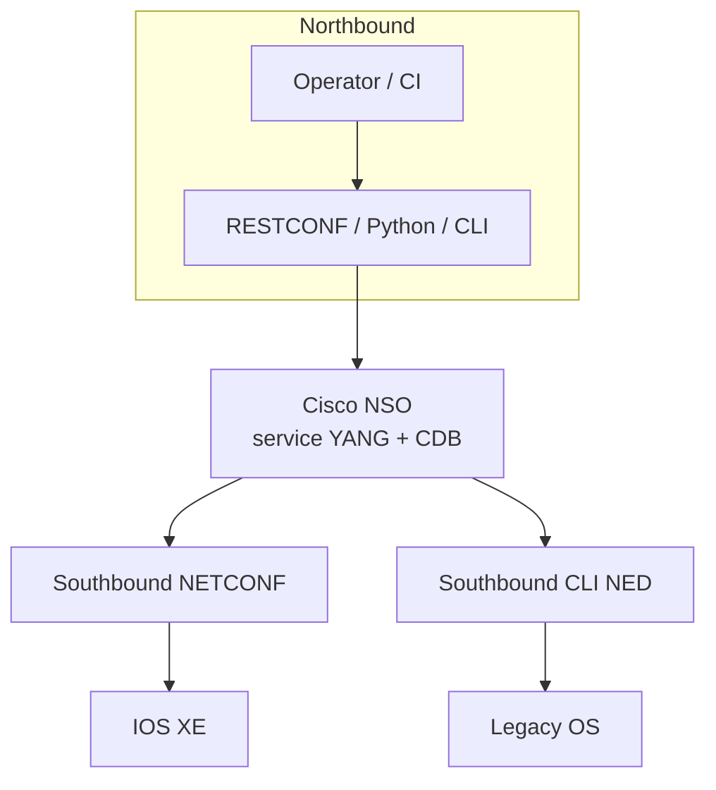

#### Comparison table

| Capability | Ansible | Terraform | Cisco NSO |
| --- | --- | --- | --- |
| Primary language | YAML playbooks | HCL | YANG service + templates / Python |
| Default style | Ordered idempotent tasks | Declarative resource graph | Declarative service instances + commit |
| State | No central state file; world is state | `tfstate` required | CDB |
| Agent | Agentless SSH / APIs | Provider APIs | Southbound NED (NETCONF/CLI) |
| Sweet spot | OS + device config drift | Cloud/infra objects, lifecycle | Multi-device network *services* |
| Dry run | `--check` | `plan` | compare / dry-run commit |
| Destroy | Playbook with `state: absent` | `terraform destroy` | un-deploy service instance |

**Misconceptions:** Ansible is not “only Linux.” Terraform is not “only AWS.” NSO is not a replacement for Catalyst Center in campus assurance; it is orchestration of services onto devices.

### 3. Syntax and examples

**Ansible inventory** (`labs/08_ansible/inventory.ini`):

```ini
[lab]
127.0.0.1 ansible_connection=local
```

The group is `[lab]`. The playbook’s `hosts: lab` selects it. `ansible_connection=local` means “do not SSH; run on this machine” — useful for a WSL self-lab.

**Ansible playbook** (`labs/08_ansible/playbook.yml`) — full interpretation is 5.8. Capability shown here: package, user, file, service modules in one play.

**Terraform** (`labs/09_terraform/main.tf`):

```hcl
terraform {
  required_version = ">= 1.5.0"
  required_providers {
    local = {
      source  = "hashicorp/local"
      version = "~> 2.5"
    }
  }
}

resource "local_file" "device_inventory" {
  filename = "${path.module}/generated_inventory.json"
  content = jsonencode({
    devices = [
      { name = "edge-01", mgmt = "10.10.20.48" },
      { name = "core-01", mgmt = "10.10.20.49" },
    ]
  })
}
```

Read it as: “The `local` provider can manage files on disk. Resource `local_file.device_inventory` must exist at that path with that JSON content.” `${path.module}` is the directory containing this `.tf` file. `jsonencode` turns a HCL object into a JSON string.

**NSO** (conceptual northbound RESTCONF, original example):

```http
POST /restconf/data/l3vpn:vpn
Content-Type: application/yang-data+json

{"l3vpn:vpn": {"name": "ACME", "rd": "65000:10"}}
```

You will not build NSO in the free local lab. You must still recognize: service name, commit, device list, southbound NETCONF.

### 4. Exam-style understanding

Original study items:

**Item A.** Which tool stores a state file mapping resources to real objects?  
*Answer:* Terraform.

**Item B.** Which tool is agentless and typically uses SSH plus YAML tasks?  
*Answer:* Ansible.

**Item C.** Which tool models a VPN as a service instance and pushes per-device config via NEDs?  
*Answer:* Cisco NSO.

**Item D.** You need to install `nginx`, create user `ccnaauto`, and enable the service on lab VMs. Best fit?  
*Answer:* Ansible.

**Item E.** You need to create three cloud load balancers and later destroy them cleanly. Best fit?  
*Answer:* Terraform.

**Item F.** True or false: Terraform playbooks are YAML.  
*Answer:* False. Terraform uses HCL. Ansible uses YAML.

### 5. Hands-on exercise

1. **Ansible (WSL):**  
   `cd labs/08_ansible`  
   `ansible-playbook -i inventory.ini playbook.yml --check`  
   Then run without `--check` if you accept installing nginx locally. Read the `changed` / `ok` counters on a second run.
2. **Terraform:**  
   `cd labs/09_terraform`  
   `terraform init`  
   `terraform plan`  
   `terraform apply`  
   Open `generated_inventory.json`. Change a hostname in `main.tf`, `plan` again, then `apply`. Finish with `terraform destroy` if you want a clean tree.
3. **NSO:** Read the NSO developer docs landing page: https://developer.cisco.com/docs/nso/ — write five sentences: service model, device model, commit, southbound, northbound. DevNet sometimes lists an NSO sandbox; use it if available, otherwise docs plus this chapter satisfy **describe**.

---

## 5.7 Identify the workflow being automated by a Python script that uses Cisco APIs including ACI, Meraki, Cisco Catalyst Center, and RESTCONF

### 1. What Cisco expects me to know

The verb is **Identify**. Cisco will show you a Python snippet that uses `requests` (or an SDK) against **ACI**, **Meraki**, **Cisco Catalyst Center**, or **RESTCONF**. You must say **what the script is doing** — which platform, which resource, which HTTP method, and the workflow (auth → list → maybe create). You do not need to memorize every endpoint in those products. You need **recognition patterns**.

This objective is paired with Domain 3 platform APIs. Here the skill is *workflow identification*, not product administration.

### 2. Detailed explanation

Train yourself to scan a script in this order:

1. **Base URL and path** — the fastest discriminator.
2. **Auth header or login call.**
3. **HTTP methods** and order.
4. **Payload keys** (tenant, orgId, network-device, yang-data).
5. **What is printed or returned** — list devices, set hostname, create tenant.

**Recognition cheat sheet:**

| Platform | URL fragment | Auth pattern | Typical workflow |
| --- | --- | --- | --- |
| Meraki | `api.meraki.com/api/v1` `/organizations` `/networks` `/devices` `/clients` | `X-Cisco-Meraki-API-Key` | List orgs → pick org → list devices/clients |
| Catalyst Center | `/dna/system/api/v1/auth/token` `/dna/intent/api/v1/` | POST token with basic auth, then `X-Auth-Token` | Get token → list network-device / clients / sites |
| ACI APIC | `/api/aaaLogin.json` `/api/class/` `/api/node/mo/uni/` | Cookie / token from `aaaLogin` | Login → GET class or POST managed object |
| RESTCONF (device) | `/restconf/data/` `ietf-interfaces:` `Cisco-IOS-XE-native:` | HTTP Basic to the **device**, `Accept: application/yang-data+json` | GET/PATCH a YANG path on one box |

**Meraki workflow.** Cloud controller. Almost always: authenticate with API key on every request (no separate token call). Hierarchy is Organization → Network → Device / Client. A script that fetches `/organizations` then `/organizations/{id}/devices` is **inventory listing**, not changing SSIDs.

**Catalyst Center workflow.** On-prem (or sandbox) controller. You **must** obtain a token first. Paths under `/dna/intent/` are intent APIs (inventory, command runner, templates). A script that only GET-lists devices is discovery/inventory. A script that POST-s a template is change.

**ACI workflow.** APIC is the controller. Login JSON body typically contains `aaaUser` credentials. After login, `GET /api/class/fvTenant.json` lists tenants. `POST` to a distinguished name under `uni/` creates policy. If you see `fvTenant`, `fvBD`, `fvAEPg`, you are in ACI even if the word “ACI” never appears.

**RESTCONF workflow.** Device-level. Media type `application/yang-data+json` (or `+xml`). Path starts with `/restconf/data/` plus `module:container/...`. `interface=GigabitEthernet1` is how RESTCONF encodes a YANG list key in the URL. GET is read; PATCH/PUT/POST/DELETE mutate according to RESTCONF rules.

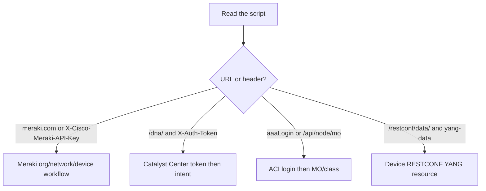

**SDK pattern.** `labs/05_cisco_apis/sdk_pattern.py` wraps `requests`. Exam scripts might call `api.organizations.get_organizations()` (Meraki SDK) or `dnac.devices.get_device_list()`. Identify the **workflow**, not the SDK brand.

### 3. Syntax and examples

**Meraki — list devices** (workflow of `labs/05_cisco_apis/meraki_list_devices.py`):

```python
orgs = get("/organizations")
org_id = orgs[0]["id"]
devices = get(f"/organizations/{org_id}/devices")
clients = get(f"/networks/{net_id}/clients", params={"timespan": 86400})
```

Identify: *Authenticate with Dashboard API key. List organizations, take the first, list that org’s devices, then list clients on the first network for the last day.*

**Catalyst Center — inventory** (`catalyst_center_devices.py`):

```python
tok = token()  # POST /dna/system/api/v1/auth/token
devices = get("/dna/intent/api/v1/network-device", tok)
```

Identify: *Obtain a Catalyst Center token, then list network devices from the intent API.*

**RESTCONF — read hostname and interfaces** (`restconf_get_interfaces.py`):

```python
HEADERS = {
    "Accept": "application/yang-data+json",
    "Content-Type": "application/yang-data+json",
}
restconf("Cisco-IOS-XE-native:native/hostname")
restconf("ietf-interfaces:interfaces")
```

Identify: *HTTP Basic to an IOS XE device. GET native hostname leaf, then GET IETF interfaces container. Read-only inventory of that box.*

**ACI — original example (not in the lab folder):**

```python
login = {
    "aaaUser": {"attributes": {"name": user, "pwd": password}}
}
s = requests.Session()
s.post(f"https://{apic}/api/aaaLogin.json", json=login, verify=False)
tenants = s.get(f"https://{apic}/api/class/fvTenant.json", verify=False).json()
```

Identify: *Log in to APIC, then list all tenant objects in the fabric.*

**RESTCONF write workflow (original):**

```python
requests.patch(
    "https://router/restconf/data/ietf-interfaces:interfaces/interface=GigabitEthernet1",
    auth=("admin", "admin"),
    headers={"Content-Type": "application/yang-data+json"},
    json={"ietf-interfaces:interface": {"description": "UPLINK", "enabled": True}},
    verify=False,
)
```

Identify: *Device-level RESTCONF PATCH of one interface’s description and enabled flag. Not Meraki, not Catalyst Center.*

### 4. Exam-style understanding

Original study items. Practice **naming the platform and the workflow in one sentence**.

**Item A.** Script uses `X-Cisco-Meraki-API-Key` and GET `/networks/{id}/clients`.  
*Answer:* Meraki controller API listing clients on a network.

**Item B.** Script POSTs to `/dna/system/api/v1/auth/token` then GETs `/dna/intent/api/v1/network-device`.  
*Answer:* Catalyst Center: authenticate, then inventory network devices.

**Item C.** Script POSTs `aaaLogin.json` then GETs `/api/class/fvTenant.json`.  
*Answer:* ACI APIC: login, list tenants.

**Item D.** Script GETs `/restconf/data/ietf-interfaces:interfaces/interface=GigabitEthernet1` with `Accept: application/yang-data+json`.  
*Answer:* RESTCONF read of one IETF interface on a device.

**Item E.** Distractor: Webex `https://webexapis.com/v1/rooms` is **not** in the 5.7 list. If you see it, you are in Domain 3 collaboration APIs, not this objective.

**Item F.** A script has both `aaaLogin` and later `interface GigabitEthernet`. If the GigabitEthernet appears inside a RESTCONF URL, you have two different tools — but ACI scripts do not normally use RESTCONF on the APIC for interface IETF models. Prefer the URL.

### 5. Hands-on exercise

1. Open every file in `labs/05_cisco_apis/` and `labs/06_yang_netconf_restconf/restconf_get_interfaces.py`. For each, write: platform, auth, resources touched, mutating or read-only.
2. Cover the ACI gap: in Postman or a scratch file, write (do not need to run) a 15-line `aaaLogin` + `fvTenant` script using the pattern above. Say the workflow out loud.
3. Shuffle printed snippets with a study partner (or hide filenames) and identify them in under 30 seconds — that is the exam skill.

---

## 5.8 Interpret the workflow being automated by an Ansible playbook (management packages, user management related to services, basic service configuration, and start/stop)

### 1. What Cisco expects me to know

The verb is **Interpret**. Cisco tells you the scope: **management packages**, **user management related to services**, **basic service configuration**, and **start/stop**. You will be shown a YAML playbook similar to `labs/08_ansible/playbook.yml`. You must explain **which hosts**, **which tasks in order**, **what desired state each module enforces**, and **whether a re-run would change anything**.

You are not asked to write a 200-task role from scratch. You *are* asked to read YAML indentation, `hosts`, `become`, `vars`, module names, and `state:` keys.

### 2. Detailed explanation

Anatomy of a playbook:

```yaml
- name: Human description of the play
  hosts: group_from_inventory
  become: true          # escalate to root (sudo)
  vars:
    some_key: value
  tasks:
    - name: Human description of the task
      ansible.builtin.module_name:
        argument: value
```

**Play vs task.** The list item with `hosts:` is a **play**. The list under `tasks:` is ordered **tasks**. Ansible runs task 1 on all matched hosts (by default), then task 2, and so on.

**Inventory** selects machines. `hosts: lab` means “all hosts in group `lab`.” `hosts: all` means everyone. A hostname can appear in inventory.ini.

**Modules in the exam scope:**

| Workflow Cisco named | Typical modules | Key arguments |
| --- | --- | --- |
| Management packages | `package`, `yum`, `apt`, `dnf` | `name`, `state: present` / `absent` / `latest` |
| User management related to services | `user`, `group` | `name`, `state`, `shell`, `create_home`, `groups` |
| Basic service configuration | `copy`, `template`, `lineinfile`, `file` | `dest`, `content` / `src`, `mode` |
| Start/stop | `service`, `systemd` | `name`, `state: started` / `stopped` / `restarted`, `enabled: true` (start on boot) |

**Idempotence.** `package: state=present` installs only if missing. `user: state=present` creates only if missing. `service: state=started` starts only if not running. `copy` writes the file if content differs. A second run should be green.

**`become: true`** is required for package install, user create, and writing `/var/www`. Without it, those tasks fail with permission denied — a common interpretation trap.

**FQCN.** `ansible.builtin.package` is the fully qualified collection name. Older playbooks say `package:` or `apt:`. Same workflow.

**Handlers.** You may see `notify: Restart nginx` and a `handlers:` section. A handler runs **once at the end if notified** — typical for “restart service only if the config file changed.” That is still start/stop, just deferred.

**What the exam playbook is *not*.** It is not Terraform. It is not a Kubernetes manifest. If you see `tasks:` and `ansible.builtin`, it is Ansible.

### 3. Syntax and examples

Full lab playbook (`labs/08_ansible/playbook.yml`), interpreted line by line:

```yaml
- name: Prepare a lab linux host
  hosts: lab
  become: true
  vars:
    lab_user: ccnaauto
    app_package: nginx

  tasks:
    - name: Ensure nginx is installed
      ansible.builtin.package:
        name: "{{ app_package }}"
        state: present

    - name: Create application user
      ansible.builtin.user:
        name: "{{ lab_user }}"
        shell: /bin/bash
        state: present
        create_home: true

    - name: Deploy a simple index page
      ansible.builtin.copy:
        dest: /var/www/html/index.html
        content: |
          CCNA Automation Ansible lab
        mode: "0644"

    - name: Start and enable nginx
      ansible.builtin.service:
        name: nginx
        state: started
        enabled: true
```

**Workflow in English:**

1. Target the `lab` inventory group; use sudo.
2. **Package management:** ensure the package named in `app_package` (nginx) is installed.
3. **User management:** ensure user `ccnaauto` exists, bash shell, home directory.
4. **Basic service configuration:** write `/var/www/html/index.html` with a fixed string, mode 0644.
5. **Start/stop:** nginx process must be running **now** (`started`) and must start at boot (`enabled: true`).

Jinja2 `{{ app_package }}` substitutes variables. If you change `app_package: httpd`, the same play installs Apache instead — still package management.

**Start vs stop original snippet:**

```yaml
- name: Stop nginx for maintenance
  ansible.builtin.service:
    name: nginx
    state: stopped
    enabled: false
```

Interpret: *Stop the service now and prevent it from starting on boot.* Opposite of the lab playbook’s last task.

**Package absent:**

```yaml
- ansible.builtin.package:
    name: telnet
    state: absent
```

Interpret: *Uninstall telnet if present.* Still “management packages.”

### 4. Exam-style understanding

Original study items:

**Item A.** After a successful first run of the lab playbook, what does a second run do to the user `ccnaauto`?  
*Answer:* Nothing material; `state: present` is already satisfied.

**Item B.** Which task implements “basic service configuration” rather than package install?  
*Answer:* The `copy` to `index.html`.

**Item C.** `enabled: true` vs `state: started`.  
*Answer:* `state` is now; `enabled` is boot-time.

**Item D.** `hosts: lab` but inventory only has `127.0.0.1` under `[lab]`. Where does nginx get installed?  
*Answer:* The local machine (especially with `ansible_connection=local`).

**Item E.** Task order: could you start nginx *before* installing the package?  
*Answer:* The playbook would fail; order matters. Ansible is a task list.

**Item F.** Given a playbook with `user: name=www-data` and `service: name=nginx state=started`, summarize.  
*Answer:* Ensure a service account exists and nginx is running — user management related to services plus start.

### 5. Hands-on exercise

1. Read `labs/08_ansible/playbook.yml` and `inventory.ini` without running anything. Write the five-sentence workflow above from memory.
2. In WSL: `ansible-playbook -i labs/08_ansible/inventory.ini labs/08_ansible/playbook.yml --syntax-check`
3. Run `--check` then a real apply if you want nginx on the VM. Run twice. Screenshot or copy the recap (`ok=`, `changed=`).
4. Edit a copy: add a task `state: stopped` for nginx, predict the recap, run it, then restore `started`.
5. Docs: https://docs.ansible.com/ansible/latest/collections/ansible/builtin/service_module.html — read `state` and `enabled`.

---

## 5.9 Interpret the workflow being automated by a bash script (such as file management, app install, user management, directory navigation)

### 1. What Cisco expects me to know

The verb is **Interpret**. Given a bash script, explain the workflow. Cisco’s examples: **file management**, **app install**, **user management**, **directory navigation**. You need to read `cd`, `mkdir`, `cp`, `mv`, `rm`, `apt-get`/`yum`, `useradd`/`id`, `chmod`, `chown`, variables, and `if` tests well enough to narrate the script.

This is Linux-for-automation literacy, not a LPIC exam.

### 2. Detailed explanation

Bash scripts used in network automation labs usually bootstrap a control node or a small Linux helper VM. Read them as a **sequence of side effects**.

**Directory navigation.** `cd /opt/app` changes the working directory for subsequent relative paths. `cd "$(dirname "$0")"` means “go to the directory where this script lives” — common in CI. `pwd` prints the current directory. Failure to `cd` is why a script “cannot find” a file that exists.

**File management.**

| Command | Workflow |
| --- | --- |
| `mkdir -p /etc/myapp` | Create directory path; `-p` no error if exists, creates parents |
| `cp src dest` | Copy file |
| `mv old new` | Rename or move |
| `rm -f file` | Delete file, ignore missing |
| `rm -rf dir` | Recursive delete — dangerous |
| `chmod 644 file` | Permissions |
| `chown user:group file` | Ownership |
| `cat > file <<'EOF'` | Write a file from a heredoc |
| `touch file` | Create empty or update timestamp |

**App install.** Debian/Ubuntu: `apt-get update` then `apt-get install -y nginx`. RHEL: `yum install -y` or `dnf`. `-y` answers yes. `apt-get update` refreshes package **indexes**; it does not upgrade every package (`upgrade` does).

**User management.** `useradd -m -s /bin/bash ccnaauto` creates a user with home. `id ccnaauto` checks existence. `usermod -aG sudo ccnaauto` adds a group. `passwd` is interactive — pipelines avoid it and use `chpasswd` or SSH keys.

**Scripting glue.** `set -e` exit on error. `if [ -d /var/www ]; then` tests a directory. `$1` is the first argument. `$@` is all arguments. `#` comments.

**Ansible vs bash.** A bash script that always runs `apt-get install` is imperative. Ansible `package: state=present` is the IaC form of the same workflow. Exam: interpret the bash, do not rewrite it unless asked.

### 3. Syntax and examples

Original bootstrap script covering all four Cisco example areas:

```bash
#!/usr/bin/env bash
# Workflow: navigate, install nginx, create service user, deploy a file.
set -euo pipefail

APP_DIR=/opt/ccnaauto-web
USER_NAME=ccnaauto

cd /tmp
apt-get update
apt-get install -y nginx

if ! id "$USER_NAME" >/dev/null 2>&1; then
  useradd -m -s /bin/bash "$USER_NAME"
fi

mkdir -p "$APP_DIR"
cat > "$APP_DIR/index.html" <<'EOF'
CCNA Automation bash lab
EOF
cp "$APP_DIR/index.html" /var/www/html/index.html
chown "$USER_NAME":"$USER_NAME" "$APP_DIR/index.html"
chmod 644 /var/www/html/index.html

systemctl enable --now nginx
```

**Narration:** Change to `/tmp`. Refresh apt indexes and install nginx (app install). If user `ccnaauto` does not exist, create with home and bash (user management). Create `/opt/ccnaauto-web` (directory), write `index.html` (file management), copy it into nginx’s docroot, set owner and mode. Enable and start nginx.

**Directory navigation trap:**

```bash
cd /etc/nginx
cp nginx.conf /tmp/nginx.conf.bak
cd /var/www/html
rm index.html
```

Interpret: *Backup the nginx config from `/etc/nginx`, then delete `index.html` from the web root — two different directories; the `rm` does not delete `/etc/nginx/index.html`.*

**Relative vs absolute:**

```bash
cd /opt
mkdir app
cd app
touch config.yml
```

After this, `config.yml` is `/opt/app/config.yml`. If the script never `cd`s back, the next relative `cp` still uses `/opt/app`.

### 4. Exam-style understanding

Original study items:

**Item A.** What does `mkdir -p /var/www/html` do if `/var/www` already exists?  
*Answer:* Creates `html` if needed; does not fail.

**Item B.** `apt-get install -y git` without `update` — risk?  
*Answer:* May install from stale indexes or fail to find the package.

**Item C.** Script contains `useradd ccnaauto` with no existence check and no `-m`. Second run?  
*Answer:* Likely fails “user already exists”; home may be missing from the first run.

**Item D.** Match: `cp`, `useradd`, `dnf install`, `cd` → file, user, app, navigation.

**Item E.** `rm -rf "$WORKDIR"` when `WORKDIR` is empty accidentally.  
*Answer:* Can delete from the current directory or worse — why `set -u` and quoting matter. Interpret as destructive file management.

### 5. Hands-on exercise

1. In WSL, create `labs/08_ansible/bootstrap.sh` as a **study copy** of the script above (or run pieces manually). Do not run `rm -rf` experiments as root.
2. Trace `pwd` after each `cd` in the “trap” example on paper.
3. Compare the bash script to `labs/08_ansible/playbook.yml`. Same workflow, different IaC quality. Write three differences (idempotence, become, inventory).

---

## 5.10 Interpret the results of a RESTCONF or NETCONF query

### 1. What Cisco expects me to know

The verb is **Interpret**. This is a high-value Domain 5 skill. You will be shown a **RESTCONF** HTTP exchange or a **NETCONF** XML RPC and must say what was requested and what the device answered. You need media types, URL paths, NETCONF operations (`get` vs `get-config`, `edit-config`), and the meaning of `<rpc-reply>`, `<ok/>`, `<data>`, and JSON `yang-data` bodies.

RFCs: [RFC 8040 RESTCONF](https://datatracker.ietf.org/doc/html/rfc8040), [RFC 6241 NETCONF](https://datatracker.ietf.org/doc/html/rfc6241).  
Cisco IOS XE RESTCONF: https://www.cisco.com/c/en/us/td/docs/ios-xml/ios/prog/configuration/1717/b_1717_programmability_cg/restconf-protocol.html

### 2. Detailed explanation

#### RESTCONF

RESTCONF maps YANG data to HTTP.

- **Entry point:** `/restconf/data/` for the datastore; `/restconf/operations/` for YANG RPCs; `/restconf/yang-library-version` (and related) for what modules exist.
- **Media type:** `application/yang-data+json` or `application/yang-data+xml`. If you send `application/json` without the YANG media type, IOS XE may return **415**.
- **Path:** `/restconf/data/<module>:<container>/...`  
  Example: `/restconf/data/ietf-interfaces:interfaces/interface=GigabitEthernet1`  
  The `module:` prefix disambiguates. The `=key` syntax selects a **list** entry by its YANG key (`name` for interfaces).
- **Methods:** GET (read), POST (create in a list/container), PUT (replace), PATCH (merge), DELETE (remove).
- **Auth:** typically HTTP Basic over TLS. Port **443** (sometimes a nonstandard sandbox port).
- **Success bodies:** GET returns the resource JSON/XML. PATCH/DELETE may return **204 No Content**. Errors return YANG-modeled error JSON plus 4xx/5xx.

**How to interpret a GET result.** Look at the top-level key. `ietf-interfaces:interfaces` means “this object is the `interfaces` container from module `ietf-interfaces`.” Nested `interface` is a list (JSON array). Each element must include the key `name`. Leaves such as `enabled` are booleans. Augmentations appear as other module prefixes, for example `ietf-ip:ipv4` inside an interface.

**Query parameters** you may see: `content=config` vs `content=nonconfig` vs `content=all` (config vs operational state). Depth and fields parameters exist; if the exam shows `?content=config`, they are asking you to notice **configuration only**.

#### NETCONF

NETCONF is an XML RPC protocol over SSH, default TCP **830**.

**Session start:** client and server exchange `<hello>` with `<capabilities>`. Capabilities advertise protocol version (`:base:1.0` / `1.1`), datastores (`:candidate`, `:writable-running`), and YANG modules as URNs. Interpreting a hello: “the box supports candidate config and these modules.”

**Common RPCs:**

| RPC | Meaning | Typical reply |
| --- | --- | --- |
| `get-config` | Read **configuration** from a datastore (`running`, `candidate`, `startup`) | `<rpc-reply><data>...</data></rpc-reply>` |
| `get` | Read config **and/or operational state** (filter selects) | `<data>` with possibly `config false` nodes |
| `edit-config` | Merge/replace/delete config in a target datastore | `<ok/>` on success |
| `copy-config` | Copy one datastore to another | `<ok/>` |
| `lock` / `unlock` | Exclusive edit | `<ok/>` |
| `commit` | Candidate → running (if `:candidate`) | `<ok/>` |
| `close-session` | Graceful disconnect | `<ok/>` |

**Filters.** A subtree filter in `<get-config>` limits XML to, for example, one interface. Interpreting a small `<data>` does **not** mean the device has only one interface; it means the filter asked for one.

**`get` vs `get-config`.** If the XML contains operational leaves such as `oper-status` or `statistics`, it is almost certainly `<get>` (or RESTCONF operational resource), not `<get-config>`. Configuration leaves (`description`, `enabled`) appear in both.

**Errors.** `<rpc-reply>` with `<rpc-error>`: look at `<error-tag>` (`invalid-value`, `data-missing`, `access-denied`). Do not treat any `<rpc-reply>` as success.

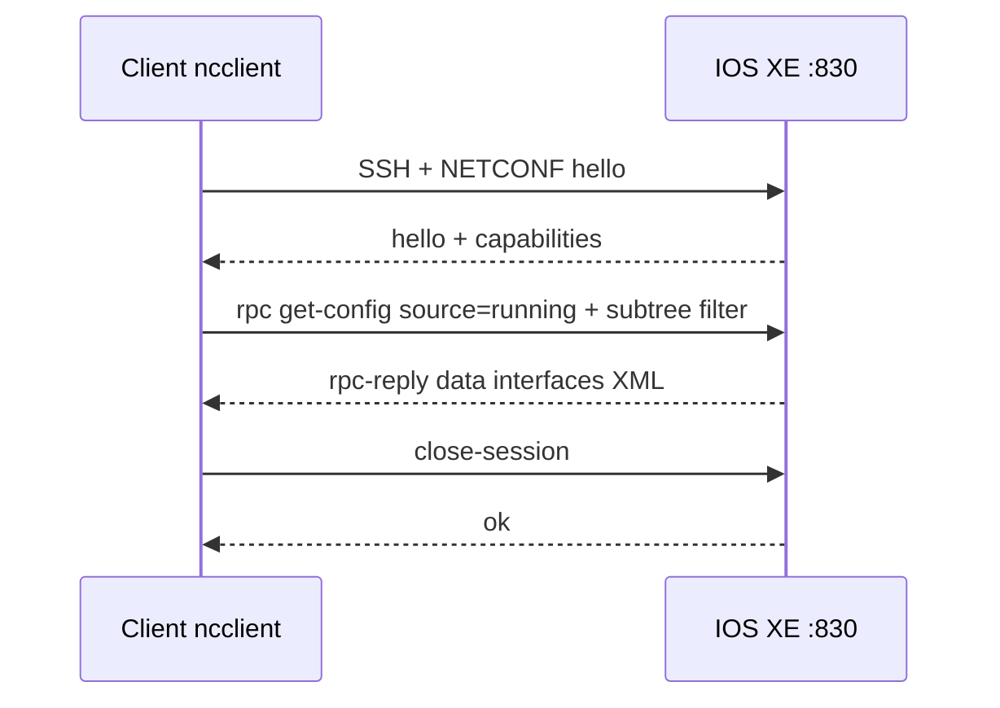

### 3. Syntax and examples

**RESTCONF GET** matching `labs/06_yang_netconf_restconf/sample_restconf_get.json`:

```http
GET /restconf/data/ietf-interfaces:interfaces HTTP/1.1
Host: devnetsandboxiosxe.cisco.com
Accept: application/yang-data+json
Authorization: Basic ...
```

Result to interpret:

```json
{
  "ietf-interfaces:interfaces": {
    "interface": [
      {
        "name": "GigabitEthernet1",
        "description": "MANAGEMENT",
        "enabled": true,
        "ietf-ip:ipv4": {
          "address": [
            {
              "ip": "10.10.20.48",
              "netmask": "255.255.255.0"
            }
          ]
        }
      }
    ]
  }
}
```

**Interpretation:** The device returned the IETF interfaces container. One list entry, key `GigabitEthernet1`, description MANAGEMENT, administratively enabled. The IETF IP module is **augmented** onto the interface: IPv4 address 10.10.20.48/24 (mask form). This is **configuration-shaped** data (address, enabled), not packet counters.

**Single-interface URL:**

```text
/restconf/data/ietf-interfaces:interfaces/interface=GigabitEthernet1
```

Equals sign encodes the list key. A slash-only path would be a different container.

**NETCONF `get-config` result** (`labs/06_yang_netconf_restconf/sample_netconf_get-config.xml`):

```xml
<rpc-reply xmlns="urn:ietf:params:xml:ns:netconf:base:1.0" message-id="101">
  <data>
    <interfaces xmlns="urn:ietf:params:xml:ns:yang:ietf-interfaces">
      <interface>
        <name>GigabitEthernet1</name>
        <description>MANAGEMENT</description>
        <enabled>true</enabled>
      </interface>
    </interfaces>
  </data>
</rpc-reply>
```

**Interpretation:** Successful reply (`data`, no `rpc-error`) to message-id 101. Configuration of IETF interfaces: GigabitEthernet1, description MANAGEMENT, enabled true. Same story as the JSON, without the IPv4 augmentation in this sample.

**NETCONF request that produced it** (from `netconf_get_config.py`):

```xml
<rpc message-id="101">
  <get-config>
    <source><running/></source>
    <filter>
      <interfaces xmlns="urn:ietf:params:xml:ns:yang:ietf-interfaces">
        <interface>
          <name>GigabitEthernet1</name>
        </interface>
      </interfaces>
    </filter>
  </get-config>
</rpc>
```

**Interpretation:** Read **running** configuration, subtree-filtered to one interface.

**Successful edit:**

```xml
<rpc-reply message-id="102">
  <ok/>
</rpc-reply>
```

**Interpretation:** `edit-config` (or commit/close) succeeded. There is **no** data payload; `<ok/>` is the success signal.

**Failed edit (original):**

```xml
<rpc-reply message-id="103">
  <rpc-error>
    <error-type>application</error-type>
    <error-tag>invalid-value</error-tag>
    <error-message>Invalid leaf value</error-message>
  </rpc-error>
</rpc-reply>
```

**Interpretation:** The device rejected the payload. Do not claim the interface was updated.

### 4. Exam-style understanding

Original study items:

**Item A.** JSON top-level key `ietf-interfaces:interfaces` vs `Cisco-IOS-XE-native:native`.  
*Answer:* IETF standard interface model vs Cisco native configuration tree.

**Item B.** RESTCONF path `interface=GigabitEthernet1` — why the equals?  
*Answer:* YANG list key in the URL.

**Item C.** Distinguish `<get-config>` reply vs `<get>` reply if you see `<oper-status>up</oper-status>`.  
*Answer:* Operational leaf ⇒ `<get>` (or operational RESTCONF), not config-only `get-config`.

**Item D.** HTTP 204 after PATCH.  
*Answer:* Success, no body; the resource was updated (or already matched).

**Item E.** `Content-Type: application/yang-data+json` on the **response**.  
*Answer:* Body is YANG-modeled JSON, not a random product REST API.

**Item F.** NETCONF `<hello>` lists `urn:ietf:params:netconf:capability:candidate:1.0`.  
*Answer:* Device supports the candidate datastore; edits can target candidate then commit.

### 5. Hands-on exercise

1. Compare `sample_restconf_get.json` and `sample_netconf_get-config.xml` side by side. List three leaves present in both.
2. Run `labs/06_yang_netconf_restconf/restconf_get_interfaces.py` against DevNet IOS XE Always-On (`labs/.env`). Note status code, Content-Type, and hostname JSON.
3. Run `netconf_get_config.py`. Copy the first eight capabilities. Identify at least one YANG module URN and whether `:candidate` appears.
4. In Postman: GET `https://{host}/restconf/data/ietf-interfaces:interfaces/interface=GigabitEthernet1` with Basic auth and `Accept: application/yang-data+json`. Interpret the body using this section.

---

## 5.11 Interpret basic YANG models

### 1. What Cisco expects me to know

The verb is **Interpret**. Read a **basic YANG model** and explain the data tree. Required vocabulary: **module**, **namespace**, **prefix**, **container**, **list**, **key**, **leaf**, **leaf-list**, **config true/false**, **grouping**, **uses**, **type**. You will map a snippet of YANG to the JSON/XML you saw in 5.10.

The lab excerpt `labs/06_yang_netconf_restconf/sample.yang` is a teaching subset of `ietf-interfaces`, not the full IETF module.

YANG language: [RFC 7950](https://datatracker.ietf.org/doc/html/rfc7950).

### 2. Detailed explanation

YANG is a **schema language**. A **module** is a named schema document. Inside it, statements nest to form a tree.

**Header statements:**

- `module ietf-interfaces` — module name. RESTCONF uses this name before the colon.
- `namespace "urn:ietf:..."` — XML namespace URI. NETCONF XML uses this `xmlns`.
- `prefix if;` — short name used when other modules **import** this one (`if:interfaces`).
- `yang-version 1.1;` — language version.
- `organization`, `description` — metadata; rarely affect the instance data.

**Data-definition statements:**

| Statement | Meaning | Instance encoding |
| --- | --- | --- |
| `container` | Named grouping of child nodes, not a list. No key. | JSON object |
| `list` | Dictionary of entries, each uniquely identified by `key` | JSON array of objects |
| `key` | Which leaf (or leaves) uniquely identify a list row | RESTCONF `=value` in the path |
| `leaf` | Single value | JSON scalar |
| `leaf-list` | Ordered or unordered set of scalar values | JSON array of scalars |
| `type` | `string`, `boolean`, `uint8`, `enumeration`, `inet:ipv4-address`, … | Constrains the leaf |
| `config false` | Operational state, not writable config | Appears in `<get>` / operational RESTCONF |
| `config true` | Default: configuration | `get-config` / writable RESTCONF |
| `default` | Value if the leaf is omitted | Device may still omit it in replies |
| `mandatory true` | Must be present in config | |
| `grouping` | Reusable bundle of nodes (not instantiated by itself) | |
| `uses` | Insert a grouping here | Expands like a macro |

**`config false` on a container** makes the whole subtree operational. In the sample, `interfaces` is config; `interfaces-state` is `config false` (older IETF style; newer models often use a single tree with `config false` leaves). Exam: if you see `config false`, you cannot `edit-config` those leaves.

**Identity of a list entry.** `list interface { key "name"; leaf name { type string; } ...}` means two interfaces cannot share `name`. RESTCONF: `interface=GigabitEthernet1`. JSON must include `"name": "GigabitEthernet1"`.

**Augment / import (recognize, do not author).** Another module can `import ietf-interfaces` and `augment` IPv4 under each interface — that is why JSON showed `ietf-ip:ipv4` inside an interface even though `sample.yang` has no IP leaves.

**Types.** `enumeration` with `enum up; enum down;` means only those strings. `boolean` is `true`/`false`. Wrong type → NETCONF `invalid-value` or RESTCONF 400.

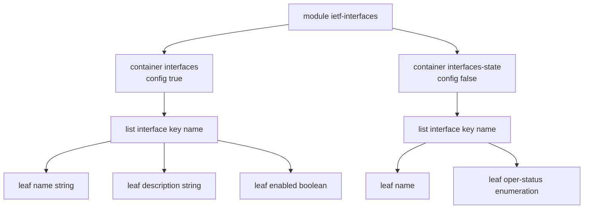

### 3. Syntax and examples

Lab model (abridged comments):

```yang
module ietf-interfaces {
  yang-version 1.1;
  namespace "urn:ietf:params:xml:ns:yang:ietf-interfaces";
  prefix if;

  container interfaces {
    list interface {
      key "name";
      leaf name { type string; }
      leaf description { type string; }
      leaf enabled { type boolean; default "true"; }
    }
  }

  container interfaces-state {
    config false;
    list interface {
      key "name";
      leaf name { type string; }
      leaf oper-status {
        type enumeration {
          enum up;
          enum down;
          enum testing;
        }
      }
    }
  }
}
```

**Interpretation drills:**

- Module name for RESTCONF: `ietf-interfaces`.
- XML ns: `urn:ietf:params:xml:ns:yang:ietf-interfaces`.
- Writable path: `ietf-interfaces:interfaces/interface=...`
- Read-only path conceptually: `ietf-interfaces:interfaces-state/interface=.../oper-status`
- Can you PATCH `oper-status`? **No** — parent is `config false`.
- Can two list entries omit `name`? **No** — it is the key.

**`grouping` / `uses` original example:**

```yang
grouping addr-block {
  leaf ip { type string; }
  leaf prefix-length { type uint8; }
}

container ipv4 {
  list address {
    key "ip";
    uses addr-block;
  }
}
```

**Interpretation:** Each `address` list entry has leaves `ip` (key) and `prefix-length` because `uses addr-block` copies that grouping. `grouping` itself is not a RESTCONF resource.

**`leaf-list` original:**

```yang
leaf-list name-server {
  type string;
}
```

JSON instance: `"name-server": ["1.1.1.1", "8.8.8.8"]` — array of strings, not array of objects. Contrast with `list`.

### 4. Exam-style understanding

Original study items:

**Item A.** Difference between `leaf` and `leaf-list`.  
*Answer:* One scalar vs multiple scalars.

**Item B.** Difference between `leaf-list` and `list`.  
*Answer:* `list` has child nodes and a `key`; `leaf-list` is only repeated scalars.

**Item C.** Given `container interfaces { list interface { key "name";` which JSON is valid?  
A: `"interface": { "name": "Gi1" }` as a single object with no array  
B: `"interface": [ { "name": "Gi1" } ]`  
*Answer:* B matches a YANG list (JSON array). Some encodings may vary; IETF JSON encoding of lists is an array.

**Item D.** `prefix if` — do RESTCONF URLs use `if:interfaces` or `ietf-interfaces:interfaces`?  
*Answer:* RESTCONF uses the **module name**, not the prefix. Prefix is for YANG references inside modules.

**Item E.** Find the operational leaf in the sample.  
*Answer:* `oper-status` under `interfaces-state`.

### 5. Hands-on exercise

1. Print `sample.yang` and highlight: module, namespace, prefix, two containers, two lists, keys, leaves, `config false`, types.
2. For each leaf, write one JSON snippet and one XML snippet.
3. Add on paper a `leaf-list alias { type string; }` under `list interface`. Write the JSON for two aliases.
4. Read RFC 7950 section 3 (overview) only: https://datatracker.ietf.org/doc/html/rfc7950 — enough for CCNA Automation.

---

## 5.12 Interpret a unified diff

### 1. What Cisco expects me to know

The verb is **Interpret**. Read **unified diff** output (`git diff`, `diff -u`, a GitHub pull request) and say what file changed, which lines were removed or added, and where the hunk sits in the file. This is how code review (5.13) and CI (5.4) present change.

Lab file: `labs/04_git/example.diff`.

### 2. Detailed explanation

Unified diff is a text format. Core pieces:

```text
--- a/path/to/old
+++ b/path/to/new
@@ -oldStart,oldCount +newStart,newCount @@ optional hunk header
 context line (unchanged, prefix space)
-removed line (present in old, absent in new)
+added line (absent in old, present in new)
```

**File headers.** `---` is the original (often `a/` from Git). `+++` is the new file (`b/`). If a file is created, the old side may be `/dev/null`. If deleted, the new side may be `/dev/null`.

**Hunk header.** `@@ -1,6 +1,7 @@` means:

- Old file: starting at **line 1**, the hunk covers **6** lines.
- New file: starting at **line 1**, the hunk covers **7** lines.

The new side has one extra line (6 → 7), which matches one `+` line net of removals.

**Line prefixes** (the first character of each hunk line):

| Prefix | Meaning |
| --- | --- |
| space | Context — unchanged |
| `-` | Removed |
| `+` | Added |
| `\` | “No newline at end of file” marker (rare) |

A **modified** line is usually shown as a `-` old version immediately followed by a `+` new version.

**What a diff does not tell you by itself:** whether tests passed, whether the change is a good idea, or whether it was already committed. It only shows textual change. `git diff` (unstaged) vs `git diff --cached` (staged) vs `git diff HEAD~1` (last commit) are different **ranges** with the same format.

### 3. Syntax and examples

Lab diff (`labs/04_git/example.diff`):

```diff
--- a/hostname.py
+++ b/hostname.py
@@ -1,6 +1,7 @@
 import requests
 
-url = "https://router/restconf/data/Cisco-IOS-XE-native:native/hostname"
+HOST = "https://router"
+url = f"{HOST}/restconf/data/Cisco-IOS-XE-native:native/hostname"
 response = requests.get(url, auth=("admin", "admin"), verify=False)
 print(response.json())
```

**Interpretation:**

- File: `hostname.py`.
- Hunk starts at line 1 on both sides. Old length 6, new length 7.
- Unchanged: `import requests`, blank line, `response = requests.get(...)`, `print(...)`.
- Removed: a hardcoded full RESTCONF URL.
- Added: `HOST = "https://router"` and an f-string URL that builds the same path from `HOST`.
- Net intent: make the base URL a variable. Auth and `verify=False` did **not** change.

**Created file (original example):**

```diff
--- /dev/null
+++ b/labs/09_terraform/generated_inventory.json
@@ -0,0 +1,3 @@
+{
+  "devices": []
+}
```

Interpret: *New file with three lines; nothing removed.*

**Two hunks.** A file can have `@@ -10,4 +10,5 @@` later. Each hunk is independent. Do not assume the whole file is shown.

### 4. Exam-style understanding

Original study items:

**Item A.** In `@@ -20,3 +20,5 @@`, how many lines does the new side of this hunk include?  
*Answer:* 5.

**Item B.** A hunk has two `-` lines and one `+` line. Did the file grow or shrink?  
*Answer:* Shrink by one line in this hunk (net −1).

**Item C.** Does the lab diff change authentication?  
*Answer:* No. Only the URL construction changed.

**Item D.** Prefix of an unchanged `import requests` line?  
*Answer:* A space character (often easy to miss in a question stem).

**Item E.** `---` and `+++` both say `hostname.py` but `a/` vs `b/`.  
*Answer:* Git’s way of labeling old vs new tree; same path.

### 5. Hands-on exercise

1. Read `labs/04_git/example.diff` and narrate it without looking at this section.
2. In a scratch clone, change one Python file, run `git diff`, and label every `@@` number by opening the file and counting.
3. On GitHub, open any pull request, switch to Files changed, and interpret one hunk. That is the same format as the exam.

---

## 5.13 Describe the principles and benefits of a code review process

### 1. What Cisco expects me to know

The verb is **Describe**. Explain **principles** of code review and **benefits**, especially for infrastructure automation (playbooks, Terraform, Python API scripts). You already know Git from Domain 1; here the human process around a diff (5.12) and a pipeline (5.4) is the point.

### 2. Detailed explanation

A **code review** is a structured look at a proposed change **before** it becomes the shared main branch (and before it hits production devices). Typical GitHub flow: branch → commit → pull request → reviewers comment on the unified diff → CI runs → approve → merge.

**Principles:**

1. **Small, focused changes.** A PR that rewrites Ansible and Terraform and a YANG model is hard to review. Prefer one workflow per PR.
2. **The diff is the artifact.** Reviewers read 5.12 output, not a slide deck. “Trust me I ran it” is not a review.
3. **Automation first, humans second.** Linters, `terraform plan`, pytest, ansible-lint, secret scanners run in CI so humans do not nitpick formatting or catch a hardcoded API key late.
4. **Correctness, safety, and operability.** For network IaC, reviewers ask: idempotent? wrong inventory? `become` too wide? `rm -rf`? `verify=False` acceptable only in a lab? blast radius?
5. **Authorship vs approval.** The author does not approve their own change in a disciplined team. At least one other engineer (or a maintained CODEOWNERS file) looks.
6. **Comments are about the code, and they should be actionable.** “This `get-config` filter is unscoped and will pull the entire running config” is a review. “I don’t like YAML” is not.
7. **Recorded outcome.** Approve, request changes, or comment. The Git platform stores who signed off — audit benefit.
8. **Secrets never merge.** Reviewers watch for API keys in diffs. `.env` must stay untracked.

**Benefits:**

- **Catch bugs** that unit tests miss (wrong Catalyst Center path, Meraki org ID hardcoded).
- **Share knowledge** — junior engineers see how RESTCONF URLs are built.
- **Consistency** with team style and IaC principles (5.5).
- **Safety** for production networks: two people agree before BGP changes.
- **Audit and compliance** — who approved the change to firewall rules.
- **Better CI** — reviewers demand tests that then keep working.

Code review does not replace CML/pyATS (5.3) or CI (5.4). It sits in the pipeline as a gate: **green tests + human approval**.

### 3. Syntax and examples

There is no single “code review language.” You will see GitHub/GitLab UI. A review comment anchored on a diff line (original example):

```text
playbook.yml:22
Reviewer: create_home: true is good. Please also set
  groups: sudo
only if this user must become root; otherwise omit it (least privilege).
```

A PR checklist (original):

```markdown
- [ ] ansible-lint and terraform plan are green
- [ ] No secrets in the diff
- [ ] Inventory targets lab, not prod
- [ ] pyATS or RESTCONF GET assertion described
```

`git log` after merge shows the PR; `git blame` shows who last touched a line — benefits of a reviewed history.

### 4. Exam-style understanding

Original study items:

**Item A.** Name three benefits of code review for Ansible playbooks.  
*Answer:* Catch destructive tasks, share module knowledge, ensure inventory/scope, require CI, audit who approved.

**Item B.** Why review Terraform `plan` output as well as HCL?  
*Answer:* The plan is the real create/destroy set; HCL can hide blast radius until plan.

**Item C.** Is “the pipeline is green” a substitute for review?  
*Answer:* No. CI cannot judge intent (“this VLAN is the wrong site”). Both.

**Item D.** Principle most closely tied to 5.12?  
*Answer:* Review the unified diff, line by line.

### 5. Hands-on exercise

1. Push a branch that only changes a comment in `labs/08_ansible/playbook.yml`. Open a GitHub pull request. Request review from a classmate or review it yourself as if you were a second engineer — write two comments using the principles above.
2. Intentionally put a fake key `X-Cisco-Meraki-API-Key: 12345` in a branch (never a real key). Practice catching it in the diff, then remove it before merge.
3. Read `labs/04_git/workflow.yaml` and mark where “open PR / review” belongs relative to clone, commit, merge, push.

---

## 5.14 Interpret a sequence diagram that includes API calls

### 1. What Cisco expects me to know

The verb is **Interpret**. Given a **sequence diagram** that includes **API calls**, identify participants, message order, what is synchronous vs asynchronous, and what comes back. Domain 2 webhooks and Domain 3 controllers show up here as diagrams rather than as Python.

You should be able to **read** UML/Mermaid sequence diagrams: lifelines, arrows, return messages, optional loops, notes.

### 2. Detailed explanation

A sequence diagram shows **time going down** and **participants going across**. Each vertical line is a **lifeline** (client, API gateway, Catalyst Center, device, webhook listener).

**Arrow conventions (UML-ish, also used in Mermaid):**

| Arrow | Typical meaning |
| --- | --- |
| Solid line with filled/open arrowhead to the right | Synchronous call (HTTP request). Caller waits. |
| Dashed line back | Return / HTTP response. |
| Open arrow / async message | Fire-and-forget or “response comes later” (webhook, job queued). |
| Box over a lifeline | Activation — that participant is processing. |
| `alt` / `opt` / `loop` frames | Conditional or repeated calls (retries, pagination). |

**How to interpret an API sequence:**

1. **Who speaks first?** Usually the automation client.
2. **Is there an auth call before the business call?** Catalyst Center token POST before GET devices; ACI `aaaLogin` before class query; Meraki often has **no** extra auth call (key on every request).
3. **Synchronous REST?** Client → server → dashed return with 200 and JSON. The next arrow should not start until the return (unless the diagram shows parallel).
4. **Asynchronous?** Client POST returns 202 + task id; later the client polls, **or** the server calls the client’s webhook URL. Those are different participants.
5. **Error path** in an `alt` box: 401 then re-auth; 429 then retry.

**Participant order** is not arbitrary: left-to-right often follows the request path (user, script, controller, device). If a webhook appears, the **device or controller becomes the HTTP client** and your listener is the server — arrows reverse.

### 3. Syntax and examples

**Synchronous RESTCONF GET** (device-level, matches lab 06):

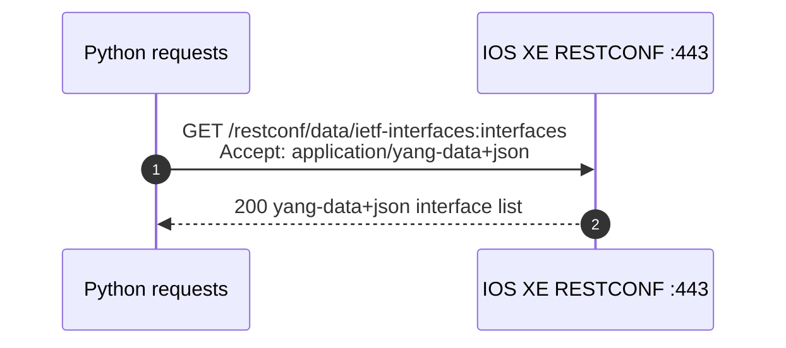

Interpret: *One synchronous API call. No controller. Return is the YANG JSON.*

**Catalyst Center token then inventory (sync):**

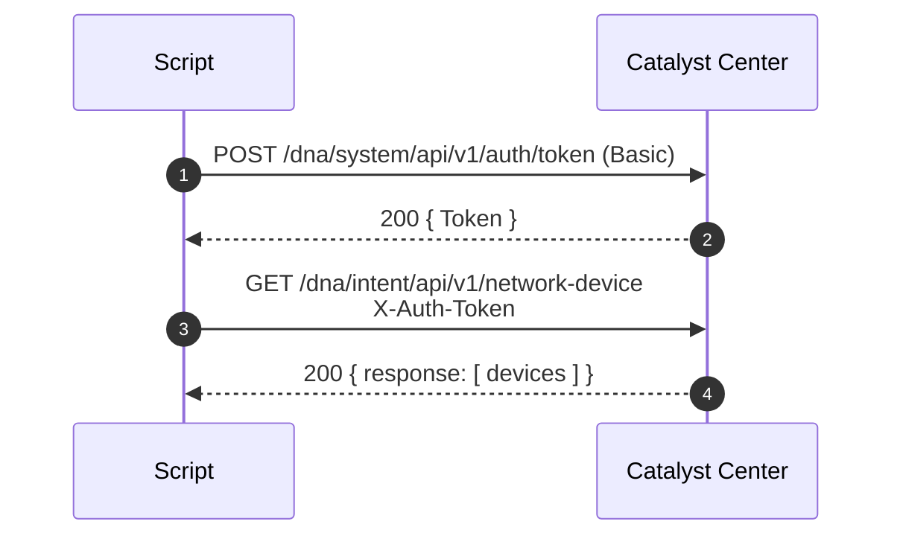

Interpret: *Two synchronous calls. Workflow is authenticate, then list devices. Token is not a webhook.*

**Asynchronous intent + webhook (original):**

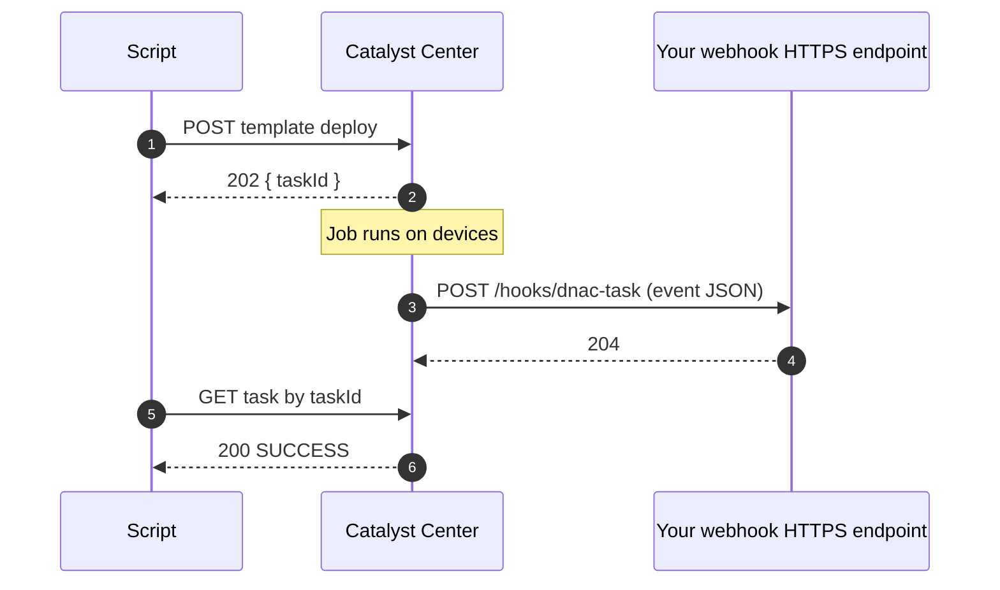

Interpret: *Deploy is asynchronous (202). Controller later **calls you** (webhook — reverse HTTP). Script may also poll the task. Three participants.*

**NETCONF vs REST in one picture:**

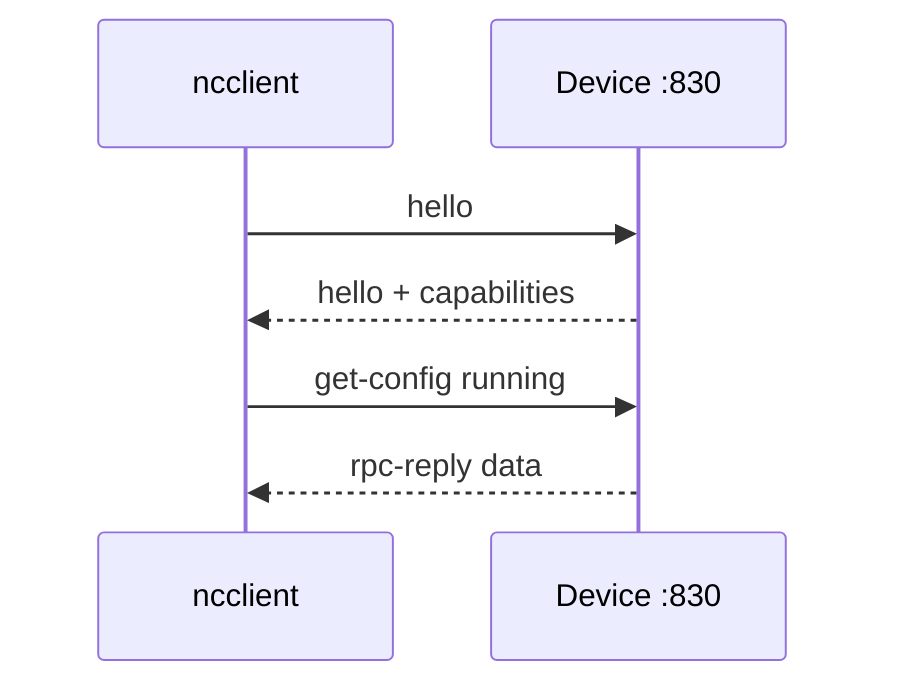

Interpret: *Capability exchange is mandatory before RPCs. Returns are XML `rpc-reply`, not HTTP status codes.*

### 4. Exam-style understanding

Original study items:

**Item A.** In a diagram, the second arrow is dashed from APIC to Python after `aaaLogin`. What is that message?  
*Answer:* Login response (token/cookie). Next arrows should use it.

**Item B.** Arrow from Meraki cloud to `https://example.com/hook` with no prior dashed return wait.  
*Answer:* Webhook (asynchronous event); Meraki is the HTTP client.

**Item C.** Why does a Catalyst Center diagram have more participants than a RESTCONF GET?  
*Answer:* Controller plus devices (and maybe a webhook receiver); RESTCONF is client plus one box.

**Item D.** `loop` frame around GET with `offset`.  
*Answer:* Pagination until the API returns no more rows.

**Item E.** Participant order: Client, Firewall, API. A SYN to port 443 dies at the firewall.  
*Answer:* Sequence never reaches the API — useful when combined with 6.8 (blocked port).

### 5. Hands-on exercise

1. Draw (Mermaid or paper) the sequence for `labs/05_cisco_apis/meraki_list_devices.py`: orgs → devices → clients. All synchronous.
2. Draw `catalyst_center_devices.py`: token, then devices, then optional client-health.
3. Draw `netconf_get_config.py`: hello, capabilities print, get-config, disconnect.
4. Add one webhook participant to the Catalyst Center diagram hypothetically. Label which arrows reverse direction.

---

# 6.0 Network Fundamentals — 15%

Network fundamentals **are on this exam**. Cisco is not asking you to re-sit the entire 200-301 CCNA curriculum. The depth here is: **purpose and usage** of addressing and VLANs, **function** of common boxes and planes, **interpret** a simple topology, **recognize** well-known ports, **diagnose** a short list of application connectivity failures, and **explain** how network constraints show up in applications.

If you already hold CCNA, use this domain as a precision review aimed at automation engineers: you must still map RESTCONF :443 vs NETCONF :830, explain why a Python script sees a load-balancer IP, and know why DNS failure looks like “the API is down.”

Lab files: `labs/10_network_troubleshooting/diagnose.py` for 6.8/6.9.

---

## 6.1 Describe the purpose and usage of MAC addresses and VLANs

### 1. What Cisco expects me to know

The verb is **Describe** the **purpose and usage** of **MAC addresses** and **VLANs**. You need the ideas an automation engineer uses when reading inventory JSON, Meraki client lists, or switch interface YANG — not spanning-tree timer math.

### 2. Detailed explanation

**MAC address (Media Access Control).** A 48-bit Layer 2 identifier burned into (or assigned to) a NIC, usually written `00:11:22:33:44:55` or `0011.2233.4455`. Purpose: uniquely identify an interface on a **local Ethernet segment** so switches can forward frames. Usage you will see in APIs:

- Meraki client objects include `mac` and often `ip`.
- Catalyst Center device inventory includes MAC / serial.
- Switch CAM/MAC tables map MAC → port. Automation that “finds a host” is often a MAC lookup, not a traceroute.

MACs do not route across L3. A packet that leaves a router gets a **new** Ethernet header with the next-hop MAC. If a script shows the same IP with a changing MAC, you may be looking at HSRP/VRRP virtual MACs or a VM that vMotioned.

**VLAN (Virtual LAN).** A VLAN is a **broadcast domain** carved out of a switch fabric. Purpose: isolate groups of endpoints (users vs cameras vs servers) without separate physical switches. Usage:

- Access port: one VLAN (untagged) for a PC or AP.
- Trunk port: multiple VLANs tagged with 802.1Q between switches, firewalls, and hypervisors.
- SVI (switched virtual interface): the Layer 3 gateway IP for that VLAN on a Layer 3 switch.

From an automation perspective, “create VLAN 20 and put Gi1/0/12 in it” is a device-level or controller-level change. ACI does not use campus VLANs the same way (EPGs), but campus Catalyst still does.

**How they work together.** Frames inside VLAN 20 are switched using MAC tables **scoped to that VLAN**. Hosts in VLAN 20 cannot talk to VLAN 30 at Layer 2; a router/SVI/firewall must route (and maybe filter) between them.

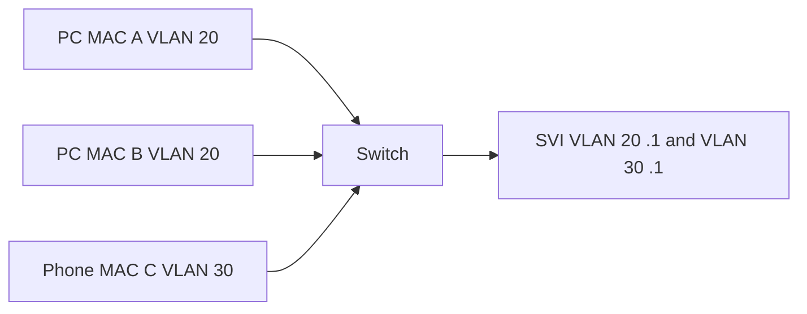

### 3. Syntax and examples

JSON you might see from a controller (original):

```json
{
  "hostname": "access-01",
  "managementIpAddress": "10.10.20.11",
  "macAddress": "00:1e:14:a1:b2:c3",
  "interface": "GigabitEthernet1/0/12",
  "vlanId": 20
}
```

Interpret: *This device’s mgmt IP is L3; the endpoint or port is in VLAN 20; MAC identifies the chassis or the client depending on the API.*

IOS-XE style (conceptual, not a lab file):

```text
interface GigabitEthernet1/0/12
 switchport mode access
 switchport access vlan 20
```

```text
interface Vlan20
 ip address 10.20.0.1 255.255.255.0
```

Purpose: port in VLAN 20; SVI is the gateway for that subnet.

### 4. Exam-style understanding

Original study items:

**Item A.** Purpose of a MAC vs purpose of an IP.  
*Answer:* MAC identifies an L2 interface on a local segment; IP identifies an L3 endpoint across networks.

**Item B.** Two PCs in VLAN 20 and VLAN 30, same switch, no SVI. Can they ARP each other?  
*Answer:* No. Different broadcast domains.

**Item C.** Meraki client list has `mac` but `ip` is null.  
*Answer:* L2-seen device without a learned DHCP/IP, or the timespan missed it.

**Item D.** Why does a RESTCONF interface list not contain MAC by default in `ietf-interfaces` config?  
*Answer:* MAC is often operational hardware state (`config false`), not something you set on a physical NIC.

### 5. Hands-on exercise

1. On WSL, run `ip link` (or Windows `getmac`). Identify one MAC. Note it is local to that interface.
2. In the Meraki lab script output (`meraki_list_devices.py`), find MAC-like fields on devices if you have a sandbox.
3. Sketch two VLANs and one trunk. Label which links are tagged.

---

## 6.2 Describe the purpose and usage of IP addresses, routes, subnet mask / prefix, and gateways

### 1. What Cisco expects me to know

**Describe purpose and usage** of **IP addresses**, **routes**, **subnet mask / prefix**, and **gateways**. Enough to read a topology, a RESTCONF `ietf-ip` block, and a failed API call that never left the subnet. Not enough to design VLSM for a global enterprise.

### 2. Detailed explanation

**IP address.** Layer 3 identifier. IPv4 is 32-bit (`10.10.20.48`); IPv6 is 128-bit. Purpose: routing between networks, not switching inside a VLAN. Usage in automation: every device inventory field `managementIpAddress`, RESTCONF `ietf-ip:ipv4` `ip`, Meraki `lanIp`.

**Subnet mask / prefix.** The mask (`255.255.255.0`) or prefix length (`/24`) splits the address into **network** and **host**. Purpose: decide “is this destination local (ARP/ND) or remote (send to a gateway)?” Usage: you will see either form. RESTCONF sample uses `netmask`; many APIs use `prefix-length`. `/24` means 256 addresses, 254 usable hosts in classic IPv4 (network and broadcast reserved). `/32` is a single host route. `/128` is a single IPv6 address.

**Gateway (default gateway).** The IP on the **local subnet** that forwards packets toward other networks — typically the SVI, router, or firewall interface. A host with IP `10.10.20.48/24` and gateway `10.10.20.1` ARPs for `.1` when the destination is not `10.10.20.0/24`. Wrong gateway is a classic “API times out” cause: the packet never leaves the VLAN.

**Routes.** A route is a mapping: destination prefix → next hop (or exit interface). Devices have:

- Connected routes (the subnet on an interface).
- Static routes (operator or IaC defined).
- Dynamic routes (OSPF, BGP, EIGRP) installed by the **control plane** (6.5).

A default route `0.0.0.0/0` is “everything else.” Automation scripts on a jump host still use the host OS routing table. If you can curl Meraki cloud but not an APIC at `10.0.0.10`, think routes/VPN/firewall before thinking Python.

**Longest prefix match.** If `10.10.20.0/24` and `10.10.0.0/16` both exist, a packet to `10.10.20.48` uses `/24`. You do not need to compute huge tables; you need to know **more specific wins**.

### 3. Syntax and examples

From `sample_restconf_get.json`:

```json
"ietf-ip:ipv4": {
  "address": [
    { "ip": "10.10.20.48", "netmask": "255.255.255.0" }
  ]
}
```

Purpose: this interface is in `10.10.20.0/24`. Hosts in that subnet use a gateway (not shown in this snippet) to reach other networks.

Linux host config (WSL):

```bash
ip addr show
ip route show
```

Typical default route line: `default via 10.10.20.1 dev eth0`. That `via` is the gateway.

Terraform lab inventory (`main.tf`) stores `mgmt = "10.10.20.48"` — usage: management IP for automation to target, not a route by itself.

Static route conceptual CLI:

```text
ip route 10.30.0.0 255.255.255.0 10.10.20.1
```

Interpret: *To reach 10.30.0.0/24, send to next hop 10.10.20.1 (must be reachable on a connected subnet).*

### 4. Exam-style understanding

Original study items:

**Item A.** Mask `255.255.255.0` as prefix?  
*Answer:* `/24`.

**Item B.** Host `10.10.20.48/24`, destination `10.10.20.49`. Gateway used?  
*Answer:* No. Same subnet — ARP for the destination MAC.

**Item C.** Same host, destination `8.8.8.8`.  
*Answer:* Send to default gateway.

**Item D.** Purpose of a route vs purpose of a VLAN.  
*Answer:* Route forwards between L3 networks; VLAN segments L2 broadcast domains.

**Item E.** RESTCONF shows IP but ping to another subnet fails. First IP question?  
*Answer:* Is there a gateway/route, and is the mask correct so the destination is actually “remote”?

### 5. Hands-on exercise

1. On Windows: `ipconfig` / `route print`. Identify your IPv4, mask, and default gateway.
2. Convert `255.255.255.0` and `255.255.255.252` to prefix lengths (`/24`, `/30`).
3. Read `labs/09_terraform/main.tf` device `mgmt` addresses. State the /24 they appear to share (`10.10.20.0/24`).
4. Optional: `python labs/01_python_basics/test_subnet.py` if it encodes subnet checks from Domain 1.

---

## 6.3 Describe the function of common networking components (such as switches, routers, firewalls, and load balancers)

### 1. What Cisco expects me to know

**Describe the function** of **switches, routers, firewalls, and load balancers**. Four boxes, four jobs. Enough to place them on a diagram (6.4) and know which one your API script is talking to.

### 2. Detailed explanation

**Switch (Layer 2 / multilayer).** Forwards Ethernet frames using MAC tables (and VLAN context). A **Layer 3 switch** also routes between SVIs. Function in a campus: connect endpoints, enforce VLANs, often PoE for APs/phones. Automation: high device count, Catalyst Center inventory, RESTCONF on IOS XE.

**Router.** Forwards **packets** between IP networks using the routing table. Function: WAN edge, branch internet, interconnecting VLANs when not done on an L3 switch. NAT (6.6) often lives here. Automation: fewer boxes, richer YANG, SD-WAN vManage for many edges.

**Firewall.** Forwards or **drops** according to policy (5-tuple, application, user). Function: security boundary — internet edge, data-center, micro-segmentation. Stateful firewalls track TCP sessions. Automation: policy APIs (FMC, FTD, ASA, cloud SG) more than “enable interface.” On a topology, a firewall in the path explains **blocked ports** (6.8).

**Load balancer (ADC).** Distributes connections across a pool of servers using a **virtual IP (VIP)**. Function: scale, health checks, SSL offload, sometimes URL routing. It is a **NAT-ish** device from the server’s point of view (source NAT or destination NAT). Automation: Terraform loves load-balancer objects in cloud; on-prem F5/NGINX/Cisco still show up as a hop that changes IP and port.

Related boxes you may see on diagrams: **AP** (wireless edge, still a MAC/VLAN story), **proxy** (6.8), **WAN circuit**. Stick to the four named functions unless the diagram labels more.

### 3. Syntax and examples

| Component | Forwards based on | Typical “management” API |
| --- | --- | --- |
| Switch | MAC + VLAN | Catalyst Center, RESTCONF, Meraki |
| Router | IP prefix / next hop | RESTCONF, SD-WAN vManage |
| Firewall | Policy / state | FMC, Meraki MX, cloud SG |
| Load balancer | VIP, health, algorithm | Cloud LB Terraform resource, REST |

Original health-check idea (load balancer):

```text
VIP 203.0.113.10:443 → pool 10.20.0.11:8080, 10.20.0.12:8080
```

Function: clients hit one IP; two app servers share load. The app may log the LB IP as the client (6.8 NAT).

### 4. Exam-style understanding

Original study items:

**Item A.** Which component separates VLAN 20 and VLAN 30 at Layer 3?  
*Answer:* Router or L3 switch (SVI), possibly a firewall if that is the gateway.

**Item B.** Which component drops TCP/830 from the internet?  
*Answer:* Firewall (or ACL on a router — exam “such as” list highlights firewall).

**Item C.** Which component owns a VIP?  
*Answer:* Load balancer.

**Item D.** Meraki MS vs MX vs MR — functions?  
*Answer:* Switch, security/appliance (firewall/NAT/VPN), wireless AP. Still the same four ideas.

### 5. Hands-on exercise

1. Label each icon on the 6.4 mermaid diagram before you read 6.4’s interpretation.
2. In `diagnose.py`, note which symptoms implicate a firewall vs a load balancer vs a VPN gateway.

---

## 6.4 Interpret a basic network topology diagram with elements such as switches, routers, firewalls, load balancers, and port values

### 1. What Cisco expects me to know

The verb is **Interpret**. Read a **basic** diagram: boxes, links, **port values** (Gi0/0, port 443, VLAN tags). Say what talks to what, which device is L2 vs L3 vs security vs VIP, and which **TCP/UDP port** a client would use. Combine 6.3 + 6.7.

### 2. Detailed explanation

Method:

1. **Name every node** (switch, router, firewall, LB, host, controller).
2. **Follow a packet** from a labeled client to a labeled service. Each hop: switched (MAC), routed (IP), filtered (firewall), or NATed (LB/firewall).
3. **Read interface IDs** (`Gi0/1`, `eth0`) as *which cable*, not as TCP ports.
4. **Read numbers like `:443` or `tcp/830`** as **transport ports** (6.7). A common exam mix-up is treating `GigabitEthernet1` as “port 1/tcp.”
5. **Management path vs data path.** A Python script may reach IOS XE mgmt `10.10.20.48:443` (RESTCONF) while user traffic uses a different VLAN through the LB. Diagrams sometimes draw both.

**Port values** on diagrams mean two different things — always disambiguate:

- **Interface names:** GigabitEthernet1, GigabitEthernet1/0/24, port-channel 1.
- **Transport ports:** 22, 443, 830, 161.

### 3. Syntax and examples

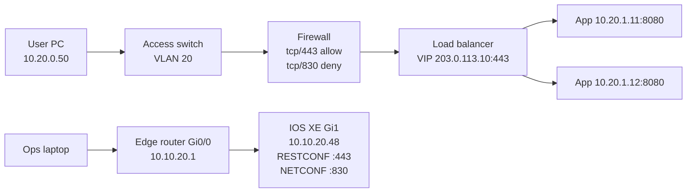

**Interpretation of this original diagram:**

- User HTTP(S) path: PC → access switch (VLAN 20) → firewall (allows 443, **denies NETCONF 830** from this zone) → load balancer VIP on **tcp/443** → backend **8080**.
- Ops automation path: laptop → edge router `Gi0/0` → IOS XE `GigabitEthernet1` at 10.10.20.48. RESTCONF uses **443**; NETCONF uses **830**. Interface `Gi1` is not port 1/tcp.
- The firewall in the *user* path does not automatically apply to the *mgmt* path unless the diagram shows it that way.

ASCII variant you might see on an exam item:

```text
[PC]--Gi1/0/12--[SW]--trunk--[RTR Gi0/0]--Gi0/1--[FW]--[LB :443]--[APP :8080]
```

Interpret left to right; `Gi1/0/12` is an access interface; `:443` is HTTPS on the VIP.

### 4. Exam-style understanding

Original study items:

**Item A.** Where is HTTP terminated in the mermaid diagram?  
*Answer:* Often at the LB (SSL offload) or the app; the VIP is `:443`. Backends are `:8080`.

**Item B.** Can the user PC open NETCONF to IOS XE through the firewall as drawn?  
*Answer:* No. `tcp/830 deny` on that firewall path.

**Item C.** `Gi0/0` on the router — Layer 2 port number 0 or an interface name?  
*Answer:* Interface name.

**Item D.** How many Layer 3 hops from User PC to App1?  
*Answer:* At least switch (L2) then firewall/LB as L3 hops depending on whether the SW is L2-only. Count routed boundaries: PC subnet → FW/LB networks → app subnet.

### 5. Hands-on exercise

1. Cover the interpretation bullets, redraw the mermaid from memory, then check.
2. Add Catalyst Center as a cloud box connected only to the ops laptop and the IOS XE mgmt network. State which APIs are controller-level vs device-level (5.2).
3. Walk `diagnose.py` cases against this diagram (blocked 830, NAT at LB).

---

## 6.5 Describe the function of management, data, and control planes in a network device

### 1. What Cisco expects me to know

**Describe the function** of the **management**, **data**, and **control** planes. This is how you explain why RESTCONF can work while traffic is blackholing, or why a CPU spike (control plane) is different from an ACL drop (data plane).

### 2. Detailed explanation

**Data plane (forwarding plane).** Moves frames/packets through the device as fast as possible, usually in hardware (ASIC). Function: switching, routing lookups already programmed, ACL/QoS applied to transit traffic. If a user packet from VLAN 20 to the VIP is forwarded, that is data plane. Automation does **not** ride the data plane except when your API call is itself transit traffic through another box.

**Control plane.** Builds and maintains the **tables** the data plane uses: OSPF/BGP/EIGRP, ARP/ND, MAC learning, spanning tree. Function: “how should we forward?” not “forward this packet.” A BGP neighbor drop is a control-plane event; existing packets may still follow last-known hardware until the FIB updates. pyATS “learn bgp” is largely control-plane state.

**Management plane.** How humans and **software** operate the device: SSH, HTTPS GUI, RESTCONF, NETCONF, SNMP, gRPC telemetry config. Function: configure and observe. CPU of the management process is separate from forwarding ASICs on purpose (control-plane policing exists because mixing them is dangerous).

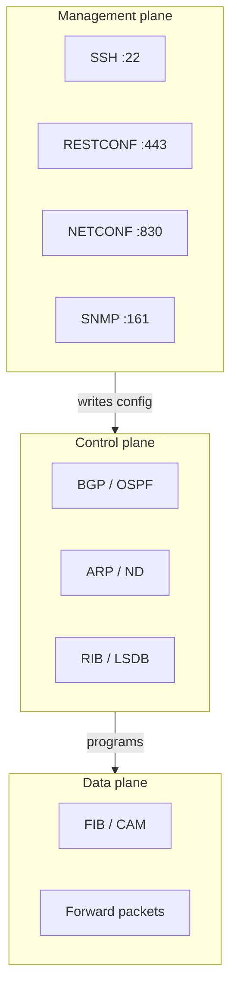

**Why automation cares.** Your Python `requests` session is **management plane**. It can succeed (200 on RESTCONF) while the **data plane** drops user traffic (ACL, down interface at line protocol, wrong VLAN). Conversely, a device can forward packets while management is unreachable (VTY ACL, VRF isolation, HTTPS disabled). Troubleshoot the plane that matches the symptom.

**NETCONF vs BGP.** Both can use TCP, but BGP is control plane between routers; NETCONF is management plane from an orchestrator. Do not call NETCONF “control plane” on this exam.

### 3. Syntax and examples

| Plane | Example protocol / feature | Exam association |
| --- | --- | --- |
| Management | SSH, RESTCONF, NETCONF, SNMP, HTTPS GUI | Your Ansible/Python session |
| Control | OSPF hellos, BGP, ARP | Neighbor up/down, routing table |
| Data | Switching a frame, CEF/FIB forward | User application packets |

Original symptom mapping:

- `ncclient` times out to :830, users still browse the VIP → **management** path broken (ACL, VRF, NETCONF not enabled).
- RESTCONF GET works, users fail → **data** path (NAT, blocked 443 through FW, wrong gateway).
- BGP down, some prefixes missing → **control** plane; data plane forwards remaining routes.

### 4. Exam-style understanding

Original study items:

**Item A.** Which plane does Ansible SSH use?  
*Answer:* Management.

**Item B.** Which plane computes OSPF shortest path?  
*Answer:* Control.

**Item C.** Which plane applies an interface ACL to transit HTTP?  
*Answer:* Data.

**Item D.** CoPP (control-plane policing) protects which plane from being flooded?  
*Answer:* Control (and often management sharing the CPU) — so forwarding ASICs keep working.

### 5. Hands-on exercise

1. Three-column table: list every protocol in 6.6 and 6.7 into a plane. NTP/SNMP/SSH are management (NTP is often classed management; SNMP too). BGP is control. User HTTPS through a switch is data.
2. Using the 6.4 diagram, color mgmt path vs user data path.

---

## 6.6 Describe the functionality of these IP Services: DHCP, DNS, NAT, SNMP, NTP

### 1. What Cisco expects me to know

**Describe the functionality** of **DHCP, DNS, NAT, SNMP, NTP**. What problem each solves, who talks to whom, and how a failure looks to an application or an automation script. Ports appear again in 6.7.

### 2. Detailed explanation

**DHCP (Dynamic Host Configuration Protocol).** Function: automatically assign IP address, mask, gateway, and DNS servers to clients. Server (or relay) hears a broadcast; client configures the lease. Without DHCP, a PC may have a 169.254.x.x APIPA address and cannot reach the API. Automation devices often use **static** mgmt IPs instead, so DHCP matters more for clients (Meraki client lists) than for the IOS XE sandbox.

**DNS (Domain Name System).** Function: resolve names (`api.meraki.com`, `devnetsandboxiosxe.cisco.com`) to IP addresses. Applications and `requests` call DNS **before** TCP. DNS failure looks like “the API is down” but `curl https://8.8.8.8` might still work. Split-horizon DNS and corporate suffixes matter on VPN (6.8).

**NAT (Network Address Translation).** Function: rewrite IP (and often port) so private hosts share a public address or so overlapping networks can communicate. PAT/overload maps many insides to one outside. Destination NAT / VIP on a load balancer rewrites the destination. **Impact:** servers see the firewall/LB IP, not the client (see `diagnose.py`). Automation ACLs that allow “the client IP” may be wrong.

**SNMP (Simple Network Management Protocol).** Function: poll devices for operational data (`GET` on UDP **161**) and receive **traps/informs** (UDP **162**). Still widely used for monitoring; model-driven telemetry is the newer path. SNMPv2c uses community strings (weak); SNMPv3 adds crypto. Ansible/Python may still `snmpget`; it is not RESTCONF.

**NTP (Network Time Protocol).** Function: synchronize clocks (UDP **123**). Certificates, log correlation, Kerberos, and `expiring` API tokens all assume reasonable time. A device years off will fail TLS to Catalyst Center. Automation pipelines that log across hops need NTP.

### 3. Syntax and examples

| Service | Function in one line | Typical port |
| --- | --- | --- |
| DHCP | Assign IP/mask/gateway/DNS | UDP 67 server, 68 client |
| DNS | Name → IP | UDP/TCP 53 |
| NAT | Rewrite addresses/ports | N/A (feature, not a listener) |
| SNMP | Monitor/query/trap | UDP 161 / 162 |
| NTP | Time sync | UDP 123 |

Original NAT illustration:

```text
Client 10.20.0.50:51000 → (PAT) → 203.0.113.5:40001 → Internet API
App sees 203.0.113.5, not 10.20.0.50
```

`/etc/resolv.conf` or Windows DNS server list is the DNS **usage** on the automation host.

### 4. Exam-style understanding

Original study items:

**Item A.** Script fails with `NameResolutionError` but ping to a known IP works. Which service?  
*Answer:* DNS.

**Item B.** App logs show all users as `10.0.0.1`. Which service/feature?  
*Answer:* NAT (or LB SNAT).

**Item C.** Device TLS to controller fails; clock is 2019. Which service?  
*Answer:* NTP (time).

**Item D.** Monitoring platform has no interface counters; RESTCONF works. Which service might be filtered?  
*Answer:* SNMP 161.

**Item E.** New laptop has no IP on a DHCP VLAN.  
*Answer:* DHCP (or relay, or port in wrong VLAN — 6.1).

### 5. Hands-on exercise

1. `nslookup api.meraki.com` (or `Resolve-DnsName`). That is DNS functionality.
2. Read cases in `labs/10_network_troubleshooting/diagnose.py` that mention NAT.
3. On a home router GUI, find DHCP pool, DNS, NAT/PAT, and NTP — map each to this table.

---

## 6.7 Recognize common protocol port values (such as, SSH, Telnet, HTTP, HTTPS, and NETCONF)

### 1. What Cisco expects me to know

The verb is **Recognize**. Memorize the well-known **TCP/UDP port numbers** the blueprint calls out and the related automation/ops ports listed below. The official “such as” list is **SSH, Telnet, HTTP, HTTPS, and NETCONF**. You should also recognize RESTCONF, SNMP, NTP, DNS, and DHCP because 6.6 and the rest of the exam use them constantly.

### 2. Detailed explanation

A **port** is a 16-bit transport demux value. TCP 443 and UDP 443 are different sockets; we still say “HTTPS is 443/tcp.” Firewalls (6.3, 6.8) allow or deny **these** numbers. Your Python `requests` library uses 443 by default for `https://`; `ncclient` defaults to **830**.

**Telnet vs SSH.** Telnet **23** is cleartext and should be disabled; SSH **22** is the management-plane remote CLI. Ansible’s default is SSH 22.

**HTTP vs HTTPS vs RESTCONF.** HTTP **80** is cleartext web. HTTPS **443** is TLS web. **RESTCONF typically runs on 443** with `yang-data+json`. Do not confuse RESTCONF with NETCONF: different protocol, different port.

**NETCONF** is **830/tcp** over SSH. If a topology allows 443 but not 830, RESTCONF might work while `ncclient` fails.

Well-known numbers are IANA defaults. Operators can rebind (`ip http secure-port 8443`). Exam items almost always use defaults unless the diagram labels otherwise.

### 3. Syntax and examples

| Protocol | Port | Transport | Plane / use |
| --- | --- | --- | --- |
| SSH | **22** | TCP | Management CLI, Ansible, Git over SSH |
| Telnet | **23** | TCP | Legacy cleartext CLI — avoid |
| HTTP | **80** | TCP | Unencrypted web / some APIs (lab only) |
| HTTPS | **443** | TCP | Web, most REST APIs, **RESTCONF default** |
| NETCONF | **830** | TCP | YANG XML RPCs over SSH |
| RESTCONF | **443** (typical) | TCP | YANG over HTTPS |
| DNS | **53** | UDP (TCP for large) | Name resolution |
| DHCP | **67 / 68** | UDP | Server / client |
| NTP | **123** | UDP | Time |
| SNMP | **161 / 162** | UDP | Get / trap |

`labs/.env.example` already encodes the IOS XE defaults: `IOSXE_SSH_PORT=22`, `IOSXE_NETCONF_PORT=830`, `IOSXE_RESTCONF_PORT=443`.

Python recognition:

```python
manager.connect(host=host, port=830, ...)          # NETCONF
requests.get("https://host/restconf/data/...")     # HTTPS 443 implied
```

### 4. Exam-style understanding

Original study items:

**Item A.** Match: 22, 23, 80, 443, 830.  
*Answer:* SSH, Telnet, HTTP, HTTPS, NETCONF.

**Item B.** RESTCONF blocked but SSH to the same IP works. Which port to check besides 22?  
*Answer:* 443 (HTTPS/RESTCONF), not 830 unless they asked NETCONF.

**Item C.** `ncclient` vs `requests` default ports.  
*Answer:* 830 vs 443.

**Item D.** SNMP poll vs trap ports.  
*Answer:* 161 vs 162.

**Item E.** Is GigabitEthernet0/0 “port 0”?  
*Answer:* No — interface name (6.4).

### 5. Hands-on exercise

1. Recite the table until you can fill it blank.
2. In `netconf_get_config.py` and `restconf_get_interfaces.py`, highlight the port numbers.
3. Optional: from WSL `nc -vz devnetsandboxiosxe.cisco.com 830` and `443` when the always-on sandbox is up (do not scan random internet hosts).

---

## 6.8 Diagnose application connectivity issues (NAT problem, Transport Port blocked, proxy, and VPN)

### 1. What Cisco expects me to know

The verb is **Diagnose**. Given symptoms, pick among the blueprint’s four causes: **NAT problem**, **transport port blocked**, **proxy**, and **VPN**. Use a method, not guesswork. The lab `labs/10_network_troubleshooting/diagnose.py` is the cheat-sheet in code form.

You are not doing full packet-tracer expert troubleshooting. You are mapping **application** failures (browser, `requests`, API SDK) to those four network causes.

### 2. Detailed explanation

**Method.** Ask, in order:

1. **DNS** — does the name resolve? (If not, it may still *look* like VPN split-tunnel or proxy PAC, but start here.)
2. **TCP handshake** — SYN-ACK on the destination **port**? If SYN with no SYN-ACK, think **transport port blocked** (firewall, SG, ip http not running, wrong port 830 vs 443).
3. **TLS** — handshake stall or cert error: often **proxy** SSL inspection or clock/NTP.
4. **Application data** — TCP works but app sees wrong client IP or cannot callback: **NAT**. Works off-net but not on corporate Wi-Fi: **proxy**. Works on LAN but not over tunnel, or specific subnets fail: **VPN** overlap or missing interesting traffic.

**NAT problem.** Source NAT hides the client; destination NAT/VIP hides the server’s real IP. Symptoms from the lab: browser reaches the VIP but the app logs the load-balancer IP; return traffic fails because NAT state expired; overlapping RFC1918 on both sides of a firewall. First check: compare app logs vs real client; `X-Forwarded-For`; packet capture source IPs.

**Transport port blocked.** Firewall/SG/ACL drops a port. Symptom: SYN, no SYN-ACK, capture shows no return. First check: confirm the **actual** port (80/443/830/22) is allowed **in the path drawn on the topology**. RESTCONF vs NETCONF mix-ups belong here.

**Proxy.** Corporate HTTP/HTTPS proxy intercepts or requires `HTTP_PROXY`/`HTTPS_PROXY`. Symptom: works on home network, fails on corp Wi-Fi; TLS stall to `api.example.com`; Python `requests` works if you set `verify` to the corp CA bundle. First check: proxy env vars, PAC file, trust store. Explicitly **not** a YANG error.

**VPN.** IPsec/SSL VPN. Two classic failures:

- **Overlap:** both sites use `10.10.20.0/24`. Interesting traffic never encrypts correctly or return routes to the local LAN.
- **Split tunnel / ACL:** only some prefixes go over the VPN; the API’s prefix does not.

First check: proxy IDs / encryption domains / local vs remote subnets.

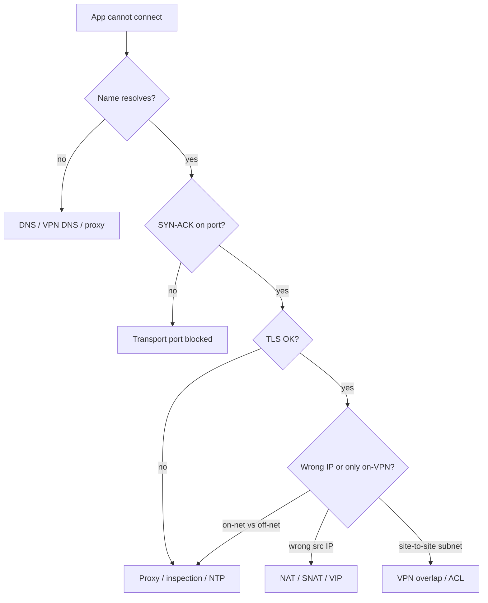

### 3. Syntax and examples

From `labs/10_network_troubleshooting/diagnose.py`:

```python
Symptom(
    "Browser reaches the VIP but the app sees the load-balancer IP as client IP",
    "NAT / SNAT on the load balancer or firewall",
    "Compare source IP in app logs with the real client; check X-Forwarded-For",
)
Symptom(
    "TCP SYN is sent, no SYN-ACK. Packet capture shows no return traffic",
    "Transport port blocked by firewall or security group",
    "Confirm destination port (80/443/830) is allowed in both directions",
)
Symptom(
    "Works off-network, fails on corporate Wi-Fi. TLS handshake to api.example.com stalls",
    "HTTP/HTTPS proxy intercept or missing proxy config",
    "Check HTTPS_PROXY/HTTP_PROXY and corporate SSL inspection trust store",
)
Symptom(
    "Site-to-site users cannot reach 10.10.20.0/24. Local LAN uses the same prefix",
    "VPN overlap / interesting-traffic ACL",
    "Inspect local and remote proxy IDs / encryption domains for overlapping subnets",
)
```

Python `requests` proxy usage (original):

```python
proxies = {"https": "http://proxy.corp.example:8080"}
requests.get("https://api.meraki.com/api/v1/organizations",
             headers={"X-Cisco-Meraki-API-Key": key},
             proxies=proxies, timeout=30)
```

If this works on corp Wi-Fi and the no-proxy version works at home, you diagnosed **proxy**.

### 4. Exam-style understanding

Original study items — practice picking **exactly one** of the four named causes:

**Item A.** `ncclient` to 10.10.20.48:830 from the internet times out; SSH :22 from the jump host on the mgmt VRF works.  
*Answer:* Transport port blocked (830 not allowed on the internet path) — not NAT unless the stem shows rewritten IPs.

**Item B.** API client IP allow-list has `10.20.0.50` but the SaaS vendor logs `203.0.113.5`.  
*Answer:* NAT.

**Item C.** Same Python works at home; at work `SSLError: certificate verify failed`.  
*Answer:* Proxy (SSL inspection) until proven otherwise.

**Item D.** Two companies merge; both use `10.10.20.0/24`; tunnel is up; those prefixes fail.  
*Answer:* VPN overlap.

**Item E.** HTTP 200 from RESTCONF but users cannot reach the VIP :443.  
*Answer:* Not a Python bug. Port blocked or NAT on the **data** path (6.5). Diagnose with the four causes on the user path.

### 5. Hands-on exercise

1. Run `python labs/10_network_troubleshooting/diagnose.py` and recap each case without reading the `likely_cause` line first (cover it).
2. Using the 6.4 diagram, invent one extra symptom per cause (NAT, blocked port, proxy, VPN) and write the first check.
3. Intentionally set `HTTPS_PROXY` to a closed port in a scratch `requests` call and read the error — that is a proxy failure mode.

---

## 6.9 Explain the impacts of network constraints on applications

### 1. What Cisco expects me to know

The verb is **Explain** the **impacts** of **network constraints on applications**. Constraints to have ready: **latency**, **jitter**, **loss**, **bandwidth**, **MTU**, and **DNS failure**. Tie each to how a REST API, a voice stream, or a bulk NETCONF `<get>` behaves. This is not a QoS design course.

### 2. Detailed explanation

**Latency (delay).** Round-trip time. Impact: every synchronous API call waits. A script that GETs 500 Meraki devices **sequentially** feels 500 × RTT. Chatty NETCONF (hello + many small rpcs) suffers more than one filtered `get-config`. Humans notice >100–200 ms on interactive apps; storage replication and clustered DBs notice much less. Timeout values in `requests.get(..., timeout=30)` must exceed worst-case latency plus processing.

**Jitter (variation in delay).** Impact: real-time media (voice/video) glitches even when *average* latency is fine. Bulk file transfer and REST mostly care about mean latency and loss, not jitter. If the exam mentions Webex media vs Webex REST, jitter hits media.

**Loss (dropped packets).** TCP retransmits → goodput collapses, API calls hang then succeed slowly, or `timeout`. UDP (voice, some DNS) does not retransmit — loss is audible or causes resolution failure. A firewall that silently drops (6.8) is 100% loss on that 5-tuple.

**Bandwidth (capacity).** Impact: large YANG operational GETs, IOS image transfers, Docker pulls, Terraform provider downloads. Low bandwidth with large payloads → long jobs, CI timeouts. A 200 OK REST call with a tiny JSON body is rarely bandwidth-bound.

**MTU (maximum transmission unit).** Typical Ethernet 1500; IP/TCP headers eat some; VPN encapsulation eats more. Impact: packets that do not fit are fragmented or, with DF bit, **dropped**. Symptom: small pings work, large HTTPS POST or NETCONF RPC fails, or TCP stalls after the handshake (“PMTUD blackhole”). Automation over IPsec VPN (6.8) is a classic MTU victim.

**DNS failure.** Impact: the application never starts a TCP session to the right IP. `requests` raises a resolution error. Cached IPs may work until TTL expires. Split DNS on VPN can resolve an **internal** IP that is unreachable from the current tunnel — looks like a mysterious timeout (combine with 6.8).

**Other constraints worth one sentence:** congestion (queues add latency/loss), NAT timeouts (long-lived idle API websockets die), TLS inspection adding latency.

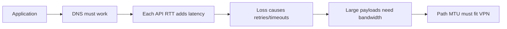

### 3. Syntax and examples

Original mapping table:

| Constraint | Typical application impact | Automation example |
| --- | --- | --- |
| High latency | Slow pages, sequential API loops crawl | 200 RESTCONF GETs in a `for` loop |
| Jitter | Voice/video artifacts | Webex media, not Webex room JSON |
| Loss | Timeouts, retransmits, truncated downloads | `requests` timeout; flaky CI |
| Low bandwidth | Long transfers, failed image upgrades | IOS image, `terraform init` providers |
| MTU too small / PMTUD fail | Large packets fail; small work | NETCONF RPC over VPN |
| DNS down | Immediate name errors | Cannot reach `api.meraki.com` |

`diagnose.py` does not list MTU; add it mentally as a fifth constraint when “small works, large fails.”

Timeout example:

```python
requests.get(url, timeout=(3.05, 27))  # connect timeout, read timeout
```

If RTT is 200 ms, connect usually succeeds; if the YANG payload is huge on a thin link, **read** timeout fires — bandwidth/latency impact, not a 404.

### 4. Exam-style understanding

Original study items:

**Item A.** Voice is choppy; REST monitoring is fine. Which constraint?  
*Answer:* Jitter (or loss on UDP), not bandwidth for tiny JSON.

**Item B.** `get-config` of the entire running config over a 256 kbps VPN times out; a filtered interface GET works.  
*Answer:* Bandwidth / payload size (and maybe MTU), not “NETCONF is down.”

**Item C.** Ping 32-byte succeeds; ping 1500 fails over the tunnel; API POST fails.  
*Answer:* MTU / encapsulation.

**Item D.** `Failed to resolve 'dnac.lab.local'` from GitHub Actions but works on the laptop.  
*Answer:* DNS (public CI cannot see internal DNS) — impact: pipeline cannot call the controller.

**Item E.** Explain why Ansible `serial: 1` against 50 high-latency devices is slow.  
*Answer:* Each SSH round trip waits full RTT; constraint is latency amplified by serialization.

### 5. Hands-on exercise

1. Run `diagnose.py` again and add a spoken sentence for each case: which 6.9 constraint is involved (loss for blocked port, latency for proxy inspection, etc.).
2. Time a RESTCONF GET against the sandbox (`Measure-Command` or `time python restconf_get_interfaces.py`). That number is mostly latency + server time.
3. Write five flashcards: constraint on the front, application impact on the back.

---

## Domain 5–6 study checklist

Use this against the official 200-901 CCNAAUTO v1.1 blueprint. You are ready to move on when you can teach each line without notes.

| Objective | Verb | Artifact to practice |
| --- | --- | --- |
| 5.1 | Describe | YANG vs NETCONF vs RESTCONF value |
| 5.2 | Compare | Controller URL vs `/restconf/data` |
| 5.3 | Describe | CML simulate; pyATS parse/test/diff |
| 5.4 | Describe | Git → lint → test → plan → deploy |
| 5.5 | Describe | Desired state, versioned, reviewable, repeatable |
| 5.6 | Describe | Ansible YAML/SSH; Terraform HCL/state; NSO services |
| 5.7 | Identify | `labs/05_cisco_apis/*` + RESTCONF script |
| 5.8 | Interpret | `labs/08_ansible/playbook.yml` |
| 5.9 | Interpret | Bash: cd, apt, useradd, mkdir/cp |
| 5.10 | Interpret | `sample_restconf_get.json`, `sample_netconf_get-config.xml` |
| 5.11 | Interpret | `labs/06_yang_netconf_restconf/sample.yang` |
| 5.12 | Interpret | `labs/04_git/example.diff` |
| 5.13 | Describe | PR + diff + CI gates |
| 5.14 | Interpret | Mermaid sequences in 5.14 |
| 6.1 | Describe | MAC L2 identity; VLAN broadcast domain |
| 6.2 | Describe | IP, mask/prefix, gateway, routes |
| 6.3 | Describe | Switch, router, firewall, LB functions |
| 6.4 | Interpret | Topology mermaid in 6.4 |
| 6.5 | Describe | Mgmt vs control vs data |
| 6.6 | Describe | DHCP DNS NAT SNMP NTP |
| 6.7 | Recognize | 22 23 80 443 830 (+ 53 67/68 123 161/162) |
| 6.8 | Diagnose | `labs/10_network_troubleshooting/diagnose.py` |
| 6.9 | Explain | Latency jitter loss bandwidth MTU DNS |

**Authoritative references used in this chapter**

- Cisco Modeling Labs: https://developer.cisco.com/modeling-labs/
- pyATS: https://developer.cisco.com/pyats/
- Ansible docs: https://docs.ansible.com/
- Terraform docs: https://developer.hashicorp.com/terraform/docs
- Cisco NSO: https://developer.cisco.com/docs/nso/
- NETCONF RFC 6241: https://datatracker.ietf.org/doc/html/rfc6241
- RESTCONF RFC 8040: https://datatracker.ietf.org/doc/html/rfc8040
- YANG RFC 7950: https://datatracker.ietf.org/doc/html/rfc7950
- Cisco IOS XE RESTCONF: https://www.cisco.com/c/en/us/td/docs/ios-xml/ios/prog/configuration/1717/b_1717_programmability_cg/restconf-protocol.html
- DevNet Sandbox: https://devnetsandbox.cisco.com

This chapter is original instructional material aligned to the published blueprint. It does not reproduce Cisco exam questions.
